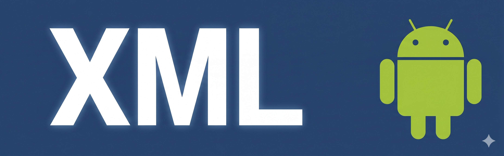
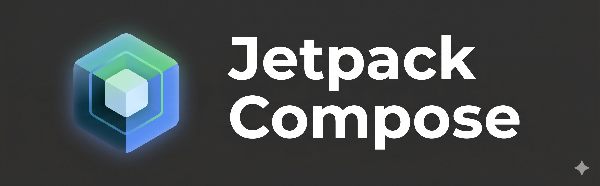

# Laborok a félév során

## Miről szólnak a laborok?

A félév során foglalkozunk az Android platformra történő natív alkalmazásfejlesztés múltjával és jelenével is egyaránt. Kezdetben bepillantást nyerünk a régebbi, XML Layout-okra épülő projektek működésébe, majd a félév túlnyomó részében Jetpack Compose keretrendszert használva építjük fel az alkalmazásunk felhasználói felületét. Mindeközben megismerkedünk a platform alapvető szolgáltatásaival, a leggyakrabban használt technológiákkal és könyvtárakkal, amiknek felhasználásával szinte bármilyen alkalmazás elkészíthető. Ennek megfelelően a tárgy laborjai során 2 projekten fogunk dolgozni.

## Az első 3 alkalom

A kezdeti laborok során egy kiadásainkat kezelő alkalmazást fogunk elkészíteni. Ennek során látni fogjuk, milyen különböző megközelítéseket használhatunk az alkalmazás felépítéséhez, illetve mik a főbb különbségek ezek között. Továbbá találkozunk a platform olyan alapvető elemeivel is, mint az `Intent`, vagy a `Fragmentek`.

## A félév további része

Miután megtapasztaltuk, hogyan zajlott az alkalmazásfejlesztés a platform és a mobileszközök hőskorában, részletesen megismerkedünk a modern fejlesztés kihívásaival. Ezen laborok keretein belül egy, az előzőnél sokkal részletesebben kidolgozott, korszerű alkalmazást készítünk el, amely filmek böngészésére és saját filmes bakancslista elkészítésére lesz alkalmas, számos érdekes és hasznos funkcióval kibővítve. 

A projekt elkészítésekor nemcsak a platform által nyújtott technológiákat fogjuk kipróbálni, hanem alapvető szoftverfejlesztési `best practice`-eket, különböző `architekturális megközelítéseket` is elsajátítunk, illetve kitárgyaljuk a köztük lévő különbségeket, valamint, hogy mikor melyiket érdemes használni.

### A projekt során előkerülő témakörök

*   Intuitív felhasználói felület kialakítása
*   Típusbiztos navigáció implementálása
*   Állapotkezelés módszerei
*   Engedélyek kezelése
*   Adatok lokális tárolása
*   Függőséginjektálás
*   Hálózati kommunikáció megvalósítása
*   Felhasználókezelés és adatszinkronizáció BaaS segítségével
*   Háttérfolyamatok futtatásának módja
*   Multimodális LLM integrálása és használata

Mielőtt belevágnánk a projektekbe, érdemes megismerkedni a fejlesztéshez használt környezettel, az Android Studioval. [Ebben a jegyzetben](../ide) összegyűjtöttük az IDE használatához szükséges alapvető tudnivalókat és számos hasznos tippet a hatékony fejlesztés érdekében.
