# Android Studio alapok és hasznos tippek

A jegyzet célja, hogy bemutassa az Android Studio fejlesztőkörnyezetet, az alkalmazásfordítás folyamatát, az alkalmazás felügyeletét, valamint az emulátor és a fejlesztőkörnyezet funkcióit. Ismertetjük egy Hello World projekt létrehozásának módját és a debugoláshoz használható fontosabb eszközöket.

**A jegyzet az alábbi témákat érinti:**

*   [Miből áll egy Android projekt?](/demo/ide/#a-projekt-felepitese)
*   [Hogyan lesz a projektből futtatható app?](/demo/ide/#forditas-menete-android-platformon)
*   [Mi az az Android SDK?](/demo/ide/#az-android-sdk)
*   [Hogy épül fel az Android Studio?](/demo/ide/#a-fejlesztokornyezet)
*   [Mi az emulátor és hogy használjuk?](/demo/ide/#emulator)
*   [Milyen app felügyeleti eszközök vannak?](/demo/ide/#alkalmazas-felugyeleti-eszkozok)
*   [Hogyan tehető hatékonyabbá a fejlesztés?](/demo/ide/#hasznos-funkciok-az-ide-ben)

## A projekt felépítése

Egy Android alkalmazás létrehozásához általában nemcsak forráskód írására van szükségünk. Gondoljuk arra, hogy az általunk használt appokban mennyi kép jelenik meg, hányféle nyelv beállítható, egyáltalán az app ikonja hogyan tud szépen megjelenni az alkalmazáslistánkban és a Play áruházban is. De a szemmel nem látható, motorháztető alatt lévő adottságok is meghatározóak. Milyen adatbázist használunk az adatok tárolására? Hogyan tudunk regisztrálni az appba egy fiókot? Milyen eszközöket használunk a funkciók teszteléséhez? Ezekhez mindent magunk írunk meg nulláról? Természetesen a válasz az, hogy nem. Akkor viszont kellenek külső könyvtárak, amiket fel tudunk használni. Na de hol és milyen formában vannak jelen ezek a projektben? Egyáltalán mit tartalmaz pontosan egy Android projekt?

Fejben a projektünket **3 nagy egységre** oszthatjuk:

1. A forráskód és a tesztek
2. A függőségeket definiáló és build fájlok
3. Az erőforrásfájlok és a Manifest.xml fájl

A projekt felépítését tekintve ezek nem különülnek el ennyire látványosan, illetve kicsit szét vannak szórva a mappák között. Nagy vonalakban így épül fel egy projekt:

*   `app`
    *   `build`: fordított állományok
    *   `src`: 
        *   `main`
            *   `java`: a forráskód
            *   `res`: erőforrások: stringek, képek, ikonok, layout-ok stb...
            *   `AndroidManifest.xml`: manifest fájl :)
        *   `test`: unit tesztek helye
        *   `androidTest`: instrumentális tesztek helye
    *   `build.gradle.kts`: modulszintű függőségek és konfiguráció
*   `gradle`:
    *   `libs.versions.toml`: könyvtárak, pluginok és verzióik
*   `build.gradle.kts`: projektszintű függőségek (jellemzően pluginok)

!!! note "Megjegyzések"
    Szerencsére az Android Studio biztosít számunkra egy másik (Android) nézetet is, amelyben egyszerűbb kikeresni a fájlokat. Laboron majd részletesen foglalkozunk azzal, hogy miért van szükség két `build.gradle.kts` fájlra, és ezek közt mi a különbség.

## Fordítás menete Android platformon

Ahhoz, hogy megértsük és átlássuk a fejlesztőkörnyezet alapfunkcióit, tisztában kell lennünk azzal, milyen módon válik a forráskódunkból és erőforrásfájljainkból futtatható állomány, illetve hogyan fogja ezt egy eszköz futtatni. Egy projekt fordításának eredménye az APK állomány, melyet közvetlenül telepíthetünk mobil eszközre. Az APK-ra tekintsünk úgy, mint egy tömörített állomány, amelyet ha átírunk `.zip` kiterjesztésre, akkor a tartalmát a fájlkezelőben is megvizsgálhatjuk.

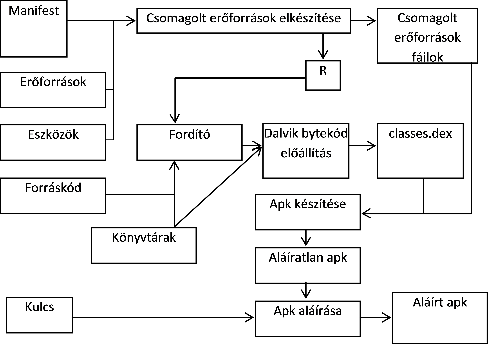

*A teljes folyamat lépései:*

1.  A fejlesztő elkészíti a Kotlin forráskódot, amelyben a felhasználói felületet Jetpack Compose segítségével vagy XML layoutokat használva definiálja.

2.  A fejlesztőkörnyezet folyamatosan naprakészen tartja az erőforrásokat és a szükséges build állományokat a fejlesztéshez és a fordításhoz. (Lásd: függőségek kezelése, [Gradle](https://gradle.org/) Sync.)

3.  A fejlesztő a Manifest állományban beállítja az alkalmazás hozzáférési jogosultságait (pl. Internet elérés, szenzorok használata, stb.), illetve ha futás idejű jogosultságok szükségesek, ezt kezeli a forráskódban is.

4.  A fordító a forráskódból, az erőforrásokból és a külső könyvtárakból előállítja az [**ART**](https://source.android.com/docs/core/dalvik) virtuális gép gépi kódját.

5.  A gépi kódból és az erőforrásokból előáll a nem aláírt APK állomány.

6.  Végül a rendszer végrehajtja az aláírást és előáll a készülékekre telepíthető, aláírt APK.

Az Android Studio a [Gradle](https://gradle.org/) build rendszert használja ezeknek a lépéseknek az elvégézéséhez.

!!! note "Megjegyzések"
	*	A teljes folyamat a fejlesztői gépen megy végbe, a készülékekre már csak bináris állomány jut el.

	*   A külső könyvtárak általában JAR állományként, vagy egy másik projekt hozzáadásával illeszthetők az aktuális projekthez (de ezt nem kell kézzel megtennünk, a függőségek kezelésében is a Gradle fog segíteni).
	
	*   Az APK állomány leginkább a Java világban ismert JAR állományokhoz hasonlítható.
	
	*   A Manifest állományban meg kell adni a támogatni kívánt Android verziót, mely felfele kompatibilis az újabb verziókkal, ennél régebbi verzióra azonban az alkalmazás már nem telepíthető.
	
	*   Az Android folyamatosan frissülő verzióival állandóan lépést kell tartaniuk a fejlesztőknek.
	
	*   Az Android alkalmazásokat tipikusan a Google Play Store-ban szokták publikálni, így az APK formátumban való terjesztés nem annyira elterjedt. [Helyette az App Bundle-t használják](https://developer.android.com/guide/app-bundle/faq).

## Az Android SDK

Előadáson szóba került, hogy a fejlesztéshez nem csupán a fejlesztőkörnyezet, hanem egy ún. SDK, azaz `Software Development Kit` is szükséges. Ez tartalmazza azokat az eszközöket, melyek lehetővé teszik a platformra való fejlesztést, illetve extra eszközök is találhatóak benne (pl. a Platform-Tools egy CLI, amelyen keresztül elérjük az emulátort, vagy saját eszközünkön végezhetünk vele olyan műveleteket, amiket egyébként felhasználóként nem tudnánk).

### SDK és könyvtárai

A [developer.android.com/studio](https://developer.android.com/studio) oldalról letölthető az IDE és az SDK. Tekintsük át ennek a fontosabb mappáit, eszközeit!

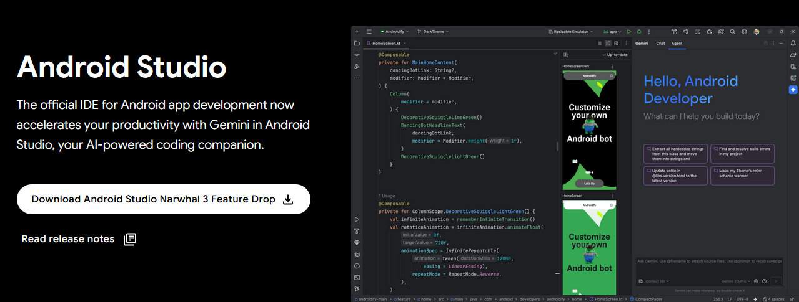

SDK szerkezet:

*   `build-tools`: Fordítást segítő eszközök API szintenkét: AIDL, AAPT2, stb.
*   `emulator`: Az Android emulátor fájljainak helye. 
*   `extras`: Különböző extra szoftverek helye. Maven repository, support libes anyagok, analytics SDK, Google [Android USB driver](https://developer.android.com/studio/run/win-usb.html) (amennyiben SDK managerrel ezt is letöltöttük) stb.
*   `platform-tools`: Fastboot és ADB binárisok helye (legtöbbet használt eszközök).
*   `platforms`, `sources`, `system-images`: Minden API levelhez külön almappában a platform anyagok, források, OS image-ek
*   `tools`: Fordítást és tesztelést segítő eszközök, SDK manager, stb.

## A fejlesztőkörnyezet

Most, hogy tisztában vagyunk a projekt szerkezetével, a fordítás menetével és az SDK elemeivel, ismerkedjünk meg az Android Studioval és annak számunkra hasznos funkcióival!

Android fejlesztésre a labor során a JetBrains IntelliJ alapjain nyugvó Android Studio-t fogjuk használni.

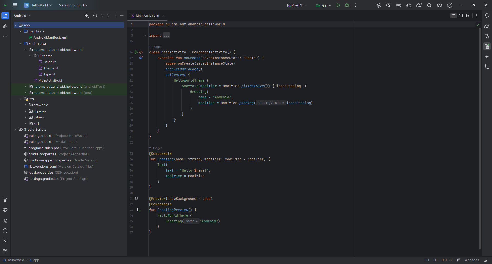

### Fő panelek

#### Project Explorer

Új projekt létrehozásakor az Android Studio letölti a projekt függőségeit és elindul a build folyamat a Gradle segítségével. Ezidő alatt alapból a `Project` nézetben látjuk a mappastruktúrákat és fájlokat, ahogy a korábbi fejezetben is szemléltetve volt. Amint sikeresen lefutott a build, ez átvált egy barátságosabb, `Android` nézetre, ahol könnyebben elérjük a módosítandó fájlokat.

  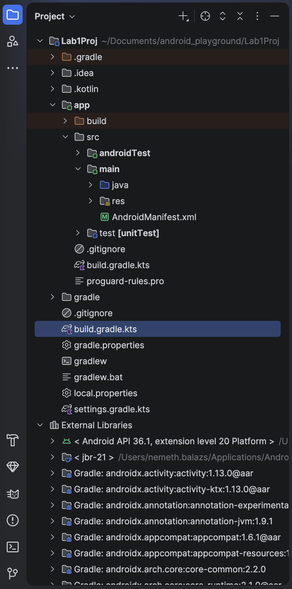
  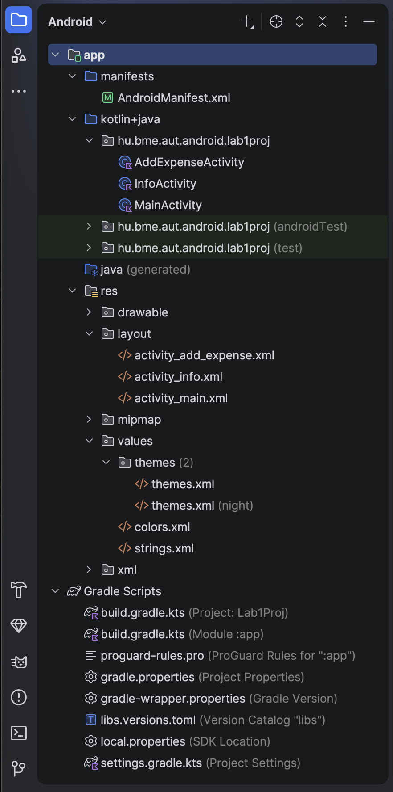

#### Resource Manager

Eggyel a Project Explorer ikonja alatt található ez a menü, ahol bármilyen erőforrásfájlt hozzá tudunk adni és testreszabni a projektünkhöz. Például az alkalmazásikon beállítása is innen végezhető el legegyszerűbben.

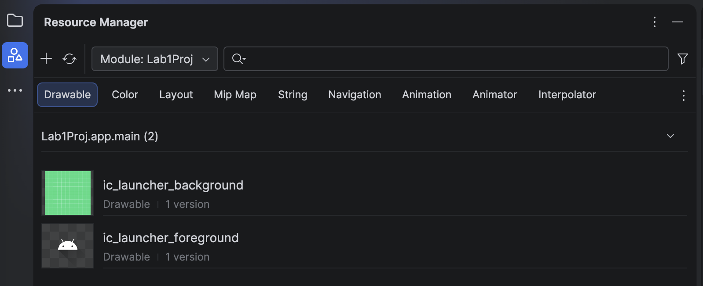

#### Device Manager

A képernyő jobb oldaláról érhető el. Itt tudunk hozzáadni, módosítani, elindítani, leállítani virtuális eszközöket (emulátorokat), amiken futtathatjuk a fejlesztés alatt álló alkalmazást.

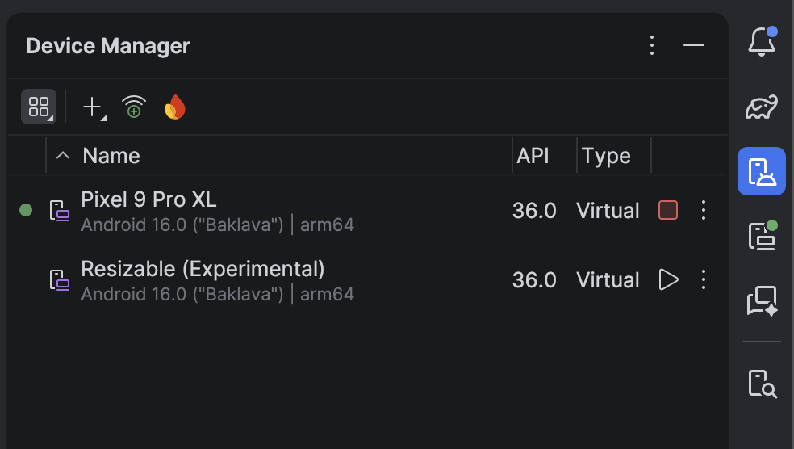

A fenti képen a létező virtuális eszközök listáját találjuk. Az *Add Device* ablakot a *Create Virtual Device* opcióval tudjuk megnyitni a jobb oldalon lévő `+` ikonra kattintás után. Itt néhány előre elkészített sablon áll rendelkezésre. Magunk is készíthetünk ilyet, ha tipikusan egy adott eszközre szeretnénk fejleszteni (pl. Galaxy S24). Lásd: [Emulátor létrehozása](/demo/ide/#emulator).

#### SDK manager

Az SDK kezelésére az SDK managert használjuk, ezzel lehet letölteni és frissen tartani az eszközeinket. Indítása az Android Studion keresztül lehetséges.

Az SDK Manager elérhető a `Tools -> SDK Manager` menüpontból.

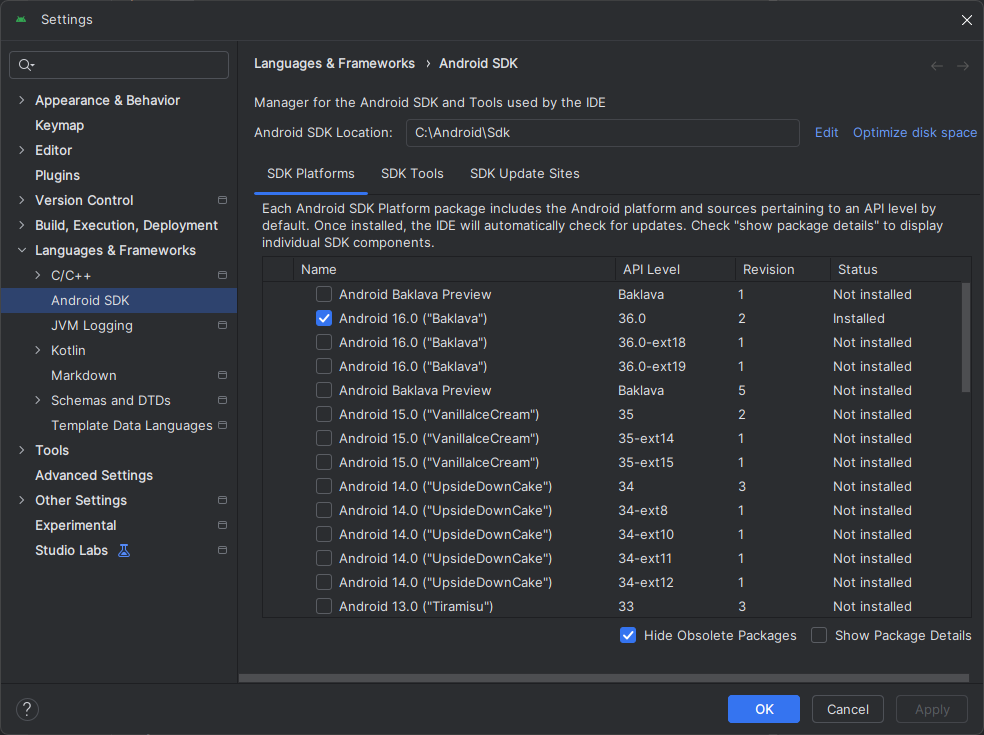

!!! note "Megjegyzés"
	Korábban létezett egy standalone SDK manager de ennek használata mára deprecated lett. Ha online forrásokban ilyet látunk ne lepődjünk meg.

### Emulátor

Készítsünk új emulátort! (Mi a különbség az emulátor és a (például iOS fejlesztéshez használt) szimulátor között?) Értelemszerűen csak olyan API szintű eszközt készíthetünk, amilyenek rendelkezésre állnak az SDK manageren keresztül.

1. A jobb oldali panelon kattintsunk a fent található *Create Virtual Device...* gombra!
1. Válasszunk az előre definiált készülék sablonokból (pl. *Pixel 9 Pro*), majd nyomjuk meg a *Next* gombot.
1. Az eszköz konfigurációja:
	- A virtuális eszköz neve legyen például `Labor_emu`.
	- Döntsük el, hogy milyen Android verziójú emulátort kívánunk használni, illetve, hogy milyen szolgáltatásokra van szükségünk. CPU/ABI alapvetően x86_64 legyen, mivel ezekhez kaphatunk [hardveres gyorsítást](https://developer.android.com/studio/run/emulator-acceleration) is. Itt válasszunk a rendelkezésre állók közül egyet, majd *Next*.
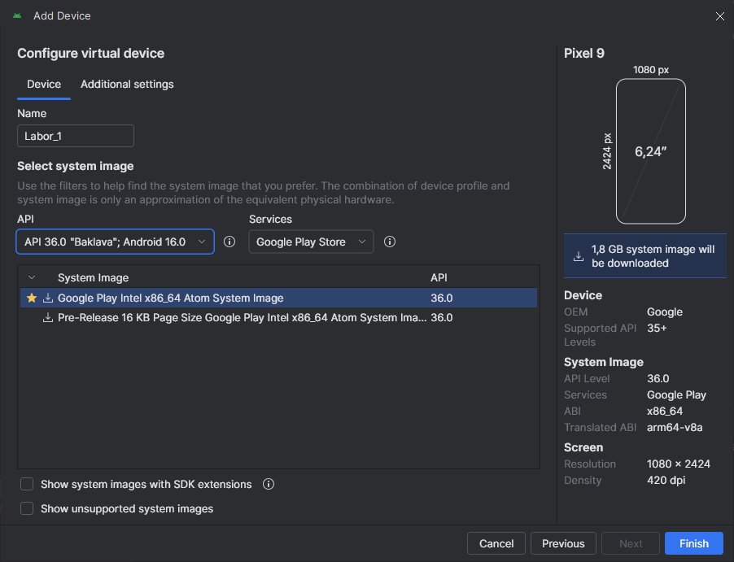
1. Az *Additional settings* fül alatt alatt további opciókat találunk:
	- Tetszés szerint kapcsoljuk ki vagy be a készülék keretének megjelenítését.
	- Kamera opciók:
        - *WebcamX*, hardveres kamera, ami a számítógépre van csatlakoztatva
        - *Emulated*, egy egyszerű szoftveres megoldás, **most legalább az egyik kamera legyen ilyen**.
        - *VirtualScene*, egy kifinomultabb szoftveres megoldás, amelyben egy 3D világban mozgathatjuk a kamerát.
    - Hálózat: Állíthatjuk a sebességét és a késleltetését is kommunikációs technológiák szerint.
    - Válasszuk ki az alapértelmezett orientációt.
    - *Default boot*: Az Android emulátor állapotáról való pillanatkép elmentésének lehetősége. Ez azt takarja, hogy a virtuális operációs rendszer csak felfüggesztésre kerül az emulátor bezáráskor (például a megnyitott alkalmazás is megmarad, a teljes állapotával), és *Quick* esetben a teljes OS indítása helyett másodperceken belül elindul az emulált rendszer. *Cold* esetben viszont minden alkalommal leállítja és újra indítja a virtális eszköz teljes operációs rendszerét.
    - Belső és külső tárhely mérete, esetleg konkrét image beállítása a tárhely tartalmáról.
    - Teljesítmény:
	    - A használandó CPU magok száma.
	    - Grafikai gyorsítás típusa. (Hardveres gyorsítás csak a megfelelő driver esetén érhető el)     
        - VM heap: az alkalmazások virtuális gépének szól, maradhat az alapérték. Tudni kell, hogy készülékek esetében gyártónként változik.
        - A kívánt bináris *interface*.
    - Ha mindent rendben talál az ablak, akkor *Finish*!

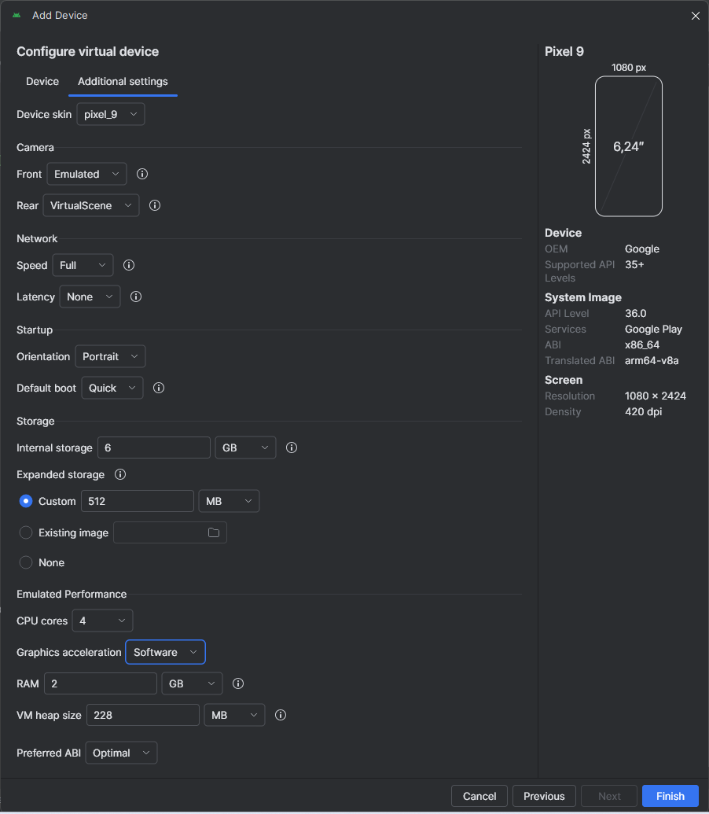

A Device Manager-ben megjelent az imént létrehozott eszközünk. Itt lehetőség van a korábban megadott paraméterek szerkesztésére, külső eszköz csatlakoztatására, a "készülékről" a felhasználói adatok törlésére (*Wipe Data* - Teljes visszaállítás), illetve az emulátor példány duplikálására vagy törlésére.

A Play gombbal indítsuk el az új emulátort!

!!! danger "Emulátor problémák"
	Amennyiben az emulátor nem indulna el, ellenőrizzük az alábbi tippeket:

    * Van-e elég hely (minimum 15-20 GB) a meghajtón?
    * Legfrisebb-e az Android Studio és az sdk?
    * SDK manager > sdk tools: legrisebb-e az android emulator?
    * Nincs-e az Android Studio vagy az sdk telepítési útjában szóköz, ékezetes betű vagy különleges karakter?
    * Próbáltál-e más API-t, Play Store-ral, a nélkül?
    * Virtualizáció be van-e kapcsolva/engedélyezve van-e a gépen?
    * Grafikai gyorsítás típusát próbáljuk meg átállítani.

Az elindított emulátoron próbáljunk ki néhány előre telepítétt alkalmazást!

!!! note "Megjegyzés"
	A gyári emulátoron kívül több alternatíva is létezik, mint pl. a [Genymotion](https://www.genymotion.com/fun-zone/) vagy a [BigNox](https://www.bignox.com/), viszont a Google féle emulátor a legelterjedtebb, így amennyiben ezzel nem jelentkeznek problémáink, maradjunk ennél.

Tesztelés céljából nagyon jól használható az emulátor, amely az alábbi képen látható plusz funkciókat is adja. Lehetőség van többek között egyedi hely beállítására, bejövő hívás szimulálására, virtuálisan szenzorok manipulálására, stb. A panelt a futó emulátor jobb oldalán található vezérlő gombok közül a *...* gombbal lehet megnyitni:

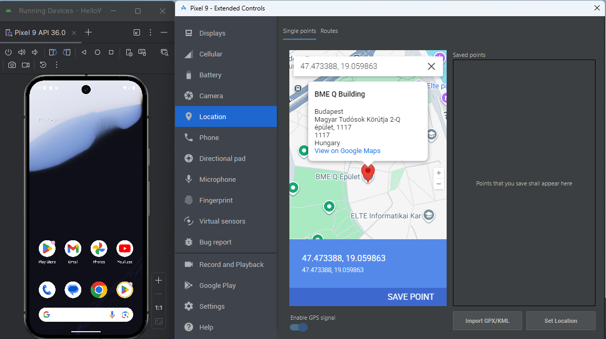

A futó emulátort a `Running Devices` menüből érjük el, ahol a fent található gombokkal el tudjuk forgatni, hangerőt állítani, a képernyőt elaltatni stb.

!!! note "Az emulátor erőforrásigénye"
    Az emulátor futtatásához jelenleg nem árt ha a gépünkben legalább 16GB memória van, de igazán kényelmesen >=32GB-on érzi magát. Ha úgy látjuk, hogy a gépünkön nyögvenyelősen fut az emulátor, akkor érdemes lehet saját eszközt használni helyette, amit [vezetékkel vagy vezeték nélkül is csatlakoztathatunk a fejlesztőkörnyezethez](https://developer.android.com/studio/run/device).

### Alkalmazás felügyeleti eszközök

Most, hogy van egy emulátorunk, amin futtatni tudjuk az appot, megnézzük milyen eszközök állnak rendelkezésre az app futásának diagnosztikájára.

#### Logcat

Ezt a felülelet gyakran fogjuk használni fejlesztéskor (vagy csak akaratunkon kívül találkozunk vele majd nem várt kivételek keletkezésekor az app futása közben...). 

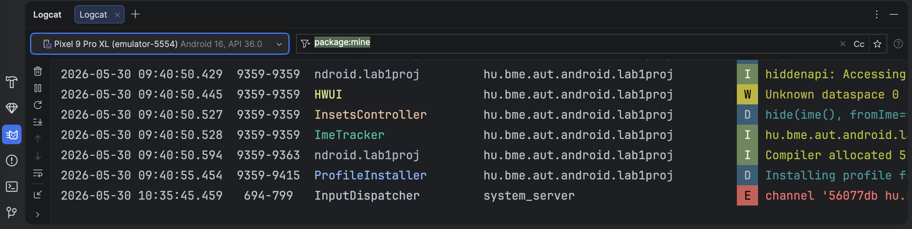

Mi magunk is tudunk logolni erre a felületre, erre különböző opciók állnak rendelkezésre, mivel Androidon több naplózási szint létezik. A teljesség igénye nélkül pár ilyen:

*   `Log.d`: leggyakrabban használt, DEBUG logoknak
*   `Log.e`: komolyabb hibák megjelenítésére, pirossal ki lesz emelve
*   `Log.i`: ha valamilyen információt akarunk megjeleníteni (pl. navigáció innen oda)
*   `Log.wtf`: hivatalos dokumentáció szerint: *What a Terrible Failure* :)))

#### Android Profiler

A készülék erőforráshasználata [monitorozható](https://developer.android.com/studio/profile/android-profiler) ezen a felületen, amelyet az említett `View -> Tool Windows`-ból érhetünk el.

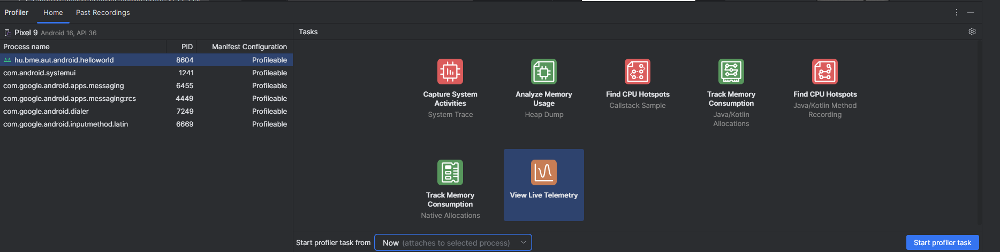

Például részletes információt kaphatunk a processzor és a memória használatáról:

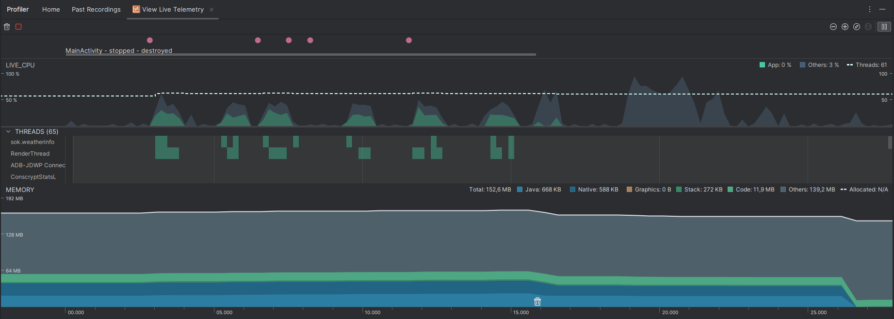

#### App Inspection

A készüléken debuggolt alkalmazásunk [hálózati forgalmát](https://developer.android.com/studio/debug/network-profiler) és [adatbázisát](https://developer.android.com/studio/inspect/database) is meg tudjuk tekinteni. (`View -> Tool Windows -> App Inspection`)

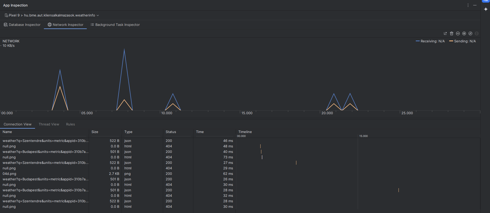

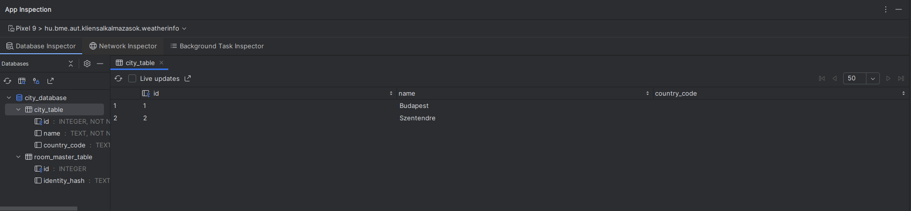

#### Device Explorer

A készüléken lévő fájlrendszert is [böngészhetjük](https://developer.android.com/studio/debug/device-file-explorer). (`View -> Tool Windows -> Device Explorer`)

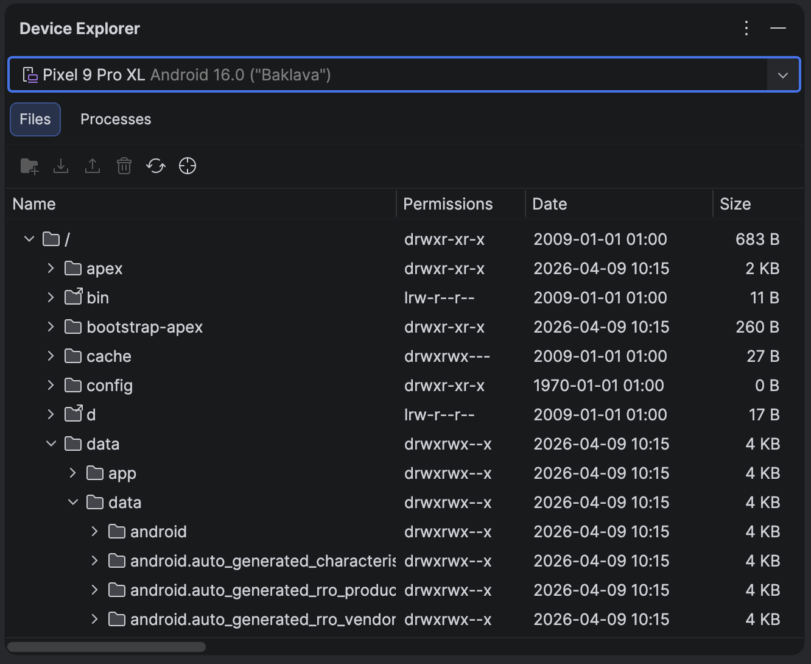

Ha olyan szituációba kerülünk, hogy az éppen fejlesztett alkalmazásunk adataihoz szeretnénk az eszközön hozzáférni (például az alkalmazásban használt adatbázistáblákat szeretnénk kimenteni), akkor ezeket mindig a `/data/data/[app_package_name]` elérési úton keressük.

### Hasznos funkciók az IDE-ben

Számtalan lehetőséget támogat az Android Studio a fejlesztés egyszerűbbé tétele érdekében. A jegyzet további részében a szerintünk legfontosabbakat gyűjtöttük össze.

*   IntelliSense, fejlett refaktorálás támogatás.
*   Ha egy sorban színre, vagy képi erőforrásra hivatkozunk, a sor elejére kitesz egy miniatűr változatot.
*   Ha közvetve hivatkozott erőforrást (akár `resources.get...`, akár `R...`) adunk meg, összecsukja a hivatkozást és a tényleges értéket mutatja. Ha rávisszük az egeret felfedi, ha kattintunk kibontja a hivatkozást.
*   Névtelen belső osztályokkal is hasonlót tud, javítva a kód olvashatóságát.
*   Kódkiegészítésnél szabad a kereső, a szótöredéket keresi, nem pedig a szóval kezdődő lehetőségeket (lásd képen).
*   Változónév ajánlás: amikor változónévre van szükségünk, nyomjunk *Ctrl+Space*-t. Ha adottak a körülmények, a Studio egész jó neveket tud felajánlani.
*   Szigorú lint. A Studio megengedi a warningot. Ezért szigorúbb a lint, több mindenre figyelmeztet (olyan apróságra is, hogy egy View egyik oldalán van padding, a másikon nincs)
*   Layout szerkesztés. A grafikus layout építés lehetséges.
*   CTRL-t lenyomva navigálhatunk a kódban, pl. osztályra, metódushívásra kattintva. Ezt a navigációt (és az egyszerű másik osztályba kattintást is) rögzíti, és a historyban előre-hátra gombokkal lehet lépkedni. Ha van az egerünkön/billentyűzetünkön ilyen gomb, és netes böngészés közben aktívan használjuk, ezt a funkciót nagyon hasznosnak fogjuk találni.
*   Ha több fájl is meg van nyitva egyszerre, könnyen navigálhatunk az <kbd>ALT</kbd> + <kbd>BAL</kbd>/<kbd>JOBB</kbd> nyilak segítségével az fájlok között.

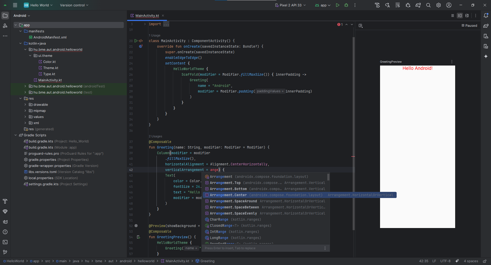

#### Billentyűkombinációk

*   <kbd>CTRL</kbd> + <kbd>ALT</kbd> + <kbd>L</kbd>: Kódformázás
*   <kbd>CTRL</kbd> + <kbd>SPACE</kbd>: Kódkiegészítés
*   <kbd>SHIFT</kbd> + <kbd>F6</kbd> Átnevezés (Mindenhol)
*   <kbd>F2</kbd>: A következő error-ra ugrik. Ha nincs error, akkor warningra.
*   <kbd>CTRL</kbd> + <kbd>Z</kbd> illetve <kbd>CTRL</kbd> + <kbd>SHIFT</kbd> + <kbd>Z</kbd>: Visszavonás és Mégis
*   <kbd>CTRL</kbd> + <kbd>P</kbd>: Paraméterek mutatása
*   <kbd>ALT</kbd> + <kbd>INSERT</kbd>: Metódus generálása
*   <kbd>CTRL</kbd> + <kbd>O</kbd>: Metódus felüldefiniálása
*   <kbd>CTRL</kbd> + <kbd>F9</kbd>: Fordítás
*   <kbd>SHIFT</kbd> + <kbd>F10</kbd>: Fordítás és futtatás
*   <kbd>SHIFT</kbd> <kbd>SHIFT</kbd>: **Keresés mindenhol**
*   <kbd>CTRL</kbd> + <kbd>N</kbd>: Keresés osztályokban
*   <kbd>CTRL</kbd> + <kbd>SHIFT</kbd> + <kbd>N</kbd>: Keresés fájlokban
*   <kbd>CTRL</kbd> + <kbd>ALT</kbd> + <kbd>SHIFT</kbd> + <kbd>N</kbd>: Keresés szimbólumokban (például függvények, property-k)
*   <kbd>CTRL</kbd> + <kbd>SHIFT</kbd> + <kbd>A</kbd>: Keresés a beállításokban, kiadható parancsokban.
*   <kbd>ALT</kbd> + <kbd>ENTER</kbd> **Hiányzó elemek importálása/létrehozása.**

[További billentyűkombinációk](https://developer.android.com/studio/intro/keyboard-shortcuts).
!!!tip "Keresés"
    Hogy ha bármikor szükségünk van valamire, de esetleg nem találnánk a menüpontok között, akkor a dupla Shift lenyomásával (<kbd>Shift</kbd>+<kbd>Shift</kbd>) kereshetünk az Android Studioban (illetve más JetBrains IDE-kben). Próbáljuk is ki és keressünk rá a "Device Manager" opcióra.

#### Hasznos beállítások

Állítsuk be a következő hasznos funkciókat:

*   **Auto importok bekapcsolása** (`Settings -> Editor -> General -> Add unambigous import on the fly`)
*   Kis- nagybetű érzékenység kikapcsolása a kódkiegészítőben (settingsben keresés: *Match case*)
*   "Laptop mód" ki- és bekapcsolása (`File -> Power Save Mode`)
*   Sorszámozás bekapcsolása (kód melletti részen bal oldalt: jobb egérgomb, `Appearance -> Show Line Numbers`)

Lehetőség van felosztani a szerkesztőablakot, ehhez kattinsunk egy megnyitott fájl tabfülére jobb gombbal, *Split Right/Down* vagy csak kattintsunk rá hosszan és kezdjük el húzni a kódfelületre!

#### Rainbow Brackets plugin

A `Settings -> Plugins` menüben keressünk rá a *Marketplace*-en és telepítsük a **Rainbow Brackets** plugint. Az IDE újraindítása után aktiválódik is. Főleg *Composable függvények* olvashatóságát javítja azáltal, hogy kiszínezi a zárójeleket, így nem fogunk elveszni a többszörösen egymásba ágyazott UI-elemek és lambda függvények rengetegében.