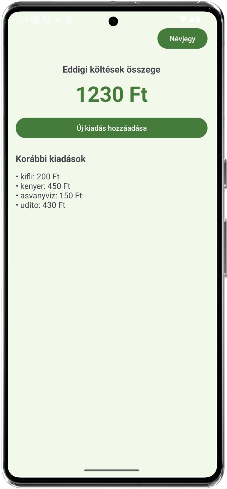
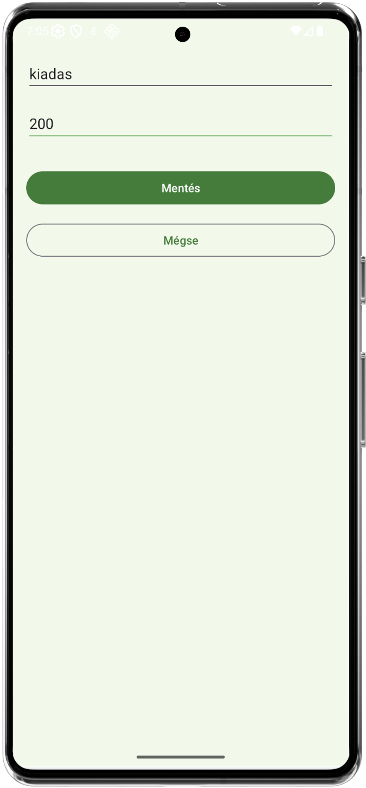
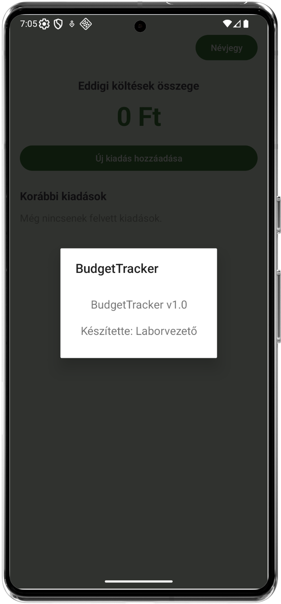
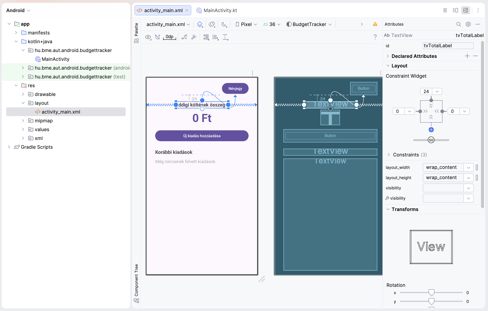

# Labor01 - XML alapok, több Activity

A különböző bankok alkalmazásaiban lehetőségünk van havi bontásban megtekinteni az aktuális kiadásainkat, bevételeinket, illetve azoknak összegét. Sőt, a kiadásaink még kategóriákba is rendezhetőek, így viszonylag tiszta képet kapunk arról, mire is költöttük a pénzünket az elmúlt időszakban. Innentől fogva könnyen meghatározhatjuk azt is, mi az, amire túl sokat költünk, így több szempontból is hasznot húzhatunk az alkalamazásból. 

De mi történik, ha készpénzzel fizetünk valahol, azt hol lehetne rögzíteni, és összevonni a kártyás fizetésekkel? Ezenkívül kedvező lenne, ha beállíthatnánk határokat is az egyes költési kategóriákra, és valahol jelezve lenne, ha azt átlépjük, így ezt sem nekünk kell fejben tartanunk.

## A labor célkitűzése

Látható, hogy egy ilyen egyszerű pénztárca alkalmazásban is mennyi lehetőség rejlik funkciók tekintetében. Az első 3 laboralkalom célja, hogy egy ilyen alkalmazás elkészítésén keresztül vezessen be az `XML Layout`-okon alapuló Android fejlesztés világába.

Ezen az első laboralkalmon belevágunk egy költségkezelő alkalmazás fejlesztésébe. A labor során a következő koncepciókkal ismerkedünk meg:

*   Activity-k létrehozása, azok típusainak megismerése
*   Activity-k közti navigáció Intentek segítségével
*   Alapvető UI komponensek Androidon
*   XML layout-ok tervezése és felépítése a Designer használatával és kódból
*   A ViewBinding jelentősége

A labor végére lesz egy kezdetleges appunk, amelyben rögzíthetjük a kiadásainkat, és láthatjuk azoknak az összegét. Továbbá felsorolásszerűen megjelenítjük az egyes tételeket is a képernyőn. A következő laboron majd ezt fejlesztjük tovább.

<div style="display: flex; align-items: center;">
  
  
  
</div>

## A kezdeti koncepció

A fenti képek szemléltetik az első elképzeléseinket egy ilyen appról. Első megközelítésben:

*   legyünk képesek rögzíteni az egyes kiadásainkat
*   látni ezeknek összegét a főképernyőn
*   illetve felsorolásszerűen magukat a tételeket is. 

Egyelőre ezeket nem kötjük semmilyen dátumhoz vagy kategóriához, csak legyen valami kiindulópontunk.

*   Legyen egy főképernyő, ahol láthatjuk a tételeket és az összeget
*   Egy gombbal pedig mehessünk át egy másik képernyőre, ahol rögzíthetjük a tétel nevét és összegét
*   Poénból tegyünk bele egy névjegy menüt is, így ha más emberek is elkezdik az appot, akkor tudni fogják, hogy mi készítettük.

## A megvalósítás

Az app felépítése nagy vonalakban:

*   Minden képernyőhöz egy Activity-t rendelünk.
*   A képernyők közti navigáció így az Activity-k közti navigáció lesz.
*   Minden Activity-hez tartozni fog Kotlin kód és egy XML alapú layout leíró, amely meghatározza a felhasználói felület elemeit.
*   Az egyes rögzített tételek adatait az Activity-k között átküldjük felvételkor, így fogjuk tudni a főképernyőn megjeleníteni a hozzáadott tételeket.

## A projekt létrehozása

A projektet ezen a laboron nulláról építjük fel. Nyissuk meg az Android Studio-t, majd nyomjunk a `New project` gombra. A megjelenő menüből válasszuk az `Empty Views Activity` lehetőséget. Ezzel létrehozunk egy 1db Activity-t tartalmazó projektet, amely a View rendszer elemeit fogja támogatni (XML layoutok). 

A projekt konfigurációjánál adjuk meg a következőket:

-   Name: `BudgetTracker`
-   Package: `hu.bme.aut.android.budgettracker`
-   Save location: `saját_mappa/BudgetTracker`
-   Language: `Kotlin`
-   Minimum SDK: `API 24`
-   Build configuration language: `Kotlin DSL (build.gradle.kts)`

Beszéljük át a laborvezetővel, hogy a fent látható konfigurációban melyik elemnek mi a jelentősége! A projekt létrejötte és a kezdeti build lefutása után nézzük át a laborvezetővel milyen projektfájlok vannak!

## Főképernyő felületének kialakítása

Láthatjuk, hogy a létrejött projektben az `app -> kotlin+java -> saját_package`-ben elérhető a `MainActivity.kt`, azaz az egyetlen Activity a projektben. De ő nem csak úgy magában él, hanem együtt jár vele egy XML alapú layout leíró fájl, az `app -> res -> layout` mappában lévő `activity_main.xml`. Ezek alkotják a fő Activity kódját (működésének leírását), és a felületét alkotó hierarchiát.

Vágjunk is bele a főképernyő felületének létrehozásába a laborvezetővel közösen, a Designer segítségével! A layout fájl megnyitásával a Designer menüben pakoljuk össze a szükséges elemeket és állítsuk be a megfelelő *constraint*-eket és *padding*-eket, hogy az első képernyő tartalmát kapjuk!

Ezután beszéljük át a laborvezetővel, hogyan valósulnak meg ezek kód szintjén!



??? note "A kód, ha nem lenne rá idő"

    ```xml
    <?xml version="1.0" encoding="utf-8"?>
        <androidx.constraintlayout.widget.ConstraintLayout
            xmlns:android="http://schemas.android.com/apk/res/android"
            xmlns:app="http://schemas.android.com/apk/res-auto"
            android:id="@+id/main"
            android:layout_width="match_parent"
            android:layout_height="match_parent"
            android:padding="16dp"
            android:fitsSystemWindows="true">

            <Button
                android:id="@+id/btnInfo"
                android:layout_width="wrap_content"
                android:layout_height="wrap_content"
                android:layout_marginEnd="16dp"
                android:text="Névjegy"
                app:layout_constraintEnd_toEndOf="parent"
                app:layout_constraintTop_toTopOf="parent" />

            <TextView
                android:id="@+id/tvTotalLabel"
                android:layout_width="wrap_content"
                android:layout_height="wrap_content"
                android:layout_marginTop="24dp"
                android:text="Eddigi költések összege"
                android:textSize="18sp"
                android:textStyle="bold"
                app:layout_constraintTop_toBottomOf="@id/btnInfo"
                app:layout_constraintStart_toStartOf="parent"
                app:layout_constraintEnd_toEndOf="parent" />

            <TextView
                android:id="@+id/tvTotalSum"
                android:layout_width="wrap_content"
                android:layout_height="wrap_content"
                android:layout_marginTop="8dp"
                android:text="0 Ft"
                android:textSize="42sp"
                android:textStyle="bold"
                android:textColor="?attr/colorPrimary"
                app:layout_constraintEnd_toEndOf="parent"
                app:layout_constraintStart_toStartOf="parent"
                app:layout_constraintTop_toBottomOf="@id/tvTotalLabel" />

            <Button
                android:id="@+id/btnAddExpense"
                android:layout_width="0dp"
                android:layout_height="wrap_content"
                android:layout_marginStart="16dp"
                android:layout_marginTop="16dp"
                android:layout_marginEnd="16dp"
                android:text="Új kiadás hozzáadása"
                app:layout_constraintEnd_toEndOf="parent"
                app:layout_constraintStart_toStartOf="parent"
                app:layout_constraintTop_toBottomOf="@id/tvTotalSum" />

            <TextView
                android:id="@+id/tvExpensesTitle"
                android:layout_width="0dp"
                android:layout_height="wrap_content"
                android:layout_marginStart="16dp"
                android:layout_marginTop="24dp"
                android:layout_marginEnd="16dp"
                android:text="Korábbi kiadások"
                android:textSize="18sp"
                android:textStyle="bold"
                app:layout_constraintEnd_toEndOf="parent"
                app:layout_constraintStart_toStartOf="parent"
                app:layout_constraintTop_toBottomOf="@id/btnAddExpense" />

            <TextView
                android:id="@+id/tvExpensesList"
                android:layout_width="0dp"
                android:layout_height="0dp"
                android:layout_marginStart="16dp"
                android:layout_marginTop="12dp"
                android:layout_marginEnd="16dp"
                android:hint="Még nincsenek felvett kiadások."
                android:text=""
                android:textSize="16sp"
                app:layout_constraintBottom_toBottomOf="parent"
                app:layout_constraintEnd_toEndOf="parent"
                app:layout_constraintStart_toStartOf="parent"
                app:layout_constraintTop_toBottomOf="@id/tvExpensesTitle" />

        </androidx.constraintlayout.widget.ConstraintLayout>
    ```

## A UI elemek programozása, ViewBinding bevezetése

Most, hogy készen van a statikus XML layout leírónk, foglalkozhatunk az abban lévő elemek programozásával, például beállíthatjuk, mi történjen az egyes gombok megnyomásakor. Na de felvetül a kérdés, vajon hogyan hivatkozhatunk a Kotlin kódból ezekre az elemekre?

Láthatjuk, hogy a `MainActivity` kódjában az *onCreate* függvényben az `R` objektumon keresztül beállítjuk az imént létrehozott layout leírónkat, mint ContentView (R-en keresztül érjük el, hiszen a projektben a layout leíró is egy erőforrás). Illetve a gyökérnézetnek a *ConstraintLayout*-unkat állítjuk be az *AppCompatActivity* osztály `findViewById` függvényének segítségével:

```kotlin
setContentView(R.layout.activity_main)
ViewCompat.setOnApplyWindowInsetsListener(findViewById(R.id.main)) { v, insets ->
    ...
}
```

Az ebben lévő elemekre, így pl. a gombokra is hasonlóan hivatkozhatnánk, például a névjegy gombjára így állítanánk be egy eseménykezelőt:

```kotlin
val infoButton = findViewById<Button>(R.id.btnInfo)
infoButton.setOnClickListener { ... }
```

Ez első ránézésre nem is tűnik olyan vészesnek, de azért felvillan bennünk egy kis piros jelzés, hogy ez lehet nem annyira kényelmes. Nézzük miből áll ez a hivatkozás:

*   A findViewById-nak meg kell adnunk, hogy milyen típust várunk el tőle, különben nem (vagy nem várt módon) fog működni a kódunk. Ezt egyébként ebben a még csúnyább cast-olós formában is megtehetjük: `val infoButton = findViewById(R.id.btnInfo) as Button`
*   Mindig az `R` objektumon keresztül hivatkozzuk az elérni kívánt elem ID-ját.

Mi történik, ha átnevezzük az egyik ID-t a layout-ban? Mi történik ha véletlenül rossz típusra castolunk és nem egyértelmű a hiba fejlesztés során? Mi történik ha szimplán nem létező ID-t adunk meg?

Láthatjuk, hogy a `findViewById` használata nem feltétlenül a legtisztább megoldás a UI elemek elérésére és sejthetjük, hogy a korábban felsorolt problémákra találtak már jó megoldást. És ez így is van, ezt a feature-t hívják `ViewBinding`-nak. A `ViewBinding` bevezetése a projektbe megoldást ad a fent felsorolt problémáinkra. Lássuk is, hogy hogyan kell ezt használni és miért jobb, mint az egyes elemek keresgélése ID alapján!

### Lépések a ViewBinding engedélyezéséhez

**Első lépés:** Engedélyezzük a modulszintű `build.gradle.kts` fájlban az alábbi kóddal az *android* blokkon belül, majd nyomjunk egy *Sync now*-t:

```kotlin
buildFeatures {
    viewBinding = true
}
```

**Második lépés:** Vegyünk fel a `MainActivity`-ben az *onCreate* előtt egy *ActivityMainBinding* típusú változót:

```kotlin
private lateinit var binding: ActivityMainBinding
```

!!! info "lateinit"
    A lateinit kulcsszóval megjelölt property-ket a fordító megengedi inicializálatlanul hagyni az osztály konstruktorának lefutása utánig, anélkül, hogy nullable-ként kéne azokat megjelölnünk (ami később kényelmetlenné tenné a használatukat, mert mindig ellenőriznünk kéne, hogy null-e az értékük). Ez praktikus olyan esetekben, amikor egy osztály inicializálása nem a konstruktorában történik (például ahogy az Activity-k esetében az onCreate-ben), mert később az esetleges null eset lekezelése nélkül használhatjuk majd a property-t. A lateinit használatával átvállaljuk a felelősséget a fordítótól, hogy a property-t az első használata előtt inicializálni fogjuk - ellenkező esetben kivételt kapunk.

**Harmadik lépés:** Töröljük a `ViewCompat`-on történő függvényhíváshoz tartozó összes sort a `binding` objektum inicializálásával, illetve írjuk át a *setContentView* hívás paraméterét is (az *enableEdgeToEdge()* hívást is kiszedhetjük):

```kotlin 
binding = ActivityMainBinding.inflate(layoutInflater)
setContentView(binding.root)
```

Innentől fogva egyszerűen ezen a `binding` objektumon keresztül érjük el a layout-ban definiált elemeket (és csak azokat). De honnan jött ez az *ActivityMainBinding* típus? A *ViewBinding* bekapcsolása által minden Activity-nk layout leírójához automatikusan generálódik egy ilyen szemléletes elnevezésű osztály, amiben definiálva vannak a UI elemeink, emiatt nincsen már szükség a keresgélésükre.

!!! info
    Észrevehetjük, hogy így már a *ConstraintLayout*-nak nincs is szüksége ID-ra, szimplán *root*-ként hivatkozható a *setContentView*-ban. Ezenkívül minden korábbi problémánk is megoldódott, és a kódunk is tisztább lett, nincsen szükség plusz castolásokra sem.

Mielőtt még beállítanánk, hogy gombnyomásra hogyan menjünk át egy másik képernyőre, ahol hozzá tudunk adni egy tételt, készítsük is el azt a képernyőt egy újabb Activity formájában.

## Kiadások rögzítése

A gyökér package-ünkön jobb klikk után `New -> Activity -> Empty Views Activity` opciót választva adjunk hozzá egy új Activity-t a projekthez, melynek neve legyen `AddExpenseActivity`. A *Generate a Layout file* opció legyen bepipálva, minden mást hagyjunk ahogy van.

Ezzel létrejött egy új Kotlin fájl és egy XML layout leíró is. A Designer felületet használva vagy kódolva készítsük el ennek a képernyőnek is a felületét, azaz adjunk hozzá 2 szövegmezőt a tétel nevének és értékének beviteléhez, alájuk pedig 2 gombot a mentés vagy a visszalépés műveletéhez.

??? note "A kód, ha nem lenne kedv vagy idő"
    ```xml 
    <?xml version="1.0" encoding="utf-8"?>
    <androidx.constraintlayout.widget.ConstraintLayout
        xmlns:android="http://schemas.android.com/apk/res/android"
        xmlns:app="http://schemas.android.com/apk/res-auto"
        android:layout_width="match_parent"
        android:layout_height="match_parent"
        android:padding="16dp"
        android:fitsSystemWindows="true">

        <com.google.android.material.textfield.TextInputEditText
            android:id="@+id/etExpenseName"
            android:layout_width="match_parent"
            android:layout_height="wrap_content"
            android:layout_marginStart="16dp"
            android:layout_marginTop="16dp"
            android:layout_marginEnd="16dp"
            android:hint="Kiadás megnevezése (pl. Kávé)"
            app:layout_constraintEnd_toEndOf="parent"
            app:layout_constraintStart_toStartOf="parent"
            app:layout_constraintTop_toTopOf="parent" />

        <com.google.android.material.textfield.TextInputEditText
            android:id="@+id/etExpenseAmount"
            android:layout_width="match_parent"
            android:layout_height="wrap_content"
            android:layout_marginStart="16dp"
            android:layout_marginTop="16dp"
            android:layout_marginEnd="16dp"
            android:hint="Összeg (Ft)"
            android:inputType="number"
            app:layout_constraintEnd_toEndOf="parent"
            app:layout_constraintStart_toStartOf="parent"
            app:layout_constraintTop_toBottomOf="@+id/etExpenseName" />

        <Button
            android:id="@+id/btnSave"
            android:layout_width="match_parent"
            android:layout_height="wrap_content"
            android:layout_marginStart="16dp"
            android:layout_marginTop="32dp"
            android:layout_marginEnd="16dp"
            android:text="Mentés"
            app:layout_constraintEnd_toEndOf="parent"
            app:layout_constraintStart_toStartOf="parent"
            app:layout_constraintTop_toBottomOf="@+id/etExpenseAmount" />

        <Button
            android:id="@+id/btnCancel"
            style="@style/Widget.Material3.Button.OutlinedButton"
            android:layout_width="match_parent"
            android:layout_height="wrap_content"
            android:layout_marginStart="16dp"
            android:layout_marginTop="16dp"
            android:layout_marginEnd="16dp"
            android:text="Mégse"
            app:layout_constraintEnd_toEndOf="parent"
            app:layout_constraintStart_toStartOf="parent"
            app:layout_constraintTop_toBottomOf="@+id/btnSave" />

    </androidx.constraintlayout.widget.ConstraintLayout>
    ```

!!! warning "Stringek a kódban"
    Nem valami szép, hogy a gombokon vagy szövegmezőkön megjelenő szövegeket a programkódban tároljuk, legyen ez akár XML vagy Kotlin kód. Sokkal praktikusabb ezeket a szövegeket erőforrásfájlokba  kiszervezni és azonosítókkal ellátni. Ezeket az erőforrásokat aztán elláthatjuk minősítőkkel a nyelvre vonatkozóan, így elegáns módon lekezelhetjük az alkalmazás többnyelvűségének támogatását, mert a programkódot függetlenítjük a konkrét szövegek értékeitől. Szervezzük is ki a stringeket a values mappában található `strings.xml` fájlba egy gombnyomással az Android Studio által felajánlott menüben (vigyük a kurzort az adott string fölé és válasszuk az *Extract string resource* opciót)!

Vezessük be ebben az Activity-ben is a *ViewBinding* használatát, majd oldjuk meg, hogy valahogyan értesítsük a felhasználót, ha el akarja menteni a kiadást, de nem töltött ki egy szükséges mezőt! Ezt egy ún. `Toast message` segítségével tesszük meg, melynek nagyon egyszerű a használata.

A mentés gombnak állítsunk be egy eseménykezelőt az *onCreate*-en belül, amelyben leellenőrizzük, hogy üresek-e a mezők, és ha bármelyik az, akkor megjelenítünk egy üzenetet! A laborvezetővel beszéljük meg ennek a működését!

```kotlin
binding.btnSave.setOnClickListener {
    val name = binding.etExpenseName.text.toString()
    val amount = binding.etExpenseAmount.text.toString()

    if (name.isEmpty() || amount.isEmpty()) {
        Toast.makeText(this, "Kérlek töltsd ki mindkét mezőt!", Toast.LENGTH_SHORT).show()
        return@setOnClickListener
    }
}
```

Ezután gondolkodjunk el azon, hogy hogyan juttathatnánk át az ezen a képernyőn megadott értékeket a főképernyőnek!

### Navigáció és adatáramlás az Activity-k között

Pontosan erre a feladatra lesznek jók nekünk az ún. `Intent`-ek, melyekkel elindíthatunk új Activity-ket és adatokat is mozgathatunk köztük kulcs-érték párok formájában. A terv a következő:

1. A főképernyőről gombnyomásra elindítjuk a most elkészített Activity-t, de úgy, hogy számítunk tőle egy `ActivityResult` objektumra, amelyben majd a megfelelő időpontban (a mentés gomb megnyomásakor) átpasszolja nekünk az ott rögzített adatokat egy *Intent* formájában.
2. A hozzáadásért felelős Activity-ben a mezők validációja után becsomagoljuk a bennük tárolt adatokat egy *Intent*-be, amivel visszatérhetünk az őt elindító Activity számára. Ezután megsemmisítjük ezt az Activity-t hiszen nem lesz már rá szükségünk, visszakerülünk a főképernyőre.
3. Itt az *Intent*-ből kinyerjük az adatokat, és megváltoztatjuk a felhasználónak mutatott értékeket.

**Lássuk ennek a megvalósítását lépésről lépésre:**

A `MainActivity`-ben vegyünk fel egy privát segédfüggvényt az eredménnyel visszatérő Activity indításához, melyben majd lekezeljük hamarosan a kapott eredményt:

```kotlin
private val startAddExpenseActivity = registerForActivityResult(
    ActivityResultContracts.StartActivityForResult()
) { result -> ... }
```

Emellett vegyünk fel egy tagváltozót, amelyben a növelendő összeg értékét tároljuk:

```kotlin
private var totalSum: Int = 0
```

Ezután állítsuk is be az *Új kiadás hozzáadása* gomb eseménykezelőjét az *onCreate* metódusban, hogy a függvényt felhasználva indítsa el a felvételért felelős Activity-t:

```kotlin
binding.btnAddExpense.setOnClickListener {
    val intent = Intent(this, AddExpenseActivity::class.java)
    startAddExpenseActivity.launch(intent)
}
```

Menjünk át az `AddExpenseActivity` kódjára, és a korábban létrehozott eseménykezelőben a validálás után hozzuk létre az adatokat eltároló *Intent*-et, majd szüntessük meg az Activity-t. Ezáltal visszakerülünk a korábbi képernyőre de már az adatokkal együtt.

```kotlin
val resultIntent = Intent().apply {
    putExtra("EXPENSE_NAME", name)
    putExtra("EXPENSE_AMOUNT", amount)
}

setResult(RESULT_OK, resultIntent)

Toast.makeText(this, "Mentve: $name", Toast.LENGTH_SHORT).show()
finish()
```

Beszéljük át ezt a kódot a laborvezetővel!

Utolsó lépésként pedig használjuk fel a kapott adatokat a `MainActivity`-ben definiált segédfüggvényben:

```kotlin
if (result.resultCode == RESULT_OK) {
    val data: Intent? = result.data
    val name = data?.getStringExtra("EXPENSE_NAME")
    val amountString = data?.getStringExtra("EXPENSE_AMOUNT")

    if (!name.isNullOrEmpty() && !amountString.isNullOrEmpty()) {

        val amount = amountString.toIntOrNull() ?: 0

        totalSum += amount
        binding.tvTotalSum.text = "$totalSum Ft"

        val currentText = binding.tvExpensesList.text.toString()
        val newEntry = "• $name: $amount Ft"

        binding.tvExpensesList.text = if (currentText.isEmpty()) {
            newEntry
        } else {
            "$currentText\n$newEntry"
        }
    }
}
```

Nézzük át ezt a kódot is részletesen a laborvezetővel, értelmezzük az egyes UI elemek értékeinek frissítéséhez használt kódsorokat!

Ha most build-eljük és futtatjuk az alkalmazást az emulátoron, akkor működni fog az elkészített funkció, vagyis az új kiadások felvehetők, az összeg növekszik, a lista pedig bővül a felvett elemekkel. Akad viszont még pár nem működő gomb, és a Névjegy megjelenítése is hiányzik.

## Önálló feladatok

### 1. Működjön a 'Mégse' gomb

Írd meg az `AddExpeseActivity`-n található 'Mégse' gomb eseménykezelőjét, amely annyit tesz, hogy adatok átadása nélkül visszajuttat a főképernyőre. Törekedj a minél egyszerűbb és ésszerűbb megoldásra! A beadásban indokold meg röviden, hogy miért célnak megfelelő az implementációd!

### 2. Működjön a 'Névjegy' gomb

Írd meg a 'Névjegy' gomb eseménykezelőjét! A gomb megnyomásakor a harmadik képen látható dialógusablak jelenjen meg, amely mindenképpen tartalmazza a NEPTUN kódodat! (Ne feledkezz meg a stringek helyéről a projektben!)

A beadásban írd le röviden, milyen lépéseket végeztél el a funkció implementálásához!

!!! info "Segítség"
    A dialógusablak bármilyen meglepő, szintén egy külön Activity lesz, melynek az `AndroidManifest.xml` fájlban a megfelelő helyen be kell állítanod, hogy dialógusablak formában jelenjen meg: `android:theme="@style/Theme.AppCompat.DayNight.Dialog"`

### 3. TopBar bevezetése

Furcsán hat egy kicsit, hogy bár szépen jobbra van igazítva, mégsem ez a megszokott módja Android alkalmazásokban egy app névjegy gomb megjelenítésének. Adj hozzá a főképernyőhöz egy TopBar-t, és a 'Névjegy' gombot cseréld le egy kis 'i' betűt tartalmazó gombra, melyre kattintva az történik, amit az előző feladatban beállítottál!


A beadásban írd le milyen fájl(oka)t módosítottál és hogyan, esetleg mit adtál hozzá még a projekthez!

!!! info "Segítség"
    A feladat megoldásához a [MaterialToolbar](https://developer.android.com/reference/com/google/android/material/appbar/MaterialToolbar) és az [ImageButton](https://developer.android.com/reference/android/widget/ImageButton) komponenseket használhatod például.

### 4. Alap app szín lecserélése

Nézz utána, hogyan tudod megváltoztatni az alapból beállított lila színt az alkalmazásban és változtasd meg olyanra, amilyen tetszik! Pl. mint ebben a laborleírásban a képeken. Mit kellett ehhez megváltoztatni?

Hogyan reagál az app, ha az emulátorban átváltasz sötét témára? Most is jól néz ki a beállított színekkel? Ha nem, akkor mit kellene megváltoztatni?

### 5. Egyedi app ikon

Állíts be az appnak egyedi ikont! Ezt legkönnyebben a *Resource Manager* menüben tudod megtenni a **+** jelet és az **Image Asset** opciót választva. Fedezd fel a rendelkezésre álló lehetőségeket és állíts be neked tetsző ikont az apphoz!

Mely fájl (vagy fájlok) módosult(ak) az ikon lecserélése által és a projekten belül hol?
