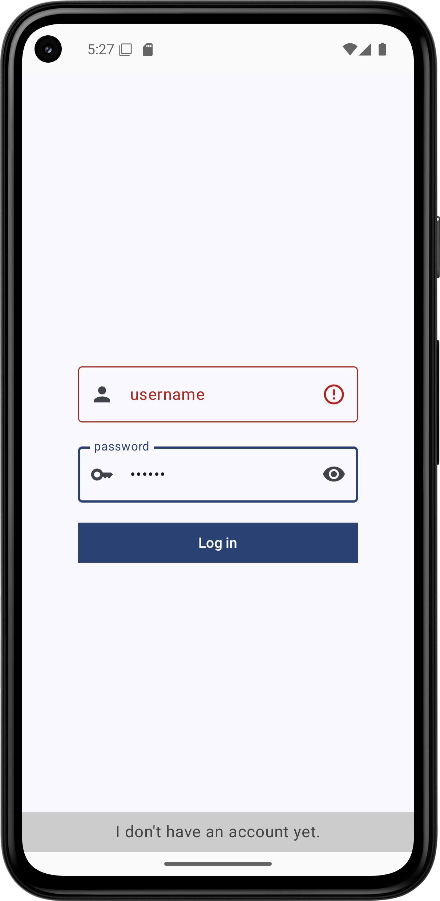
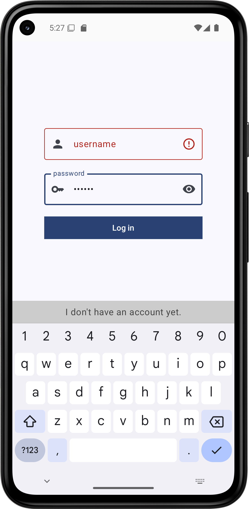

# Labor04 - Felhasználói felületek készítése a Jetpack Compose segítségével (ComposeBasics)

## Bevezetés

A labor célja a Jetpack Compose használatának bemutatása: felhasználói felületek készítése egyszerű, egymásba ágyazható *composable* metódusok segítségével, XML leírók használata nélkül. A labor során egy egyszerű alkalmazást fogunk készíteni, amelyben bejelentkezési és főképernyők találhatók.

Az alkalmazásban a tényleges bejelentkeztetési logika most nem kap helyet, pusztán a felhasználói felület létrehozásának módjára koncentrálunk.

A megvalósítandó felhasználói felületet az alábbi képernyőképek szemléltetik:

<p float="left">


</p>

## Előkészületek

A feladatok megoldása során ne felejtsd el követni a [feladat beadás folyamatát](../../tudnivalok/github/GitHub.md).

### Git repository létrehozása és letöltése

1. Moodle-ben keresd meg a laborhoz tartozó meghívó URL-jét és annak segítségével hozd létre a saját repository-dat.

1. Várd meg, míg elkészül a repository, majd checkout-old ki.

    !!! warning "Checkout"
        Egyetemi laborokban, ha a checkout során nem kér a rendszer felhasználónevet és jelszót, és nem sikerül a checkout, akkor valószínűleg a gépen korábban megjegyzett felhasználónévvel próbálkozott a rendszer. Először töröld ki a mentett belépési adatokat (lásd [itt](../../tudnivalok/github/GitHub-credentials.md)), és próbáld újra.

1. Hozz létre egy új ágat `megoldas` néven, és ezen az ágon dolgozz.

1. A `neptun.txt` fájlba írd bele a Neptun kódodat. A fájlban semmi más ne szerepeljen, csak egyetlen sorban a Neptun kód 6 karaktere.

## Projekt létrehozása

Első lépésként indítsuk el az Android Studio-t, majd:

1. Hozzunk létre egy új projektet, válasszuk az *Empty Activity* lehetőséget.
1. A projekt neve legyen `ComposeBasics`, a kezdő package pedig `hu.bme.aut.android.composebasics`.
1. Nyelvnek válasszuk a *Kotlin*-t.
1. A minimum API szint legyen API24: Android 7.0.
1. A *Build configuration language* Kotlin DSL legyen.

!!!danger "FILE PATH"
	A projekt mindenképpen a repository-ban lévő ComposeBasics könyvtárba kerüljön, és beadásnál legyen is felpusholva! A kód nélkül nem tudunk maximális pontot adni a laborra!

Sikeres projekt létrehozás után a laborvezető vezetésével vizsgáljuk meg a forrás felépítését:

- Tekintsük át, hogyan működnek a felületet leíró *composable functionök.*
- Buildeljük le a projektet, és próbáljuk ki az előnézetet.
- Nézzük meg, hogyan frissül az előnézet, ahogyan módosítjuk a kódunkat.

## Szöveges erőforrások definiálása

A `strings.xml` fájl működését már ismerjük, töltsük fel ezt előre a később szükséges szöveges címkékkel, hogy később a lényeges elemekre tudjunk koncentrálni:

```xml
<resources>
    <string name="app_name">ComposeBasics</string>
    <string name="textfield_label_email">email</string>
    <string name="textfield_label_password">password</string>
    <string name="button_label_login">Log in</string>
    <string name="textfield_label_username">username</string>
    <string name="snackbar_message_this_is_a">This is a Snackbar</string>
    <string name="top_app_bar_title_home">Home</string>
    <string name="button_label_logout">Log out</string>
    <string name="dropdown_menu_item_label_settings">Settings</string>
    <string name="dropdown_menu_item_label_profile">Profile</string>
</resources>
```

## Függőségek

### Függőségek frissítése

Az Android Studio a projekt létrehozásakor felveszi ugyan a *Compose*-t a függésegek közé, de némileg elavult verziókat használ. Frissítsük a modul szintű `build.gradle.kts` fájlban a függőségeket az alábbiakra, majd szinkronizáljuk is a projektet:

A függőségeink a Version Catalogban (`libs.version.toml`):

```gradle
[versions]
agp = "8.12.3"
kotlin = "2.2.20"
coreKtx = "1.17.0"
junit = "4.13.2"
junitVersion = "1.3.0"
espressoCore = "3.7.0"
lifecycleRuntimeKtx = "2.9.4"
activityCompose = "1.11.0"
composeBom = "2025.10.00"

[libraries]
androidx-core-ktx = { group = "androidx.core", name = "core-ktx", version.ref = "coreKtx" }
junit = { group = "junit", name = "junit", version.ref = "junit" }
androidx-junit = { group = "androidx.test.ext", name = "junit", version.ref = "junitVersion" }
androidx-espresso-core = { group = "androidx.test.espresso", name = "espresso-core", version.ref = "espressoCore" }
androidx-lifecycle-runtime-ktx = { group = "androidx.lifecycle", name = "lifecycle-runtime-ktx", version.ref = "lifecycleRuntimeKtx" }
androidx-activity-compose = { group = "androidx.activity", name = "activity-compose", version.ref = "activityCompose" }
androidx-compose-bom = { group = "androidx.compose", name = "compose-bom", version.ref = "composeBom" }
androidx-ui = { group = "androidx.compose.ui", name = "ui" }
androidx-ui-graphics = { group = "androidx.compose.ui", name = "ui-graphics" }
androidx-ui-tooling = { group = "androidx.compose.ui", name = "ui-tooling" }
androidx-ui-tooling-preview = { group = "androidx.compose.ui", name = "ui-tooling-preview" }
androidx-ui-test-manifest = { group = "androidx.compose.ui", name = "ui-test-manifest" }
androidx-ui-test-junit4 = { group = "androidx.compose.ui", name = "ui-test-junit4" }
androidx-material3 = { group = "androidx.compose.material3", name = "material3" }

[plugins]
android-application = { id = "com.android.application", version.ref = "agp" }
kotlin-android = { id = "org.jetbrains.kotlin.android", version.ref = "kotlin" }
kotlin-compose = { id = "org.jetbrains.kotlin.plugin.compose", version.ref = "kotlin" }
```

Illetve a modul szintű `build.gradle.kts` fájlban:

```gradle
dependencies {

    implementation(libs.androidx.core.ktx)
    implementation(libs.androidx.lifecycle.runtime.ktx)
    implementation(libs.androidx.activity.compose)
    implementation(platform(libs.androidx.compose.bom))
    implementation(libs.androidx.ui)
    implementation(libs.androidx.ui.graphics)
    implementation(libs.androidx.ui.tooling.preview)
    implementation(libs.androidx.material3)
    testImplementation(libs.junit)
    androidTestImplementation(libs.androidx.junit)
    androidTestImplementation(libs.androidx.espresso.core)
    androidTestImplementation(platform(libs.androidx.compose.bom))
    androidTestImplementation(libs.androidx.ui.test.junit4)
    debugImplementation(libs.androidx.ui.tooling)
    debugImplementation(libs.androidx.ui.test.manifest)
}
```

A fenti függőségekhez 36-os SDK-val kell fordítanunk a projektet, ha a legenerált alkalmazásban korábbi lenne megadva, akkor frissítsük ezt is a modul szintű `build.gradle.kts` fájlunkban:

```gradle
    compileSdk = 36
```


## Függőség felvétele

Az általunk használni kívánt ikonokhoz szükségünk van a `Material Icons Extended` modulra, valamint a navigációhoz a [`Navigation 3`](https://developer.android.com/guide/navigation/navigation-3)-re.

Vegyük fel a szükséges referenciákat a `libs.versions.toml` fájlba:

```gradle
[versions]
nav3Core = "1.0.0-alpha11"
kotlinSerialization = "2.2.20"
kotlinxSerializationCore = "1.9.0"
...

[libraries]
androidx-material-icons-extended = { group = "androidx.compose.material", name="material-icons-extended" }

androidx-navigation3-runtime = { module = "androidx.navigation3:navigation3-runtime", version.ref = "nav3Core" }
androidx-navigation3-ui = { module = "androidx.navigation3:navigation3-ui", version.ref = "nav3Core" }
kotlinx-serialization-core = { module = "org.jetbrains.kotlinx:kotlinx-serialization-core", version.ref = "kotlinxSerializationCore" }
...

[plugins]
jetbrains-kotlin-serialization = { id = "org.jetbrains.kotlin.plugin.serialization", version.ref = "kotlinSerialization"}
...
```

Majd a függőséget a modul szintű `build.gradle.kts` fájlba:

```gradle
    implementation(libs.androidx.material.icons.extended)
    
    implementation(libs.androidx.navigation3.ui)
    implementation(libs.androidx.navigation3.runtime)
    implementation(libs.kotlinx.serialization.core)
...
```

Ezen kívül kapcsoljuk be a *serialization* *plugint* a `build.gradle.kts`-ben:

Projekt szintű `build.gradle.kts`:

```kts
plugins {
    alias(libs.plugins.jetbrains.kotlin.serialization) apply false
	...
}
```

Modul szintű `build.gradle.kts`:

```kts
plugins {
    alias(libs.plugins.jetbrains.kotlin.serialization)
	...
}
```

## Elemi UI építőelemek elkészítése

A fenti képeken látható, hogy a bejelentkeztetési form egyedi kinézetű szövegmezőkből és címkékből épül fel. A *Compose* alapelve - ahogyan a neve is tükrözi, - hogy a felhasználói felületünket hierarchikusan építhetjük fel, és a kisebb építőelemekből összetettebbeket állíthatunk össze. Ez egyrészt segíti a fejlesztői gondolkodást, hiszen könnyen tudunk a felhasználói felület adott részére koncentrálni, ezeket függetlenül elkészíteni, és így idővel a részekből már könnyen összerakható lesz a teljes kívánt UI is. Másrészt, ez a megközelítés segíti az újrafelhasználást, hiszen a kisebb felületi elemek könnyen újrafelhasználhatók az alkalmazás különböző részeiben is.

Készítsünk először egy igen általános szövegmezőt, amelyet majd az éppen aktuális igényeknek megfelelően gazdagon tudunk paraméterezni. Tulajdonképpen a rendszer részét képező `TextField` is sokrétű funkcionalitással rendelkezik, azonban szeretnénk egy magasabb szintű komponenst, amely számunkra könnyebben használható, és a hibajelzés megjelenítését is megoldja.

Először hozzunk létre ehhez egy `hu.bme.aut.android.composebasics.ui.common` *package*-et. Ebbe fognak kerülni az alapvető fontosságú UI építőelemeink.

### NormalTextField

Ezen belül készítsünk egy `NormalTextField` komponenst a következő tartalommal:

```kotlin
package hu.bme.aut.android.composebasics.ui.common

@Composable
fun NormalTextField(
    modifier: Modifier = Modifier,
    value: String,
    label: String,
    onValueChange: (String) -> Unit,
    enabled: Boolean = true,
    isError: Boolean = false,
    onDone: (KeyboardActionScope.() -> Unit)?,
    leadingIcon: @Composable (() -> Unit)? = null,
    trailingIcon: @Composable (() -> Unit)? = null,
    keyboardOptions: KeyboardOptions = KeyboardOptions(
        keyboardType = KeyboardType.Text,
        imeAction = ImeAction.Done
    ),
    singleLine: Boolean = true,
) {
    OutlinedTextField(
        value = value.trim(),
        onValueChange = onValueChange,
        label = { Text(text = label) },
        leadingIcon = leadingIcon,
        trailingIcon = if (isError) {
            {
                Icon(
                    imageVector = Icons.Default.ErrorOutline,
                    contentDescription = null
                )
            }
        } else {
            {
                if (trailingIcon != null) {
                    trailingIcon()
                }
            }
        },
        modifier = modifier,
        singleLine = singleLine,
        isError = isError,
        enabled = enabled,
        keyboardOptions = keyboardOptions,
        keyboardActions = KeyboardActions(
            onDone = onDone
        )
    )
}
```

!!! info ""
	A Kotlin nyelv megengedi, hogy a függvényparamétereket függvényhíváskor nevesítve adjuk meg, így a paraméterek sorrendje változhat, mivel a név alapján a fordító össze tudja kapcsolni a paramétereket a megadott értékekkel. Egy másik hasznos tulajdonsága a Kotlin nyelvnek, hogy a paramétereknek alapértelmezett (default) érték adható meg a függvénydefinícióban, és ezzel elkerülhetjük, hogy egy függvénynek sok overloadolt változatát kelljen elkészítenünk. A két funkciót kombinálva nagyon rugalmasan tudjuk az így definiált függvényeket hívni, és ezt a Compose technológia remekül kihasználja.

Tekintsük át a fenti kódot! A komponens a konstruktoron keresztül számos paramétert át tud venni:

- **modifier**: a megjelenést módosító paraméterek; itt továbbadjuk a megadottakat, és még hozzáadjuk, hogy a téma szerinti minimális szélesség lépjen érvényre
- **value**: a szövegmező tartalma; ezt egyszerűen továbbadjuk a felhasznált `OutlinedTextField` komponensnek, de az eleji/végi whitespace karaktereket a `trim()` segítségével levágjuk
- **label**: a szövegmező címkéje, amely magyarázza annak tartalmát; ezt egy `Text` composable-be csomagolva továbbadjuk
- **onValueChange**: eseménykezelő, amely a tartalom megváltoztatásakor hívódik; egyszerűen továbbadjuk
- **enabled**: engedélyezve van-e a szövegmező?
- **isError**: ha a szövegmező tartalma nem érvényes, akkor beállíthatjuk `true` értékre, és a szövegmező végén egy hibajelző ikon fog megjelenni.
- **onDone**: eseménykezelő, hogy mi történjen, ha a szerkesztést a felhasználó befejezte
- **leadingIcon** és **traliningIcon**: a szövegmező elején és végén megjelenítendő ikonok, amelyeket egy újabb composable függvényként lehet megadni; a komponensünk beépített hibajelzést valósít meg, ezért ha hiba van beállítva, akkor a szöveg végén nem a beállított ikon, hanem hibajelzés jelenik meg
- **keyboardOptions**: ez állítja be, hogy milyen jellegű billentyűzet jelenjen meg a képernyőn, és milyen IME gyorsgomb tartozzon a szerkesztőhöz. Ha emailt vagy telefonszámot gépeltetnénk be, akkor megjeleníthetünk ehhez alkalmasabb billentyűzetet is.

A `modifier` értékeként a komponens felhasználásakor nagyon sok paraméter megadható. Erre számos példát láthatunk az Android hivatalos dokumentációjában: [https://developer.android.com/jetpack/compose/modifiers](https://developer.android.com/jetpack/compose/modifiers)

A felhasznált `OutlinedTextField` komponensen további jellemzőket is beállítottunk, amelyeket egyébként a `NormalTextField` nem tud kívülről felülbírálhatóvá tenni. Ezek jelentése:

- **singleLine**: csak egy sort lehet begépelni a szövegmezőbe
- **keyboardActions**: mi történjen az egyes IME akciók kiváltásakor. Itt csak a korábban megadott `onDone` eseménykezelőt hívjuk meg.

Ezzel elkészült az első composable komponensünk, de mivel még sok hiányzik a felhasználói felületből, ezért ezt csak soká tudnánk valójában kipróbálni. Szerencsére a Compose technológia lehetőséget ad rá, hogy fejlesztés közben is pontos előnézetet kapjunk a komponenseinkből. Ezt célszerűen úgy tesszük meg, hogy definiálunk egy előnézeti függvényt, amely a kívánt paraméterezéssel meghívja a composable függvényünket, majd erre a függvényre is rátesszük a `@Composable` és az `@ExperimentalMaterial3Api` annotációkat, illetve az előnézet generálásáért felelős `@Preview` annotációt is. Próbáljuk ki a komponensünket az alábbi tesztfüggvénnyel, amit betehetünk a `NormalTextField` fájljába:

```kotlin
@Preview
@Composable
fun NormalTextViewPreview() {
    NormalTextField(
        value = "Csetneki Péter",
        label = "Név",
        onValueChange = {},
        onDone = {}
    )
}
```

!!! info ""
	Ne feledjük, hogy a Preview csak egy build után tekinthető meg.

Előnézeti függvényből többet is létrehozhatunk, hogy lássuk, hogyan néz ki a komponensünk különböző
paraméterezések esetén. Vizsgáljuk meg a hibajelzéssel ellátott megjelenést is:

```kotlin
@Preview
@Composable
fun NormalTextViewErrorPreview() {
    NormalTextField(
        value = "abc",
        label = "Mennyiség (kg)",
        onValueChange = {},
        onDone = {},
        isError = true
    )
}
```

!!! example "BEADANDÓ (1 pont)"
    Készíts egy **képernyőképet**, amelyen látszik a **két előnézet a szövegmező komponensről** és **az ahhoz tartozó kódrészlet**. A név mezőbe a **saját neved** kerüljön. 

	A képet a megoldásban a repository-ba f1.png néven töltsd föl.


### PasswordTextField

A fentihez hasonlóan a `ui.common` package-be készítsünk egy újabb komponenst `PasswordTextField` néven az alábbi tartalommal:

```kotlin
package hu.bme.aut.android.composebasics.ui.common

@Composable
fun PasswordTextField(
    modifier: Modifier = Modifier,
    value: String,
    label: String,
    onValueChange: (String) -> Unit,
    enabled: Boolean = true,
    isError: Boolean = false,
    onDone: (KeyboardActionScope.() -> Unit)?,
    leadingIcon: @Composable (() -> Unit)? = null,
    keyboardOptions: KeyboardOptions = KeyboardOptions(
        keyboardType = KeyboardType.Password,
        imeAction = ImeAction.Done
    ),
    isVisible: Boolean = true,
    onVisibilityChanged: () -> Unit,
) {
    val visibilityIcon = if (isVisible) {
        Icons.Rounded.VisibilityOff
    } else {
        Icons.Rounded.Visibility
    }
    OutlinedTextField(
        value = value.trim(),
        onValueChange = onValueChange,
        label = { Text(text = label) },
        leadingIcon = leadingIcon,
        trailingIcon = if (isError) {
            {
                Icon(
                    imageVector = Icons.Default.ErrorOutline,
                    contentDescription = null
                )
            }
        } else {
            {
                IconButton(onClick = onVisibilityChanged) {
                    Icon(imageVector = visibilityIcon, contentDescription = null)
                }
            }
        },
        modifier = modifier,
        singleLine = true,
        isError = isError,
        enabled = enabled,
        keyboardOptions = keyboardOptions,
        keyboardActions = KeyboardActions(
            onDone = onDone
        ),
        visualTransformation = if (isVisible) VisualTransformation.None else PasswordVisualTransformation(),
    )
}

@Preview
@Composable
fun PasswordTextFieldShownPreview() {
    PasswordTextField(
        value = "MySecretPassword",
        label = "Jelszó",
        onValueChange = {},
        onVisibilityChanged = {},
        onDone = {}
    )
}

@Preview
@Composable
fun PasswordTextFieldHiddenPreview() {
    PasswordTextField(
        value = "MySecretPassword",
        label = "Jelszó",
        onValueChange = {},
        onVisibilityChanged = {},
        onDone = {},
        isVisible = false
    )
}
```

Ez a komponens csak két apró dologban tér el az előzőtől:

1. Mivel jelszavak begépeléséhez használjuk, a jelszó kitakarása vagy mutatása is állítható a komponensben. Ezt úgy valósítjuk meg, hogy nem lehet külön ikont megadni a szövegmező végéhez, hanem ott egy csukott vagy nyitott szem jelenik meg, és az erre történő kattintással lehet a láthatóságot állítani. A láthatóság állapota és az eseménykezelő paraméterekként vannak megadva, tehát a láthatóság állapotát és az eseménykezelőt a komponens bennfoglaló komponensében kell megvalósítani.

1. A komponensnek a láthatóság állapotától függően egy vizuális transzformáció is be van állítva, hogy a tartalmát ne közvetlen, hanem kitakartan jelenítse meg.

## Az alkalmazás fő képernyőinek elkészítése

### LoginScreen

Most, hogy a képernyők minden fontos alkotórésze a rendelkezésünkre áll, elkezdhetjük maguknak a képernyőknek az elkészítését. Kezdjük a bejelentkező képernyővel!

A képernyőknek és a hozzájuk kapcsolódó kódoknak hozzunk létre egy közös `hu.bme.aut.android.composebasics.ui.screen` package-et, majd ezen belül a bejelentkező képernyő a `login` package-be kerüljön! Készítsük el a képernyő kódját `LoginScreen` néven, majd adjuk meg a következő kódot:

```kotlin
package hu.bme.aut.android.composebasics.ui.screen.login

@Composable
fun LoginScreen(
    modifier: Modifier = Modifier,
    onLoginClick: (String) -> Unit
) {
    var usernameValue by remember { mutableStateOf("") }
    var isUsernameError by remember { mutableStateOf(false) }

    var passwordValue by remember { mutableStateOf("") }
    var isPasswordVisible by remember { mutableStateOf(false) }
    var isPasswordError by remember { mutableStateOf(false) }

    Box(
        modifier = modifier
            .fillMaxSize()
            .background(MaterialTheme.colorScheme.background),
        contentAlignment = Alignment.Center
    ) {
        Column(horizontalAlignment = Alignment.CenterHorizontally) {
            NormalTextField(
                modifier = Modifier
                    .width(TextFieldDefaults.MinWidth)
                    .height(64.dp),
                value = usernameValue,
                label = stringResource(id = R.string.textfield_label_username),
                onValueChange = { newValue ->
                    usernameValue = newValue
                    isUsernameError = false
                },
                isError = isUsernameError,
                leadingIcon = {
                    Icon(
                        imageVector = Icons.Default.Person,
                        contentDescription = null
                    )
                },
                keyboardOptions = KeyboardOptions(
                    imeAction = ImeAction.Next
                ),
                onDone = { }
            )
            Spacer(modifier = Modifier.height(16.dp))
            PasswordTextField(
                modifier = Modifier
                    .width(TextFieldDefaults.MinWidth)
                    .height(64.dp),
                value = passwordValue,
                label = stringResource(id = R.string.textfield_label_password),
                onValueChange = { newValue ->
                    passwordValue = newValue
                    isPasswordError = false
                },
                isError = isPasswordError,
                leadingIcon = {
                    Icon(
                        imageVector = Icons.Default.Key,
                        contentDescription = null
                    )
                },
                isVisible = isPasswordVisible,
                onVisibilityChanged = { isPasswordVisible = !isPasswordVisible },
                onDone = { }
            )
            Spacer(modifier = Modifier.height(16.dp))
            Button(
                onClick = {
                    if (usernameValue.isEmpty()) {
                        isUsernameError = true
                    } else if (passwordValue.isEmpty()) {
                        isPasswordError = true
                    } else {
                        onLoginClick(usernameValue)
                    }
                },
                modifier = Modifier
                    .width(TextFieldDefaults.MinWidth),
                shape = RectangleShape
            ) {
                Text(text = stringResource(id = R.string.button_label_login))
            }
        }
    }
}
```

Egy fontos eddig nem látott elem, hogy a felhasználói felület elemeinek állapottárolására (pl. szövegmező tartalma, látható-e valami, jelölőnégyzet be van pipálva stb.) `MutableState` típusú tárolókat kell létrehoznunk. Ezt a `mutableStateOf()` factory-metódussal tudjuk megtenni, és ennek meg kell adni a kezdőállapotot. Mindezt az inicializációt lazy betöltéssel akarjuk végezni, hogy a felület felépítése közben történjen. Ehhez használjuk a `remember` kulcsszót.

Feltűnnek még különböző konténerelemek, amelyek segítségével a felületi elemek elrendezését tudjuk meghatározni. Ilyen a korábban már érintett `Box`. Ez alkalmas a teljes képernyőtartalmak befoglalására. Ezzel állítjuk be a hátteret a Material témánk szerintire, illetve hogy a képernyő teljes egészét töltse ki a befoglalt tartalom. Ezen belül látunk egy `Column` elemet, amellyel egy oszlopba vannak rendezve egymás alá a szövegmezők és a bejelentkező gomb. A vízszintes igazítás az oszlopon középre van állítva. A normál és a jelszavas saját szövegmezők, valamint a bejelentkeztető gomb között térelválasztó `Spacer` komponenseket találunk.

Összességében azt figyelhetjük meg, hogy a logika egy része már itt fel van oldva, hiszen az állapot egyes részeit itt kezeljük, és ehhez kapcsolódóan eseménykezelőket is adunk tovább az építőelemként szolgáló kisebb komponenseknek. Viszont vannak olyan dolgok, mint pl. a login gomb eseménykezelője, amelyek még mindig felülről jönnek. Alapvetően a Compose-ban úgy kell gondolkodnunk, hogy az állapotot, amire több felületi elemnek szüksége van, azt feljebb kell emelnünk egy közös ősbe. Ezt az Android terminológia úgy hívja, hogy [`state hoisting`](https://developer.android.com/jetpack/compose/state-hoisting) Pl. a begépelt felhasználónevet a szövegmező is használja, illetve a befoglaló bejelentkező képernyőnél is szükség van rá. Maga a bejelentkező képernyő a legfelső komponens a hierarchiában, amelyik használja, ezért itt tudjuk ezt az állapotot kezelni. A navigáció viszont, hogy mi történjen a gombokra kattintáskor, az már más komponenseket is érint, ezért azt fentebbi szinten kell kezelni, ezért ez még mindig paraméterként érkezik a képernyőt megtestesítő komponenshez.

!!! note ""
	Aki fejlesztett már a React webes keretrendszerben, annak ismerős lehet ez a koncepció, mert nagyon hasonló a React komponensek működéséhez.

Nézzük is meg az elkészült komponenst:

```kotlin
@Preview(showSystemUi = true)
@Composable
fun LoginScreenPreview() {
    LoginScreen(
        onLoginClick = { }
    )
}
```

!!! example "BEADANDÓ (1 pont)"
    Készíts egy **képernyőképet**, amelyen látszik az **előnézet a bejelentkező képernyőről** és **az ahhoz tartozó kódrészlet**. 

	A képet a megoldásban a repository-ba f2.png néven töltsd föl.

### HomeScreen

A második elkészítendő képernyőnk az alkalmazás "főképernyője", amit sikeres bejelentkezés után lát a felhasználó. Viszont itt már részben érintenünk kell a képernyők közti navigáció kérdését is, hiszen a képernyőnek lesz egy menüje, ahonnan majd más képernyőkre lehet navigálni. 

Ehhez hozzunk létre egy `navigation` package-et, és ebbe kerüljön az alábbi `Screen` *interface*. Ahhoz, hogy ne sztring összehasonlítás alapján navigáljunk, ebben az osztályban felvesszük az egyes képernyőink navigációs útvonalát "konstansként". `sealed interface`-t alkalmazunk a lehetséges képernyők leírására, mert csak előre megadott számú képernyőnk van, és a főképernyő argumentumot is kaphat. A `sealed interface` kicsit hasonlít az `enumhoz`, de támogatja ezt a fontos különbséget is. 

```kotlin
package hu.bme.aut.android.composebasics.ui.navigation

sealed interface Screen : NavKey {
    @Serializable
    data object LoginScreenDestination : Screen
    @Serializable
    data class HomeScreenDestination(val userName: String) : Screen
    @Serializable
    data object ProfileScreenDestination : Screen
    @Serializable
    data object SettingsScreenDestination : Screen
}
```

!!! info "sealed interface"
	A Kotlin sealed *interface*-ei olyan osztályok, amelyekből korlátozott az öröklés, és fordítási időben minden leszármazott osztálya ismert. Ezeket az osztályokat az enumokhoz hasonló módon tudjuk alkalmazni. Jelen esetben a `Home` valójában nem a `Screen` közvetlen leszármazottja, hanem anonim leszármazott osztálya, mivel a felhasználónév paraméterként történő kezelését is tartalmazza.

Maga a főképernyő egy `screen.home` subpackage-be kerüljön. Először itt is egy segédosztályt hozunk létre a `menu` package-ben. Jelen esetben a menüpontokat fogjuk enumban modellezni. Minden menüpontra jellemző a neve, az ikonja, illetve egy azonosító, ahova navigál:

```kotlin
package hu.bme.aut.android.composebasics.ui.screen.home.menu

enum class MenuItemUiModel(
    val text: @Composable () -> Unit,
    val icon: @Composable () -> Unit,
    val screenRoute: NavKey
) {
    PROFILE(
        text = { Text(text = stringResource(id = R.string.dropdown_menu_item_label_profile)) },
        icon = {
            Icon(imageVector = Icons.Default.Person, contentDescription = null)
        },
        screenRoute = Screen.ProfileScreenDestination
    ),
    SETTINGS(
        text = { Text(text = stringResource(id = R.string.dropdown_menu_item_label_settings)) },
        icon = {
            Icon(imageVector = Icons.Default.Settings, contentDescription = null)
        },
        screenRoute = Screen.SettingsScreenDestination
    )
}
```

A menüben szerepelnek profil és beállítás lehetőségek is, amelyekről korábban nem volt szó. Ezek nem lesznek igazi kidolgozott képernyők, de példaképp szerepelnek itt, hogy bemutassuk, hogyan lehetne a főmenüből további oldalakra is elnavigálni. Látható, hogy itt a menüpontoknál meghivatkoztuk a korábban a `Screen` osztályban definiált képernyőket is. A leírt menüpontokból még fel kell építenünk a menüt is. Elvileg ezt megtehetnénk a teljes főképernyő részeként, de átláthatóbb struktúrát kapunk, ha ezt külön composable komponensbe szervezzük. Ahogyan általában véve a metódusoknál sem átlátható a túl hosszú, úgy a felületi komponenseinket is érdemes kisebb, jobban kezelhető egységekre osztani. Készítsünk tehát egy `Menu` komponenst:

```kotlin
package hu.bme.aut.android.composebasics.ui.screen.home.menu

@Composable
fun Menu(
    expanded: Boolean,
    items: Array<MenuItemUiModel>,
    onDismissRequest: () -> Unit,
    onClick: (NavKey) -> Unit,
    modifier: Modifier = Modifier
) {
    DropdownMenu(
        modifier = modifier.padding(5.dp),
        expanded = expanded,
        onDismissRequest = onDismissRequest
    ) {
        items.forEachIndexed { index, item ->
            DropdownMenuItem(
                text = item.text,
                leadingIcon = item.icon,
                onClick = { onClick(item.screenRoute) },
                modifier = Modifier.clip(RoundedCornerShape(5.dp))
            )
            if (index != items.lastIndex) {
                HorizontalDivider(modifier = Modifier
                    .height(10.dp)
                    .padding(vertical = 5.dp))
            }
        }
    }
}
```

Látjuk, hogy a menüelemek látrehozása is ciklussal történik, és a menüpontok igen könnyen bővíthetőek. A bejárásnál a menüpontok indexét is felhasználjuk, hogy a menüpontok után - az utolsó kivételével - elválasztót is generáljunk.

Most rátérhetünk a tényleges főképernyő létrehozására:

```kotlin
package hu.bme.aut.android.composebasics.ui.screen.home

@OptIn(ExperimentalMaterial3Api::class)
@Composable
fun HomeScreen(
    userName: String,
    modifier: Modifier = Modifier,
    onLogout: () -> Unit,
    onMenuItemClick: (NavKey) -> Unit
) {

    val snackbarHostState = remember { SnackbarHostState() }

    var expandedMenu by remember { mutableStateOf(false) }

    val scope = rememberCoroutineScope()

    val context = LocalContext.current

    Scaffold(
        snackbarHost = { SnackbarHost(snackbarHostState) },
        topBar = {
            TopAppBar(
                title = {
                    Text(text = stringResource(id = R.string.top_app_bar_title_home))
                },
                actions = {
                    IconButton(onClick = onLogout) {
                        Icon(
                            imageVector = Icons.AutoMirrored.Filled.Logout,
                            contentDescription = null
                        )
                    }
                    IconButton(onClick = { expandedMenu = !expandedMenu }) {
                        Icon(imageVector = Icons.Default.MoreVert, contentDescription = null)
                    }
                    Menu(
                        expanded = expandedMenu,
                        items = MenuItemUiModel.entries.toTypedArray(),
                        onDismissRequest = { expandedMenu = false },
                        onClick = {
                            onMenuItemClick(it)
                            expandedMenu = false
                        },
                    )
                }
            )
        },
        floatingActionButton = {
            FloatingActionButton(onClick = {
                scope.launch {
                    snackbarHostState.showSnackbar(message = context.getString(R.string.snackbar_message_this_is_a))
                }
            }) {
                Icon(imageVector = Icons.Default.Add, contentDescription = null)
            }
        },
        modifier = modifier
    ) {
        Box(
            modifier = Modifier
                .padding(it)
                .fillMaxSize(),
        ) {
            Text(
                text = "Hello, $userName!",
                textAlign = TextAlign.Center,
                modifier = Modifier.align(Alignment.Center)
            )
        }
    }
}
```

A képernyőn több újdonságot is felfedezhetünk:

1. A `Scaffold` elem szolgál komplexebb Material stílusú képernyők felépítésére. A paraméterezéséből látható, hogy ez az elem beépítetten támogat több gyakran megszokott képernyőelemet, mint a `SnackBar`, `TopBar` vagy a `FloatingActionButton`. Ezeket a paraméterezéssel adjuk meg neki, és gondoskodik a megfelelő elrendezésről.

1. A képernyőn `SnackBar` is lesz, és ennek az állapotát nem `MutableState`, hanem `SnackbarHostState` típusként tudjuk létrehozni.

1. A `SnackBar` üzenetek megjelenítését coroutine fogja végezni, és ehhez scope-ot Compose környezetben a `rememberCoroutineScope()` függvénnyel tudunk kérni.

1. A `LocalContext.current` kifejezéssel kaphatunk egy kontextust Compose környezetben, amellyel a rendszerszintű erőforrásokhoz - pl. a szöveges címkékhez - hozzáférhetünk.

A képernyő többi része a korábbi példák alapján már könnyen érthető.

Nézzük meg, hogyan fest az elkészített főképernyő:

```kotlin
@ExperimentalMaterial3Api
@Preview(showSystemUi = true)
@Composable
fun HomeScreenPreview() {
    HomeScreen(
        userName = "Felhasználó",
        onLogout = {},
        onMenuItemClick = {}
    )
}
```

## A képernyők közötti navigáció elkészítése

Most már csak össze kell kötnünk a meglévő képernyőket a navigációs szabályokkal. Ehhez egy navigációs gráfokat fogunk definiálni. Ezt a korábban létrehozott `navigation` package-be tegyük:

```kotlin
package hu.bme.aut.android.composebasics.ui.navigation

@Composable
fun AppNavigation(modifier: Modifier = Modifier) {
    val backStack = remember { mutableStateListOf<Screen>(Screen.LoginScreenDestination) }

    NavDisplay(
        modifier = modifier,
        backStack = backStack,
        onBack = { backStack.removeLastOrNull() },
        entryProvider = entryProvider {

            entry<Screen.LoginScreenDestination> {
                LoginScreen(onLoginClick = {
                    backStack.remove(Screen.LoginScreenDestination)
                    backStack.add(Screen.HomeScreenDestination(userName = it))
                })
            }

            entry<Screen.HomeScreenDestination> { key ->
                HomeScreen(
                    userName = key.userName,
                    onLogout = { backStack.removeLastOrNull() },
                    onMenuItemClick = { backStack.add(it as Screen) }
                )
            }

            entry<Screen.ProfileScreenDestination> {
                Box(
                    modifier = Modifier.fillMaxSize(),
                    contentAlignment = Alignment.Center
                ) {
                    Text(text = "Profile")
                }
            }

            entry<Screen.SettingsScreenDestination> {
                Box(
                    modifier = Modifier.fillMaxSize(),
                    contentAlignment = Alignment.Center
                ) {
                    Text(text = "Settings")
                }
            }
        }
    )
}
```

Az AppNavigation függvényünkben először létrehozunk egy backStack-et, ami a navigációs célpontjainkat fogja tartalmazni. Látható, hogy igazából bármi belepakolható lenne ebbe a listába, de mi jelenleg ezt *Screen*-ekre korlátozzuk, és az egyetlen létező célpontunkat, a LoginScreenDestination-t raktuk bele. Ezek után a NavDisplay függvényparamétereként beállítuk:

* a modifier dekorátort,
* az imént létrehozott backstack-et
* azt a viselkedést, amit a vissza gomb hatására végre kell hajtani (jelen esetben levenni a backstack felső elemét),
* illetve magát a navigációs logikát, ahol attól függően, hogy melyik "állomás"-on vagyöunk, megjelenítünk valamit (jelen esetben a LoginScreenDestination esetén a LoginScreen-t.

A kódból azt tudjuk megállapítani, hogy a navigáció a bejelentkeztetési képernyőn kezdődik. A navigációban navigációs bejegyzéseket adhatunk meg: mindegyikhez tartozik egy-egy "állomás", ezekhez a `Screen` osztályból hivatkozzuk meg a megfelelő útvonalat. Látható, hogy a hierarchikusan összeállított felhasználói felületek "utolsó" paraméterei itt kapnak konkrét értétet. Konkrétan a bejelentkezés gomb eseménykezelője van itt lambda-kifejezésként megadva. Ez a lambda-kifejezés valójában a backStack-et módosítja, és azzal navigáltat a megfelelő állomásra. Azt is láthatjuk, hogy tényleges bejelentkeztető logika itt nem történik, de ha erre lenne szükségünk, azt itt megtehetnénk, hiszen itt van megadva a bejelentkezés gomb eseménykezelője.

Figyeljük meg, hogy a bejelentkezés után a főképernyő hogyan kapja meg a felhasználónevet mint paramétert, illetve a `Home Screen`-en hogyan nyerjük azt ki . Láthatjuk azt is, hogy a főképernyőre érkezve a backstackről törlődik a bejelentkeztető képernyő útvonala. A navigációban a profil és beállítás oldalak nincsenek kidolgozva, ezért ide csak egy-egy `Box` elemet vettünk fel placeholder szöveggel.

Már csak a `MainActivity`-be kell bekötnünk a navigáció szerint feloldott felület megjelenítését. Itt történik az alkalmazás témájának a megadása is:

```kotlin
package hu.bme.aut.android.composebasics

class MainActivity : ComponentActivity() {
    override fun onCreate(savedInstanceState: Bundle?) {
        super.onCreate(savedInstanceState)
        enableEdgeToEdge()
        setContent {
            ComposeBasicsScreen()
        }
    }
}

@Preview(showSystemUi = true)
@Composable
fun ComposeBasicsScreen() {
    ComposeBasicsTheme() {
        AppNavigation(
            modifier = Modifier
                .fillMaxSize()
                .safeDrawingPadding()
        )
    }
}
```

!!!note "EdgeToEdge"
	Android 15-től (API 35) az alkalmazásunk képes a rendszer UI (StatusBar, NavigationBar, soft keyboard, stb.) alá is rajzolni. Ezzel valósították meg azt, hogy a készülék teljes képernyőjét használni tudjuk a szélétől a széléig. Ez hasznos lehet számtalan esetben, amikor "teljes képernyős" alkalmazást szeretnénk írni, nem korlátoz minket az elfedő rendszer UI. A funkció természetesen alacsonyabb API szinteken is elérhető, erre való a fent is látható `enableEdgeToEdge` függvényhívás.

	Ez viszont amennyire hasznos, annyi problémát is tud okozni, ha e miatt valami vezérlőnk becsúszik mondjuk a szoftveres billentyűzet alá, amit így nem tudunk elérni. Ennek kiküszöbölésére találták ki az [inseteket](https://developer.android.com/develop/ui/compose/layouts/insets). Ennek számos beállítása van, amellyel nem kell nekünk kézzel megtippelni, hogy például a *status bar* hány dp magas, különösen, hogy ezek az értékek futásidőben változhatnak (lásd szoftveres billentyűzet). A számos beállítás közül mi most a fent látható `safeDrawindPadding`-et használjuk, ami mint neve is mutatja, pont akkora *paddinget* állít mindenhova, hogy semmit se takarjon ki a rendszer UI. (Természetesen ez nem csak az `Activity`-ben, hanem minden `Screenen` és `Composable`-ön kölün is használható.)

	A funkció egyik jó demonstrációja, hogy a LoginScreen vezérlői, amik a teljes oldal közepére vannak helyezve, a szoftveres billentyűzet megjelenésekor nem takaródnak le, hanem a szabadon maradó hely közepére csúsznak.

	<p align="center"> 
	
	
	</p>

Próbáljuk ki az alkalmazást!

!!!example "BEADANDÓ (1 pont)"
	Készíts egy **képernyőképet**, amelyen látszik az **alkalmazás főképernyője belépés után a saját neveddel** (emulátoron, készüléket tükrözve vagy képernyőfelvétellel), **az ahhoz tartozó kódrészlet**, valamint a **neptun kódod a kódban valahol kommentként**. 

	A képet a megoldásban a repository-ba f3.png néven töltsd föl.

## Önálló feladat - Sötét mód

A Compose alkalmazás beépítetten támogatja az éjszakai módot. Keresd meg az emulált készülék
beállításai közt a sötét téma használatát, és kapcsold be! (Settings -> Display -> Dark theme)
Próbáld ki így az alkalmazást!

!!!example "BEADANDÓ (1 pont)"
	Készíts egy **képernyőképet**, amelyen látszik az **alkalmazás dark mode**-ban (emulátoron, készüléket tükrözve vagy képernyőfelvétellel), **az ahhoz tartozó kódrészlet**, valamint a **neptun kódod a kódban valahol kommentként**. 

	A képet a megoldásban a repository-ba f4.png néven töltsd föl.


## Önálló feladat - Regisztráció gomb

Adj hozzá a login oldal aljához egy teljes oldal szélességű gombot, ahol az új felhasználó a regisztráció oldalra navigálhatna. A gomb újrahasználható komponensként legyen megvalósítva. Az alábbi kép mutatja az elkészítendő felületet:

<p float="left">

</p>

Segítség: a `Surface` és a `Text` composable functionök a segítségedre lehetnek a megoldásban.

!!! example "BEADANDÓ (1 pont)"
    Készíts egy **képernyőképet**, amelyen látszik az **a login képernyő a gombbal** és **az ahhoz tartozó kódrészlet**. 

	A képet a megoldásban a repository-ba f5.png néven töltsd föl.
