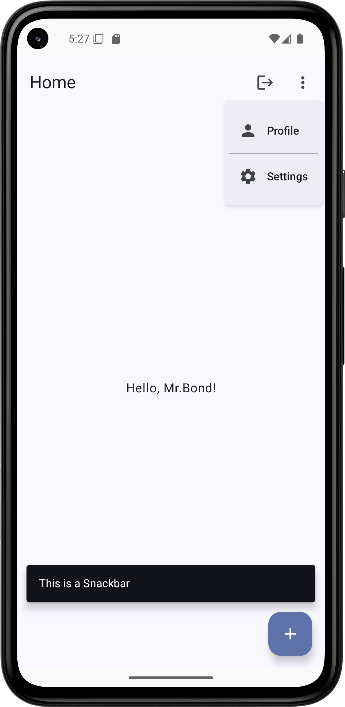

# Labor04 - Felhasználói felületek készítése a Jetpack Compose segítségével (ComposeBasics)

## Bevezetés

A labor célja a Jetpack Compose használatának bemutatása: felhasználói felületek készítése egyszerű, egymásba ágyazható *composable* metódusok segítségével, XML leírók használata nélkül. A labor során egy egyszerű alkalmazást fogunk készíteni, amelyben regisztrációs, bejelentkezési és főképernyők találhatók.

Az alkalmazásban a tényleges regisztrációs és bejelentkeztetési logika most nem kap helyet, pusztán a felhasználói felület létrehozásának módjára koncentrálunk.

A megvalósítandó felhasználói felületet az alábbi képernyőképek szemléltetik:

<p float="left">



</p>

## Előkészületek

A feladatok megoldása során ne felejtsd el követni a [feladat beadás folyamatát](../../tudnivalok/github/GitHub.md).

### Git repository létrehozása és letöltése

1. Moodle-ben keresd meg a laborhoz tartozó meghívó URL-jét és annak segítségével hozd létre a saját repository-dat.

1. Várd meg, míg elkészül a repository, majd checkout-old ki.

    !!! warning "Checkout"
        Egyetemi laborokban, ha a checkout során nem kér a rendszer felhasználónevet és jelszót, és nem sikerül a checkout, akkor valószínűleg a gépen korábban megjegyzett felhasználónévvel próbálkozott a rendszer. Először töröld ki a mentett belépési adatokat (lásd [itt](../../tudnivalok/github/GitHub-credentials.md)), és próbáld újra.

1. Hozz létre egy új ágat `megoldas` néven, és ezen az ágon dolgozz.

1. A `neptun.txt` fájlba írd bele a Neptun kódodat. A fájlban semmi más ne szerepeljen, csak egyetlen sorban a Neptun kód 6 karaktere.

## Projekt létrehozása

Első lépésként indítsuk el az Android Studio-t, majd:

1. Hozzunk létre egy új projektet, válasszuk az *Empty Compose Activity (Material3)* lehetőséget.
1. A projekt neve legyen `ComposeBasics`, a kezdő package pedig `hu.bme.aut.android.composebasics`.
1. A minimum API szint legyen *API24: Android 7.0 (Nougat)*.

!!!danger "FILE PATH"
	A projekt mindenképpen a repository-ban lévő ComposeBasics könyvtárba kerüljön, és beadásnál legyen is felpusholva! A kód nélkül nem tudunk maximális pontot adni a laborra!

Sikeres projekt létrehozás után a laborvezető vezetésével vizsgáljuk meg a forrás felépítését:

- Tekintsük át, hogyan működnek a felületet leíró *composable function*ök.
- Buildeljük le a projektet, és próbáljuk ki az előnézetet.
- Nézzük meg, hogyan frissül az előnézet, ahogyan módosítjuk a kódunkat.

## Szöveges erőforrások definiálása

A `strings.xml` fájl működését már ismerjük, töltsük fel ezt előre a később szükséges szöveges címkékkel, hogy később a lényeges elemekre tudjunk koncentrálni:

```xml
<resources>
    <string name="app_name">compose-basics</string>
    <string name="button_label_dont_have_account">I don\'t have an account yet</string>
    <string name="textfield_label_email">email</string>
    <string name="textfield_label_password">password</string>
    <string name="button_label_login">Log in</string>
    <string name="textfield_label_confirmpassword">confirm password</string>
    <string name="button_label_register">Register</string>
    <string name="button_label_already_have_account">I already have an account</string>
    <string name="textfield_label_username">username</string>
    <string name="snackbar_message_this_is_a">This is a Snackbar</string>
    <string name="top_app_bar_title_home">Home</string>
    <string name="button_label_logout">Log out</string>
    <string name="gender_male">male</string>
    <string name="gender_female">female</string>
    <string name="other">other</string>
    <string name="text_select_a_gender">Select a gender</string>
    <string name="dropdown_menu_item_label_settings">Settings</string>
    <string name="dropdown_menu_item_label_profile">Profile</string>
</resources>
```

## Függőségek frissítése

Az Android Studio a projekt létrehozásakor felveszi ugyan a *Compose*-t a függésegek közé, de némileg elavult verziókat használ. Frissítsük a modul szintű `build.gradle` fájlban a függőségeket az alábbiakra, majd szinkronizáljuk is a projektet:

```groovy
dependencies {

    def composeBom = platform('androidx.compose:compose-bom:2023.01.00')
    implementation composeBom
    androidTestImplementation composeBom

    implementation 'androidx.compose.material3:material3'
    implementation 'androidx.compose.ui:ui'
    implementation 'androidx.compose.ui:ui-tooling-preview'
    implementation 'androidx.compose.material:material-icons-extended'

    androidTestImplementation 'androidx.compose.ui:ui-test-junit4'
    debugImplementation 'androidx.compose.ui:ui-test-manifest'
    debugImplementation 'androidx.compose.ui:ui-tooling'

    implementation 'androidx.core:core-ktx:1.9.0'
    implementation 'androidx.activity:activity-compose:1.6.1'

    implementation "androidx.navigation:navigation-compose:2.5.3"

    testImplementation 'junit:junit:4.13.2'
    androidTestImplementation 'androidx.test.ext:junit:1.1.5'
    androidTestImplementation 'androidx.test.espresso:espresso-core:3.5.1'
}
```

## Elemi UI építőelemek elkészítése

A fenti képeken látható, hogy a bejelentkeztetési és a regisztrációs formok egyedi kinézetű szövegmezőkből és címkékből épülnek fel. A *Compose* alapelve - ahogyan a neve is tükrözi, - hogy a felhasználói felületünket hierarchikusan építhetjük fel, és a kisebb építőelemekből összetettebbeket állíthatunk össze. Ez egyrészt segíti a fejlesztői gondolkodást, hiszen könnyen tudunk a felhasználói felület adott részére koncentrálni, ezeket függetlenül elkészíteni, és így idővel a részekből már könnyen összerakható lesz a teljes kívánt UI is. Másrészt, ez a megközelítés segíti az újrafelhasználást, hiszen a kisebb felületi elemek könnyen újrafelhasználhatók az alkalmazás különböző részeiben is.

Készítsünk először egy igen általános szövegmezőt, amelyet majd az éppen aktuális igényeknek megfelelően gazdagon tudunk paraméterezni. Tulajdonképpen a rendszer részét képező `TextField` is sokrétű funkcionalitással rendelkezik, azonban szeretnénk egy magasabb szintű komponenst, amely számunkra könnyebben használható, és a hibajelzés megjelenítését is megoldja.

Először hozzunk létre ehhez egy `hu.bme.aut.android.composebasics.ui.common` package-et. Ebbe fognak kerülni az alapvető fontosságú UI építőelemeink.

Ezen belül készítsünk egy `NormalTextField` komponenst a következő tartalommal:

```kotlin
@ExperimentalMaterial3Api
@Composable
fun NormalTextField(
    value: String,
    label: String,
    onValueChange: (String) -> Unit,
    leadingIcon: @Composable (() -> Unit)?,
    trailingIcon: @Composable (() -> Unit)?,
    modifier: Modifier = Modifier,
    enabled: Boolean = true,
    readOnly: Boolean = false,
    isError: Boolean = false,
    onDone: (KeyboardActionScope.() -> Unit)?
) {
    TextField(
        value = value.trim(),
        onValueChange = onValueChange,
        label = { Text(text = label) },
        leadingIcon = leadingIcon,
        trailingIcon = if (isError) {
            {
                Icon(imageVector = Icons.Default.ErrorOutline, contentDescription = null)
            }
        } else {
            {
                if (trailingIcon != null) {
                    trailingIcon()
                }
            }
        },
        modifier = modifier
            .width(TextFieldDefaults.MinWidth),
        singleLine = true,
        readOnly = readOnly,
        isError = isError,
        enabled = enabled,
        keyboardOptions = KeyboardOptions(
            keyboardType = KeyboardType.Text,
            imeAction = ImeAction.Done
        ),
        keyboardActions = KeyboardActions(
            onDone = onDone
        )
    )
}
```

!!! info ""
	A Kotlin nyelv megengedi, hogy a függvényparamétereket függvényhíváskor nevesítve adjuk meg, így a paraméterek sorrendje változhat, mivel a név alapján a fordító össze tudja kapcsolni a paramétereket a megadott értékekkel. Egy másik hasznos tulajdonsága a Kotlin nyelvnek, hogy a paramétereknek alapértelmezett (default) érték adható meg a függvénydefinícióban, és ezzel elkerülhetjük, hogy egy függvénynek sok overloadolt változatát kelljen elkészítenünk. A két funkciót kombinálva nagyon rugalmasan tudjuk az így definiált függvényeket hívni, és ezt a Compose technológia remekül kihasználja.

Tekintsük át a fenti kódot! A komponens a konstruktoron keresztül számos paramétert át tud venni:

- **value**: a szövegmező tartalma; ezt egyszerűen továbbadjuk a felhasznált `TextField` komponensnek, de az eleji/végi whitespace karaktereket a `trim()` segítségével levágjuk
- **label**: a szövegmező címkéje, amely magyarázza annak tartalmát; ezt egy `Text` composable-be csomagolva továbbadjuk
- **onValueChange**: eseménykezelő, amely a tartalom megváltoztatásakor hívódik; egyszerűen továbbadjuk
- **leadingIcon** és **traliningIcon**: a szövegmező elején és végén megjelenítendő ikonok, amelyeket egy újabb composable függvényként lehet megadni; a komponensünk beépített hibajelzést valósít meg, ezért ha hiba van beállítva, akkor a szöveg végén nem a beállított ikon, hanem hibajelzés jelenik meg
- **modifier**: a megjelenést módosító paraméterek; itt továbbadjuk a megadottakat, és még hozzáadjuk, hogy a téma szerinti minimális szélesség lépjen érvényre
- **enabled**: engedélyezve van-e a szövegmező?
- **readOnly**: csak olvasható-e a szövegmező?
- **isError**: ha a szövegmező tartalma nem érvényes, akkor beállíthatjuk `true` értékre, és a szövegmező végén egy hibajelző ikon fog megjelenni.
- **onDone**: eseménykezelő, hogy mi történjen, ha a szerkesztést a felhasználó befejezte

A `modifier` értékeként a komponens felhasználásakor nagyon sok paraméter megadható. Erre számos példát láthatunk az Android hivatalos dokumentációjában: https://developer.android.com/jetpack/compose/modifiers

A felhasznált `TextField` komponensen további jellemzőket is beállítottunk, amelyeket egyébként a `NormalTextField` nem tud kívülről felülbírálhatóvá tenni. Ezek jelentése:

- **singleLine**: csak egy sort lehet begépelni a szövegmezőbe
- **keyboardOptions**: ez állítja be, hogy milyen jellegű billentyűzet jelenjen meg a képernyőn, és milyen IME gyorsgomb tartozzon a szerkesztőhöz. Itt mindig egyszerű szöveges billentyűzetet és "kész" gombot választunk. Ha emailt vagy telefonszámot gépeltetnénk be, akkor megjeleníthetünk ehhez alkalmasabb billentyűzetet is.
- **keyboardActions**: mi történjen az egyes IME akciók kiváltásakor. Itt csak a korábban megadott `onDone` eseménykezelőt hívjuk meg.

Ezzel elkészült az első composable komponensünk, de mivel még sok hiányzik a felhasználói felületből, ezért ezt csak soká tudnánk valójában kipróbálni. Szerencsére a Compose technológia lehetőséget ad rá, hogy fejlesztés közben is pontos előnézetet kapjunk a komponenseinkből. Ezt célszerűen úgy tesszük meg, hogy definiálunk egy előnézeti függvényt, amely a kívánt paraméterezéssel meghívja a composable függvényünket, majd erre a függvényre is rátesszük a `@Composable` és az `@ExperimentalMaterial3Api` annotációkat, illetve az előnézet generálásáért felelős `@Preview` annotációt is. Próbáljuk ki a komponensünket az alábbi tesztfüggvénnyel, amit betehetünk a `NormalTextField` fájljába:

```kotlin
@ExperimentalMaterial3Api
@Preview
@Composable
fun NormalTextView_Preview() {
    NormalTextField(
        value = "Csetneki Péter",
        label = "Név",
        onValueChange = {},
        leadingIcon = {},
        trailingIcon = {},
        onDone = {}
    )
}
```

Előnézeti függvényből többet is létrehozhatunk, hogy lássuk, hogyan néz ki a komponensünk különböző
paraméterezések esetén. Vizsgáljuk meg a hibajelzéssel ellátott megjelenést is:

```kotlin
@ExperimentalMaterial3Api
@Preview
@Composable
fun NormalTextView_Error_Preview() {
    NormalTextField(
        value = "abc",
        label = "Mennyiség (kg)",
        onValueChange = {},
        leadingIcon = {},
        trailingIcon = {},
        onDone = {},
        isError = true
    )
}
```

!!! example "BEADANDÓ (0.5 pont)"
    Készíts egy **képernyőképet**, amelyen látszik a **két előnézet a szövegmező komponensről** és **az ahhoz tartozó kódrészlet**. A név mezőbe a **saját neved** kerüljön. 

	A képet a megoldásban a repository-ba f1.png néven töltsd föl.


A fentihez hasonlóan a `ui.common` package-be készítsünk egy újabb komponenst `PasswordTextField` néven az alábbi tartalommal:

```kotlin
@ExperimentalMaterial3Api
@Composable
fun PasswordTextField(
    value: String,
    label: String,
    modifier: Modifier = Modifier,
    onValueChange: (String) -> Unit,
    leadingIcon: @Composable (() -> Unit)?,
    enabled: Boolean = true,
    readOnly: Boolean = false,
    isError: Boolean = false,
    onDone: (KeyboardActionScope.() -> Unit)?,
    isVisible: Boolean = true,
    onVisibilityChanged: () -> Unit,
) {
    val visibilityIcon = if (isVisible) {
        Icons.Rounded.VisibilityOff
    } else {
        Icons.Rounded.Visibility
    }
    TextField(
        value = value.trim(),
        onValueChange = onValueChange,
        label = { Text(text = label) },
        leadingIcon = leadingIcon,
        trailingIcon = if (isError) {
            {
                Icon(
                    imageVector = Icons.Default.ErrorOutline,
                    contentDescription = null
                )
            }
        } else {
            {
                IconButton(onClick = onVisibilityChanged) {
                    Icon(imageVector = visibilityIcon, contentDescription = null)
                }
            }
        },
        modifier = modifier
            .width(TextFieldDefaults.MinWidth),
        singleLine = true,
        readOnly = readOnly,
        isError = isError,
        enabled = enabled,
        keyboardOptions = KeyboardOptions(
            keyboardType = KeyboardType.Password,
            imeAction = ImeAction.Done
        ),
        keyboardActions = KeyboardActions(
            onDone = onDone
        ),
        visualTransformation = if (isVisible) VisualTransformation.None else PasswordVisualTransformation(),
    )
}
```

Ez a komponens csak két apró dologban tér el az előzőtől:

1. Mivel jelszavak begépeléséhez használjuk, a jelszó kitakarása vagy mutatása is állítható a komponensben. Ezt úgy valósítjuk meg, hogy nem lehet külön ikont megadni a szövegmező végéhez, hanem ott egy csukott vagy nyitott szem jelenik meg, és az erre történő kattintással lehet a láthatóságot állítani. A láthatóság állapota és az eseménykezelő paraméterekként vannak megadva, tehát a láthatóság állapotát és az eseménykezelőt a komponens bennfoglaló komponensében kell megvalósítani.

1. A komponensnek a láthatóság állapotától függően egy vizuális transzformáció is be van állítva, hogy a tartalmát ne közvetlen, hanem kitakartan jelenítse meg.

A harmadik alapvető komponensünk a `BottomTextButton` lesz. Ennek a kódja a következő:

```kotlin
@ExperimentalMaterial3Api
@Composable
fun BottomTextButton(
    modifier: Modifier = Modifier,
    onClick: () -> Unit,
    enabled: Boolean = true,
    label: String
) {
    val shape = RoundedCornerShape(topEnd = 5.dp, topStart = 5.dp)
    Surface(
        shape = shape,
        modifier = modifier
            .fillMaxWidth()
            .clip(shape)
            .clickable(
                enabled = enabled,
                onClick = onClick,
                role = Role.Button
            ),
        color = MaterialTheme.colorScheme.primaryContainer
    ) {
        Text(
            text = label,
            modifier = Modifier.padding(10.dp),
            textAlign = TextAlign.Center,
            color = MaterialTheme.colorScheme.onPrimaryContainer,
            style = MaterialTheme.typography.labelLarge,
            fontSize = 16.sp
        )
    }
}
```

Ez a gomb majd a bejelentkeztetési képernyő alján jelenik meg, hogy a rákattintással át tudjunk navigálni a regisztrációs felületre. Ezért egy visszafogott, de jól látható megjelenést szeretnénk. Ezt úgy érjük el, hogy egy teljes szélességű keskeny csíkként jelenítjük meg a gombot a felületen. A megvalósítást tekintve ez valójában egy színes háttéren elhelyezett szöveges címke.

A Compose *Material* témájának ehhez használt egyik fontos építőköve a `Surface`, azaz felszín. A *Material* témában egy logikai egységet egy felszín jelképez, ez a többi felszínhez képest térbeli pozíciót kap, és azokhoz képest hátrébb, vagy előrebb lehet. A felszíneknek alapja is van, ezt itt most egy lekerekített téglalapra állítjuk. A megfelelő modifierekkel beállítjuk azt is, hogy a felszín kitöltse a teljes szélességet, illetve gombként kattintható legyen. Beállítjuk továbbá, hogy az aktuálisan használt *Material* téma szerinti elsődleges konténer színt kapja meg. A szöveget `Text` elemként jelenítjük meg a felszínen. Ehhez beállítunk még paddinget, középre igazítást, a színét a téma szerint elsődleges konténeren elhelyezett elemek meghatározott színére állítjuk, illetve `16sp` fontméretet adunk meg.

Ezt a komponenst úgy tudjuk jól vizualizálni, ha befoglaljuk egy teljes képernyő magas területre, hiszen mindig a képernyő alján fog megjelenni. Ezt megtehetjük egy `Box` elemmel. Illetve az is hasznos, ha a teljes hátteret kirajzoltatjuk, hogy a tényleges háttérszín mellett lássuk a megejelenését. Ehhez használjuk az alábbi függvényt:

```kotlin
@ExperimentalMaterial3Api
@Preview(showBackground = true)
@Composable
fun TextButton_Preview() {
    Box(modifier = Modifier.fillMaxSize()) {
        BottomTextButton(
            onClick = {},
            modifier = Modifier.align(Alignment.BottomCenter),
            label = "Button"
        )
    }
}
```

!!! example "BEADANDÓ (0.5 pont)"
    Készíts egy **képernyőképet**, amelyen látszik az **előnézet a BottomTextButton komponensről** és **az ahhoz tartozó kódrészlet**. A gomb szövege a **saját neptun-kódod** legyen. 

	A képet a megoldásban a repository-ba f2.png néven töltsd föl.

## Az alkalmazás fő képernyőinek elkészítése

Most, hogy a képernyők minden fontos alkotórésze a rendelkezésünkre áll, elkezdhetjük maguknak a képernyőknek az elkészítését. Kezdjük sorban a bejelentkező képernyővel!

A képernyőknek és a hozzájuk kapcsolódó kódoknak hozzunk létre egy közös `hu.bme.aut.android.composebasics.feature` package-et, majd ezen belül a bejelentkező képernyő a `login` package-be kerüljön! Készítsük el a képernyő kódját `LoginScreen` néven, majd adjuk meg a következő kódot:

```kotlin

@ExperimentalMaterial3Api
@Composable
fun LoginScreen(
    modifier: Modifier = Modifier,
    onLoginClick: (String) -> Unit,
    onRegisterClick: () -> Unit
) {
    var usernameValue by remember { mutableStateOf("") }
    var isUsernameError by remember { mutableStateOf(false) }

    var passwordValue by remember { mutableStateOf("") }
    var isPasswordVisible by remember { mutableStateOf(false) }
    var isPasswordError by remember { mutableStateOf(false) }

    Box(
        modifier = modifier
            .fillMaxSize()
            .background(MaterialTheme.colorScheme.background),
        contentAlignment = Alignment.Center
    ) {
        Column(horizontalAlignment = Alignment.CenterHorizontally) {
            NormalTextField(
                value = usernameValue,
                label = stringResource(id = R.string.textfield_label_username),
                onValueChange = { newValue ->
                    usernameValue = newValue
                    isUsernameError = false
                },
                isError = isUsernameError,
                leadingIcon = {
                    Icon(
                        imageVector = Icons.Default.Person,
                        contentDescription = null
                    )
                },
                trailingIcon = { },
                onDone = { }
            )
            Spacer(modifier = Modifier.height(10.dp))
            PasswordTextField(
                value = passwordValue,
                label = stringResource(id = R.string.textfield_label_password),
                onValueChange = { newValue ->
                    passwordValue = newValue
                    isPasswordError = false
                },
                isError = isPasswordError,
                leadingIcon = {
                    Icon(
                        imageVector = Icons.Default.Key,
                        contentDescription = null
                    )
                },
                isVisible = isPasswordVisible,
                onVisibilityChanged = { isPasswordVisible = !isPasswordVisible },
                onDone = { }
            )
            Spacer(modifier = Modifier.height(10.dp))
            Button(
                onClick = {
                    if (usernameValue.isEmpty()) {
                        isUsernameError = true
                    } else if (passwordValue.isEmpty()) {
                        isPasswordError = true
                    } else {
                        onLoginClick(usernameValue)
                    }
                },
                modifier = Modifier.width(TextFieldDefaults.MinWidth)
            ) {
                Text(text = stringResource(id = R.string.button_label_login))
            }
        }
        BottomTextButton(
            onClick = onRegisterClick,
            label = stringResource(id = R.string.button_label_dont_have_account),
            modifier = Modifier.align(Alignment.BottomCenter)
        )
    }
}
```

Egy fontos eddig nem látott elem, hogy a felhasználói felület elemeinek állapottárolására (pl. szövegmező tartalma, látható-e valami, jelölőnégyzet be van pipálva stb.) `MutableState` típusú tárolókat kell létrehoznunk. Ezt a `mutableStateOf()` factory-metódussal tudjuk megtenni, és ennek meg kell adni a kezdőállapotot. Mindezt az inicializációt lazy betöltéssel akarjuk végezni, hogy a felület felépítése közben történjen. Ehhez használjuk a `remember` kulcsszót.

Feltűnnek még különböző konténerelemek, amelyek segítségével a felületi elemek elrendezését tudjuk meghatározni. Ilyen a korábban már érintett `Box`. Ez alkalmas a teljes képernyőtartalmak befoglalására. Ezzel állítjuk be a hátteret a Material témánk szerintire, illetve hogy a képernyő teljes tartalmát töltse ki a befoglalt tartalom. Ezen belül látunk egy `Column` elemet, amellyel egy oszlopba vannak rendezve egymás alá a szövegmezők. A vízszintes igazítás az oszlopon középre van állítva. Az oszlopon kívül helyezkedik el a `BottomTextButton`, ami majd a regisztrációs oldalra visz. A középső oszlopon a normál és a jelszavas saját szövegmezőn, valamint alattuk egy bejelentkeztető gomb van megadva, köztük térelválasztó `Spacer` komponenssel.

Összességében azt figyelhetjük meg, hogy a logika egy része már itt fel van oldva, hiszen az állapot egyes részeit itt kezeljük, és ehhez kapcsolódóan eseménykezelőket is adunk tovább az építőelemként szolgáló kisebb komponenseknek. Viszont vannak olyan dolgok, mint pl. a login és a regisztráció gomb eseménykezelője, ezek még mindig felülről jönnek. Alapvetően a Compose-ban úgy kell gondolkodnunk, hogy az állapotot, amire több felületi elemnek szüksége van, azt feljebb kell emelnünk egy közös ősbe. Ezt az Android terminológia úgy hívja, hogy [`state hoisting`](https://developer.android.com/jetpack/compose/state-hoisting) Pl. a begépelt felhasználónevet a szövegmező is használja, illetve a befoglaló bejelentkező képernyőnél is szükség van rá. Maga a bejelentkező képernyő a legfelső komponens a hierarchiában, amelyik használja, ezért itt tudjuk ezt az állapotot kezelni. A navigáció viszont, hogy mi történjen a gombokra kattintáskor, az már más komponenseket is érint, ezért azt fentebbi szinten kell kezelni, ezért ez még mindig paraméterként érkezik a képernyőt megtestesítő komponenshez.

!!! note ""
	Aki fejlesztett már a React webes keretrendszerben, annak ismerős lehet ez a koncepció, mert nagyon hasonló a React komponensek működéséhez.

Nézzük is meg az elkészült komponenst:

```kotlin

@ExperimentalMaterial3Api
@Preview(showBackground = true)
@Composable
fun LoginScreen_Preview() {
    LoginScreen(
        onLoginClick = { },
        onRegisterClick = { }
    )
}
```

!!! example "BEADANDÓ (0.5 pont)"
    Készíts egy **képernyőképet**, amelyen látszik az **előnézet a bejelentkező képernyőről** és **az ahhoz tartozó kódrészlet**. 

	A képet a megoldásban a repository-ba f3.png néven töltsd föl.

Most készítsük el a regisztrációs képernyőt! Ezt tegyük egy `register` package-be a `feature` package-en belül. Először egy `Gender` enumot készítünk a nemválasztó értékeinek reprezentálásához:

```kotlin
enum class Gender(val nameId: Int) {
    MALE(R.string.gender_male),
    FEMALE(R.string.gender_female),
    OTHER(R.string.other)
}
```

!!! info "enum"
	A Java és a Kotlin nyelvben az enumok valójában speciális osztályok, amelyeknek csak a felsorolt értékeknek megfelelő számú példánya létezik. Ezek rendelkezhetnek tagváltozókkal és metódusokkal is. Jelen esetben a nemekhez tartozó szöveges erőforrás kódját is tagváltozóként adjunk meg.

Ez az enum segít benne, hogy a kódunkban olvashatóan, típusbiztosan használjuk a nemválasztó lehetséges értékeit, viszont egyébként lokalizáltan a címkéket jelenítsük meg, amelyek szöveges erőforrásként vannak definiálva a `strings.xml` fájlban. 

Ezután elkészíthetjük a regisztrációs képernyő komponensét:

```kotlin
@ExperimentalMaterial3Api
@Composable
fun RegisterScreen(
    modifier: Modifier = Modifier,
    onRegisterClick: (String) -> Unit,
    onLoginClick: () -> Unit
) {
    var usernameValue by remember { mutableStateOf("") }
    var isUsernameError by remember { mutableStateOf(false) }

    var passwordValue by remember { mutableStateOf("") }
    var isPasswordVisible by remember { mutableStateOf(false) }
    var isPasswordError by remember { mutableStateOf(false) }

    var confirmPasswordValue by remember { mutableStateOf("") }
    var isConfirmPasswordVisible by remember { mutableStateOf(false) }
    var isConfirmPasswordError by remember { mutableStateOf(false) }

    val (selectedGender, onSelected) = remember { mutableStateOf(Gender.values()[0]) }

    Box(
        modifier = modifier
            .fillMaxSize()
            .background(MaterialTheme.colorScheme.background),
        contentAlignment = Alignment.Center
    ) {
        Column(horizontalAlignment = Alignment.CenterHorizontally) {
            NormalTextField(
                value = usernameValue,
                label = stringResource(id = R.string.textfield_label_username),
                onValueChange = { newValue ->
                    usernameValue = newValue
                    isUsernameError = false
                },
                isError = isUsernameError,
                leadingIcon = {
                    Icon(
                        imageVector = Icons.Default.Person,
                        contentDescription = null
                    )
                },
                trailingIcon = { },
                onDone = { }
            )
            Spacer(modifier = Modifier.height(10.dp))
            PasswordTextField(
                value = passwordValue,
                label = stringResource(id = R.string.textfield_label_password),
                onValueChange = { newValue ->
                    passwordValue = newValue
                    isPasswordError = false
                },
                isError = isPasswordError,
                leadingIcon = {
                    Icon(
                        imageVector = Icons.Default.Key,
                        contentDescription = null
                    )
                },
                isVisible = isPasswordVisible,
                onVisibilityChanged = { isPasswordVisible = !isPasswordVisible },
                onDone = { }
            )
            Spacer(modifier = Modifier.height(10.dp))
            PasswordTextField(
                value = confirmPasswordValue,
                label = stringResource(id = R.string.textfield_label_confirmpassword),
                onValueChange = { newValue ->
                    confirmPasswordValue = newValue
                    isConfirmPasswordError = false
                },
                isError = isConfirmPasswordError,
                leadingIcon = {
                    Icon(
                        imageVector = Icons.Default.Key,
                        contentDescription = null
                    )
                },
                isVisible = isConfirmPasswordVisible,
                onVisibilityChanged = { isConfirmPasswordVisible = !isConfirmPasswordVisible },
                onDone = { }
            )
            Spacer(modifier = Modifier.height(10.dp))
            Text(
                text = stringResource(id = R.string.text_select_a_gender),
                color = MaterialTheme.colorScheme.onBackground
            )
            Gender.values().forEach { gender ->
                Row(
                    Modifier
                        .height(56.dp)
                        .width(TextFieldDefaults.MinWidth)
                        .selectable(
                            selected = (gender == selectedGender),
                            onClick = { onSelected(gender) },
                            role = Role.RadioButton
                        )
                        .padding(horizontal = 16.dp),
                    verticalAlignment = Alignment.CenterVertically,
                    horizontalArrangement = Arrangement.Start
                ) {
                    RadioButton(
                        selected = (gender == selectedGender),
                        onClick = null
                    )
                    Text(
                        text = stringResource(id = gender.nameId),
                        style = MaterialTheme.typography.bodyLarge,
                        color = MaterialTheme.colorScheme.onBackground,
                        modifier = Modifier.padding(start = 16.dp)
                    )
                }
            }
            Button(
                onClick = {
                    if (usernameValue.isEmpty()) {
                        isUsernameError = true
                    } else if (passwordValue.isEmpty() || confirmPasswordValue.isEmpty()) {
                        isConfirmPasswordError = true
                    } else {
                        onRegisterClick(usernameValue)
                    }
                },
                modifier = Modifier.width(TextFieldDefaults.MinWidth)
            ) {
                Text(text = stringResource(id = R.string.button_label_register))
            }
        }
        BottomTextButton(
            onClick = onLoginClick,
            label = stringResource(id = R.string.button_label_already_have_account),
            modifier = Modifier.align(Alignment.BottomCenter)
        )
    }
}
```

Ezen a képernyők két kisebb újdonságot látunk:

1. A nemet tároló állapotváltozó mellett egy eseménykezelőt is létrehozunk már az inicializálásnál. Ezt tudjuk használni az állapotváltozó beállítására, ez lejjebb a kódban látható a rádiógombok létrehozásánál.

1. A rádiógombokat "ciklusosan" egy `forEach()` hívással generáljuk le. Ebből látható, hogy a felhasználói felület mennyire dinamikus is lehet. Ha a lehetséges választások listáját bővítenénk az enumban egy új elemmel, akkor az is legenerálódna a felhasználói felületre. De hasonlóan oldhatunk meg pl. adatbázisból lekérdezett elemek listázását is.

Nézzük meg, hogyan mutat az elkészített képernyő:

```kotlin
@ExperimentalMaterial3Api
@Preview(showBackground = true)
@Composable
fun RegisterScreen_Preview() {
    RegisterScreen(
        onLoginClick = { },
        onRegisterClick = { }
    )
}
```

!!! example "BEADANDÓ (0.5 pont)"
    Készíts egy **képernyőképet**, amelyen látszik az **előnézet a regisztrációs képernyőről** és **az ahhoz tartozó kódrészlet**. 

	A képet a megoldásban a repository-ba f4.png néven töltsd föl.

A harmadik elkészítendő képernyőnk az alkalmazás "főképernyője", amit sikeres bejelentkezés után lát a felhasználó. Viszont itt már részben érintenünk kell a képernyők közti navigáció kérdését is, hiszen a képernyőnek lesz egy menüje, ahonnan majd más képernyőkre lehet navigálni. Ehhez egy `navigation` package-et hozzunk létre, és ebbe kerüljön az alábbi `Screen` osztály. Most nem enumot, hanem `sealed classot` alkalmazunk, mert a főképernyő kezelése kicsit speciális lesz, az argumentumot is kaphat. Az osztály előtt definiált konstansokat később fogjuk használni, amikor teljesen összerakjuk a navigációs gráfot.

```kotlin
const val ROOT_GRAPH_ROUTE = "root"
const val AUTH_GRAPH_ROUTE = "auth"
const val MAIN_GRAPH_ROUTE = "main"

sealed class Screen(val route: String) {
    object Login: Screen(route = "login")
    object Register: Screen(route = "register")
    object Home: Screen(route = "home/{${Args.username}}") {
        fun passUsername(username: String) = "home/$username"
        object Args {
            const val username = "username"
        }
    }
    object Profile: Screen(route = "profile")
    object Settings: Screen(route = "settings")
}
```

!!! info "sealed class"
	A Kotlin sealed class-ai olyan osztályok, amelyekből korlátozott az öröklés, és fordítási időben minden leszármazott osztálya ismert. Ezeket az osztályokat az enumokhoz hasonló módon tudjuk alkalmazni. Jelen esetben a `Home` valójában nem a `Screen` közvetlen leszármazottja, hanem anonim leszármazott osztálya, mivel a felhasználónév paraméterként történő kezelését is tartalmazza.

Maga a főképernyő egy `home` subpackage-be kerüljön. Először itt is egy segédosztályt hozunk létre. Jelen esetben a menüpontokat fogjuk enumban modellezni. Minden menüpontra jellemző a neve, az ikonja, illetve egy azonosító, ahova navigál:

```kotlin
enum class MenuItemUiModel(
    val text: @Composable () -> Unit,
    val icon: @Composable () -> Unit,
    val screenRoute: String
) {
    PROFILE(
        text = { Text(text = stringResource(id = R.string.dropdown_menu_item_label_profile))},
        icon = {
            Icon(imageVector = Icons.Default.Person, contentDescription = null)
        },
        screenRoute = Screen.Profile.route
    ),
    SETTINGS(
        text = { Text(text = stringResource(id = R.string.dropdown_menu_item_label_settings))},
        icon = {
            Icon(imageVector = Icons.Default.Settings, contentDescription = null)
        },
        screenRoute = Screen.Settings.route
    )
}
```

A menüben szerepelnek profil és beállítás lehetőségek is, amelyekről korábban nem volt szó. Ezek nem lesznek igazi kidolgozott képernyők, de példaképp szerepelnek itt, hogy bemutassuk, hogyan lehetne a főmenüből további oldalakra is elnavigálni. Látható, hogy itt a menüpontoknál meghivatkoztuk a korábban a `Screen` osztályban definiált képernyőket is. A leírt menüpontokból még fel kell építenünk a menüt is. Elvileg ezt megtehetnénk a teljes főképernyő részeként, de átláthatóbb struktúrát kapunk, ha ezt külön composable komponensbe szervezzük. Ahogyan általában véve a metódusoknál sem átlátható a túl hosszú, úgy a felületi komponenseinket is érdemes kisebb, jobban kezelhető egységekre osztani. Készítsünk tehát egy `Menu` komponenst:

```kotlin
@Composable
fun Menu(
    expanded: Boolean,
    items: Array<MenuItemUiModel>,
    onDismissRequest: () -> Unit,
    onClick: (String) -> Unit,
    modifier: Modifier = Modifier
) {
    DropdownMenu(
        modifier = modifier.padding(5.dp),
        expanded = expanded,
        onDismissRequest = onDismissRequest
    ) {
        items.forEachIndexed { index, item ->
            DropdownMenuItem(
                text = item.text,
                leadingIcon = item.icon,
                onClick = { onClick(item.screenRoute) },
                modifier = Modifier.clip(RoundedCornerShape(5.dp))
            )
            if (index != items.lastIndex) {
                Divider(modifier = Modifier.height(10.dp).padding(vertical = 5.dp))
            }
        }
    }
}
```

Látjuk, hogy a menüelemek látrehozása is ciklussal történik, és a menüpontok igen könnyen bővíthetőek. A bejárásnál a menüpontok indexét is felhasználjuk, hogy a menüpontok után - az utolsó kivételével - elválasztót is generáljunk.

Most rátérhetünk a tényleges főképernyő létrehozására:

```kotlin
@ExperimentalMaterial3Api
@Composable
fun HomeScreen(
    argument: String,
    modifier: Modifier = Modifier,
    onLogout: () -> Unit,
    onMenuItemClick: (String) -> Unit
) {

    val snackbarHostState = remember { SnackbarHostState() }

    var expandedMenu by remember { mutableStateOf(false) }

    val scope = rememberCoroutineScope()

    val context = LocalContext.current

    Scaffold(
        snackbarHost = { SnackbarHost(snackbarHostState) },
        topBar = {
            TopAppBar(
                title = {
                    Text(text = stringResource(id = R.string.top_app_bar_title_home))
                },
                actions = {
                    IconButton(onClick = onLogout) {
                        Icon(imageVector = Icons.Default.Logout, contentDescription = null)
                    }
                    IconButton(onClick = { expandedMenu = !expandedMenu }) {
                        Icon(imageVector = Icons.Default.MoreVert, contentDescription = null)
                    }
                }
            )
        },
        floatingActionButton = {
            FloatingActionButton(onClick = {
                scope.launch {
                    snackbarHostState.showSnackbar(message = context.getString(R.string.snackbar_message_this_is_a))
                }
            }) {
                Icon(imageVector = Icons.Default.Add, contentDescription = null)
            }
        },
        modifier = modifier
    ) {
        Box(
            modifier = Modifier
                .padding(it)
                .fillMaxSize(),
        ) {
            Text(
                text = "Hello, $argument!",
                textAlign = TextAlign.Center,
                modifier = Modifier.align(Alignment.Center)
            )
            Box(modifier = Modifier.fillMaxSize().wrapContentSize(Alignment.TopEnd).padding(5.dp)) {
                Menu(
                    expanded = expandedMenu,
                    items = MenuItemUiModel.values(),
                    onDismissRequest = { expandedMenu = false },
                    onClick = {
                        onMenuItemClick(it)
                        expandedMenu = false
                    },
                )
            }
        }
    }
}
```

A képernyőn több újdonságot is felfedezhetünk:

1. A `Scaffold` elem szolgál komplexebb Material stílusú képernyők felépítésére. A paraméterezéséből látható, hogy ez az elem beépítetten támogat több gyakran megszokott képernyőelemet, mint a `SnackBar`, `TopBar` vagy a `FloatingActionButton`. Ezeket a paraméterezéssel adjuk meg neki, és gondoskodik a megfelelő elrendezésről.

1. A képernyőn `SnackBar` is lesz, és ennek az állapotát nem `MutableState`, hanem `SnackbarHostState` típusként tudjuk létrehozni.

1. A `SnackBar` üzenetek megjelenítését coroutine fogja végezni, és ehhez scope-ot Compose környezetben a `rememberCoroutineScope()` függvénnyel tudunk kérni.

1. A `LocalContext.current` kifejezéssel kaphatunk egy kontextust Compose környezetben, amellyel a rendszerszintű erőforrásokhoz - pl. a szöveges címkékhez - hozzáférhetünk.

A képernyő többi része a korábbi példák alapján már könnyen érthető.

Nézzük meg, hogyan fest az elkészített főképernyő:

```kotlin
@ExperimentalMaterial3Api
@Preview(showBackground = true)
@Composable
fun HomeScreen_Preview() {
    HomeScreen(
        argument = "Felhasználó",
        onLogout = {},
        onMenuItemClick = {}
    )
}
```

## A képernyők közötti navigáció elkészítése

Most már csak össze kell kötnünk a meglévő képetnyőket a navigációs szabályokkal. Ehhez navigációs gráfokat fogunk definiálni. Egyrészt definiálunk egy gráfot az authentikáció előtti képernyőkre, amely a bejelentkezés és a regisztráció képernyők közti navigációs lehetőségeket írja le. Ezeket a korábban létrehozott `navigation` package-be tegyük. Az authentikáció előtti gráf a következőképpen néz ki:

```kotlin
@ExperimentalMaterial3Api
fun NavGraphBuilder.authNavGraph(
    navController: NavHostController
) {
    navigation(
        startDestination = Screen.Login.route,
        route = AUTH_GRAPH_ROUTE
    ) {
        composable(
            route = Screen.Login.route
        ) {
            LoginScreen(
                onLoginClick = {
                    navController.navigate(Screen.Home.passUsername(it))
                },
                onRegisterClick = {
                    navController.navigate(Screen.Register.route)
                }
            )
        }
        composable(route = Screen.Register.route) {
            RegisterScreen(
                onRegisterClick = { navController.navigate(Screen.Home.passUsername(it)) },
                onLoginClick = { navController.navigate(Screen.Login.route)}
            )
        }
    }
}
```

A kódból azt tudjuk megállapítani, hogy a navigációs gráf a bejelentkeztetési képernyőn kezdődik, és neki is van egy útvonalazonosítója, amelyet most a korábban definiált `AUTH_GRAPH_ROUTE` konstanssal adtunk meg. A navigációban composable felületi elemeket adhatunk meg, mindegyikhez tartozik egy-egy útvonal, ezekhez a `Screen` osztályból hivatkozzuk meg a megfelelő útvonalat. Látható, hogy a hierarchikusan összeállított felhasználói felületek "utolsó" paraméterei itt kapnak konkrét értétek. Konkréten a regisztráció és a bejelentkezés gombok eseménykezelői vannak itt lambda-kifejezésekként megadva. Ezek a lambda-kifejezések valójában a navigációs kontrollert hívják meg, és azzal navigáltatnak a megfelelő útvonalra, amit a kontroller a navigációs gráf alapján felold. Figyeljük meg, hogy a bejelentkezés után a főképernyő útvonalába a felhasználónevet mint paramétert is belekódoljuk. Azt is láthatjuk, hogy tényleges bejelentkeztető logika itt nem történik, de ha erre lenne szükségünk, azt itt megtehetnénk, hiszen itt van megadva a bejelentkezés gomb eseménykezelője.

A másik navigációs gráf a bejelentkezés utáni navigációt írja le:

```kotlin
@ExperimentalMaterial3Api
fun NavGraphBuilder.mainNavGraph(
    navController: NavHostController
) {
    navigation(
        startDestination = Screen.Home.route,
        route = MAIN_GRAPH_ROUTE
    ) {
        composable(
            route = Screen.Home.route,
            arguments = listOf(
                navArgument(Screen.Home.Args.username) {
                    type = NavType.StringType
                }
            )
        ) {
            HomeScreen(
                argument = navController.currentBackStackEntry?.arguments
                                        ?.getString(Screen.Home.Args.username) ?: "",
                onLogout = {
                    navController.popBackStack(route = Screen.Login.route, inclusive = false)
                },
                onMenuItemClick = { navController.navigate(it) }
            )
        }
        composable(route = Screen.Profile.route) {
            Box(
                modifier = Modifier.fillMaxSize(),
                contentAlignment = Alignment.Center
            ) {
                Text(text = "Profile")
            }
        }
        composable(route = Screen.Settings.route) {
            Box(
                modifier = Modifier.fillMaxSize(),
                contentAlignment = Alignment.Center
            ) {
                Text(text = "Settings")
            }
        }
    }
}
```

Végül a kettőt egyesítenünk kell:

```kotlin
@ExperimentalMaterial3Api
@Composable
fun NavGraph(
    navController: NavHostController
) {
    NavHost(
        navController = navController,
        startDestination = AUTH_GRAPH_ROUTE,
        route = ROOT_GRAPH_ROUTE
    ) {
        authNavGraph(navController = navController)
        mainNavGraph(navController = navController)
    }
}
```

Figyeljük meg, hogy ebben a gráfban a főképernyőre érkezve hogyan lehet felhasználónevet
kinyerni! Illetve azt is megállapíthatjuk, hogy a főképernyőre érkezve a backstackről
törlődik a bejelentkeztető képernyő útvonala. Ez így logikus, hiszen ha már sikeresen
beléptünk, nem szeretnénk, hogy a back gombra kattintva véletlen kilépjünk az alkalmazásból.
A gráfban a profil és beállítás oldalak nincsenek kidolgozva, ezért ide csak egy-egy `Box`
elemet vettünk fel placeholder szöveggel.

Már csak a `MainActivity`-be kell bekötnünk a navigáció szerint feloldott felszín megjelenítését.
Itt történik az alkalmazás témájának a megadása is:

```kotlin
class MainActivity : ComponentActivity() {
    @OptIn(ExperimentalMaterial3Api::class)
    override fun onCreate(savedInstanceState: Bundle?) {
        super.onCreate(savedInstanceState)
        setContent {
            ComposeBasicsTheme {
                val navController = rememberNavController()
                NavGraph(navController = navController)
            }
        }
    }
}
```

Próbáljuk ki az alkalmazást!

!!!example "BEADANDÓ (1 pont)"
	Készíts egy **képernyőképet**, amelyen látszik az **alkalmazás főképernyője belépés után a saját neveddel** (emulátoron, készüléket tükrözve vagy képernyőfelvétellel), **az ahhoz tartozó kódrészlet**, valamint a **neptun kódod a kódban valahol kommentként**. 

	A képet a megoldásban a repository-ba f5.png néven töltsd föl.

## Önálló feladat 1.

A Compose alkalmazás beépítetten támogatja az éjszakai módot. Keresd meg az emulált készülék
beállításai közt a sötét téma használatát, és kapcsold be! (Settings -> Display -> Dark theme)
Próbáld ki így az alkalmazást!

!!!example "BEADANDÓ (1 pont)"
	Készíts egy **képernyőképet**, amelyen látszik az **alkalmazás dark mode**-ban (emulátoron, készüléket tükrözve vagy képernyőfelvétellel), **az ahhoz tartozó kódrészlet**, valamint a **neptun kódod a kódban valahol kommentként**. 

	A képet a megoldásban a repository-ba f6.png néven töltsd föl.


## Önálló feladat 2.

Készítsd el a profil oldalt úgy, hogy külön composable komponensbe szervezed ki,
és paraméterként megkapja a felhasználó nevét. Jelenítsd meg a felhasználó nevét fent középen
félkövérrel, majd alatta középen egy placeholder képet, mint a felhasználó profilképét. Ezen
a képernyőn ugyanaz a menü legyen mint a főképernyőn!

!!! example "BEADANDÓ (1 pont)"
    Készíts egy **képernyőképet**, amelyen látszik az **előnézet a profil képernyőről** és **az ahhoz tartozó kódrészlet**. 

	A képet a megoldásban a repository-ba f7.png néven töltsd föl.
