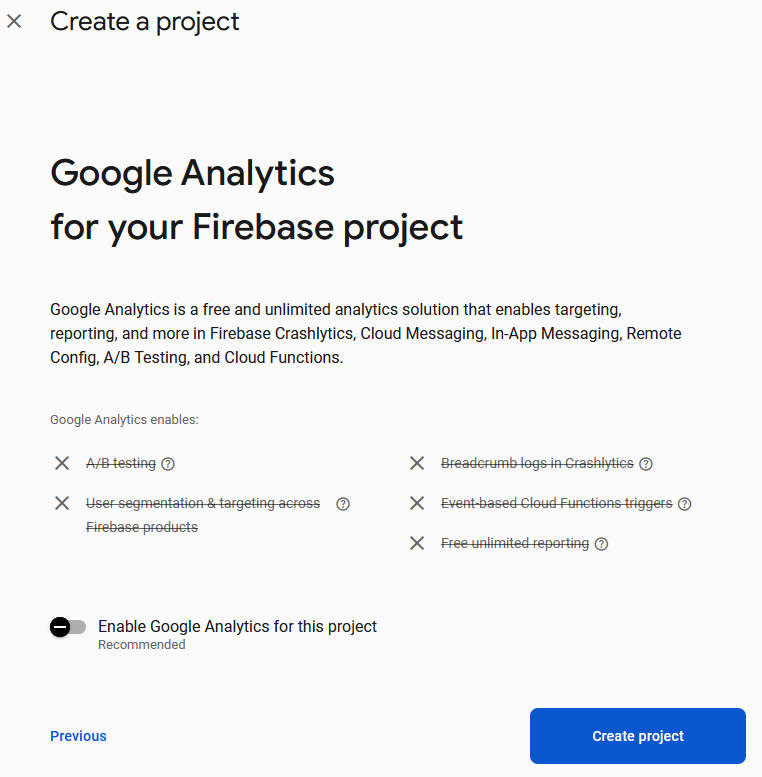
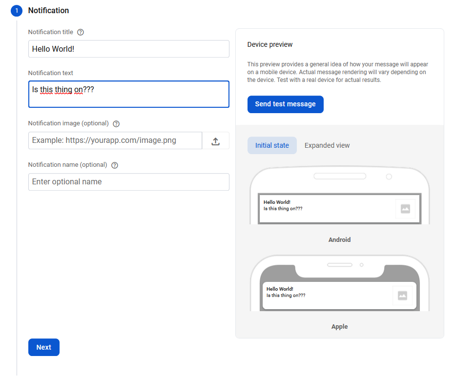

# Labor07 - Firebase

## Bevezető

A labor során a meglévő feladatkezelő alkalmazás kerül továbbfejlesztésre a Firebase Backend as a Service (BaaS) felhasználásával. A feladat célja, hogy szemléltesse, hogyan lehet közös backendet használó alkalmazást fejleszteni saját backend kód fejlesztése nélkül.

A Firebase manapság az egyik legnépszerűbb Backend as a Service megoldás Android, iOS és web kliensek támogatásával, mely számos szolgáltatást biztosít, például:
- real-time adatbáziskezelés
- storage
- authentikáció
- push értesítések
- analytics
- crash reporting

További általános információk a Firebase-ről: [https://firebase.google.com/](https://firebase.google.com/).

A laborfoglalkozás célja, hogy bemutassa a Firebase legfontosabb szolgáltatásait egy komplett alkalmazás megvalósítása keretében. 
Az alkalmazás az alábbi fő funkciókat támogatja:
- regisztráció, bejelentkezés
- üzenetek listázása
- üzenetírás
- képek csatolása üzenetekhez
- üzenetek megjelenítése valós időben
- crash reporting
- analitika

**Az anyag részletes megértéséhez javasoljuk, hogy figyelje a laborvezető utasításait és labor után is 10-20 percet szánjon a kódrészek megértésére.**


## Előkészületek

A feladatok megoldása során ne felejtsd el követni a [feladat beadás folyamatát](../../tudnivalok/github/GitHub.md).

### Git repository létrehozása és letöltése

1. Moodle-ben keresd meg a laborhoz tartozó meghívó URL-jét és annak segítségével hozd létre a saját repository-dat.

1. Várd meg, míg elkészül a repository, majd checkout-old ki.

    !!! tip ""
        Egyetemi laborokban, ha a checkout során nem kér a rendszer felhasználónevet és jelszót, és nem sikerül a checkout, akkor valószínűleg a gépen korábban megjegyzett felhasználónévvel próbálkozott a rendszer. Először töröld ki a mentett belépési adatokat (lásd [itt](../../tudnivalok/github/GitHub-credentials.md)), és próbáld újra.

1. Hozz létre egy új ágat `megoldas` néven, és ezen az ágon dolgozz.

1. A `neptun.txt` fájlba írd bele a Neptun kódodat. A fájlban semmi más ne szerepeljen, csak egyetlen sorban a Neptun kód 6 karaktere.

A Firebase funkcióinak megismeréséhez ebben a laborban egy előre elkészített projektbe fogjuk integrálni a különböző szolgáltatásokat. Ez megtalálható a repository-n belül. Indítsuk el az Android Studio-t, majd nyissuk meg a `ToDo` projektet.

!!!danger "FILE PATH"
	A projekt a repository-ban lévő `Todo` könyvtárba kerüljön, és beadásnál legyen is felpusholva! A kód nélkül nem tudunk maximális pontot adni a laborra!

Ellenőrízzük, hogy a létrejött projekt lefordul és helyesen működik!


## Projekt előkészítése, konfiguráció

Első lépésként létre kell hozni egy Firebase projektet a Firebase admin felületén (Firebase console), majd egy Android Studio projektet és a kettőt össze kell kötni:

- Navigáljunk a Firebase console felületére: [https://console.firebase.google.com/](https://console.firebase.google.com/) !
- Jelentkezzünk be!
- Hozzunk létre egy új projektet a *Create project* elemet választva!
- A projekt neve legyen *BMETodoNEPTUN_KOD*, ahol a `NEPTUN_KOD` helyére a saját Neptun kódunkat helyettesítsük!
- A Gemini
- Az analitikát most még nem szükséges konfigurálni.
- 
!!!danger "projekt név"
	A Neptun kódra azért van szükség, mert ugyanazon laborgép kulcsával ugyanolyan nevű projektet nem hozhatunk létre többször, és több laborcsoport lévén ebből probléma adódhatna. Ugyanerre lesz majd szükség a package név esetén is.

<p align="center">

</p>

<p align="center">

</p>

<p align="center">

</p>

Sikeres projekt létrehozás után fussák át a laborvezetővel közösen a Firebase console felületét az alábbi elemekre kitérve:

- Authentication
- Cloud Firestore
- Storage.

!!!warning Áttekintés
	Nézzük át a megnyitott projektet! Kiemelt figyelemmel vizsgáljuk át a projekt mostani felépítését, az új részeket (authentication, data package), illetve hogy hogyan lehetséges ebben átállni a Firebase szolgáltatásaira.

Adjuk hozzá az `AndroidManifest.xml` fájlhoz az internet használati engedélyt:

```xml
<uses-permission android:name="android.permission.INTERNET" />
```

## Firebase inicilaizáció, Authentication

Ezek után válasszuk Android Studioban a *Tools -> Firebase* menüpontot, melynek hatására jobb oldalt megnyílik a *Firebase Assistant* funkció.

A *Firebase Assistant* akkor fogja megtalálni a Firebase console-on létrehozott projektet, ha Android Studioba is ugyanazzal a Google accounttal vagyunk bejelentkezve, mint amivel a console-on létrehoztuk a projektet. Ellenőrizzük ezt mindkét helyen! Amennyiben a *Firebase Assistant*-ot nem sikerül beüzemelni, manuálisan is összeköthető a két projekt. A leírásban ismertetni fogjuk a lépéseket, amelyeket az *Assistant* végez el.

Válasszuk az *Assistant*-ban az *Authentication* szakaszt és azon belül az *Authenticate using a custom authentication system*-t, majd a *Connect to Firebase* gombot.
Ezt követően egy dialog nyílik meg, ahol ha megfelelőek az accountok, a második szakaszt (*Choose an existing Firebase or Google project*) választva kiválaszthatjuk a projektet, amit a Firebase console-on már létrehoztunk. Itt egyébként lehetőség van új projektet is létrehozni. (Ha elsőre hibát látunk a projekttel való összekapcsolásnál, próbáljuk újra, másodszorra általában sikeresen megtörténik az Android Studio projekt szinkronizálása a Firebase projekttel.)

<p align="center">

</p>

!!!info ""
	A háttérben valójában annyi történik, hogy az alkalmazásunk package neve és az aláíró kulcs *SHA-1 hash-e* alapján hozzáadódik egy Android alkalmazás a Firebase console-on lévő projektünkhöz, és az ahhoz tartozó konfigurációs (`google-services.json`) fájl letöltődik a projektünk könyvtárába az alapértelmezett (`app`) modul alá.

Ezt a lépéssorozatot manuálisan is végrehajthatjuk a Firebase console-on az *Add Firebase to your Android app*-et választva. A debug kulcs *SHA-1* lenyomata ilyenkor a jobb oldalon található Gradle fülön generálható. A fenti sorban kattintsunk az *Execute Gradle Task* menüpontra, majd a felugró ablakban Írjuk be a *gradle signingreport*-ot, és nyomjunk egy entert. Ezek utánaz alsó *Run* ablakban megtalálható az *SHA-1* kulcs.

<p align="center">

</p>

Következő lépésben szintén az *Assistant*-ban az *Authenticate using a custom authentication system* alatt válasszuk az *Add the Firebase Authentication SDK to your app* elemet, itt látható is, hogy milyen módosítások történnek a projekt és modul szintű `build.gradle.kts` fájlokban.

<p align="center">

</p>


Sajnos a Firebase plugin nincs rendszeresen frissítve, és így előfordul, hogy a függőségek régi verzióját adja hozzá a `build.gradle.kts` fájlokhoz. Ezért most frissíteni fogjuk az imént automatikusan felvett függőségeket, valamint innentől manuálisan fogjuk hozzáadni az újabbakat az *Assistant* használata helyett. Fontos, hogy mindenből az itt leírt verziót használjuk.

Ellenőrizzük a projekt szintű `build.gradle.kts` fájlban a szerepel-e a `google-services`

```gradle
plugins {
    alias(libs.plugins.google.gms.google.services) apply false
	...
}
```

Illetve, hogy a `libs.versions.toml` fájlban megfelelő-e a verzió:

```toml
[versions]
googleGmsGoogleServices = "4.4.4"
...

[plugins]
google-gms-google-services = { id = "com.google.gms.google-services", version.ref = "googleGmsGoogleServices" }
...
```

A Firebase BoM segítségével egységesen tudjuk kezelni az összes firebase könyvtárunk verziószámát.

Vegyük fel a Firebase BoM-ot a `libs.versions.toml` fájlba:

```toml
[versions]
firebaseBom = "34.5.0"

[libraries]
firebase-bom = { group = "com.google.firebase", name = "firebase-bom", version.ref = "firebaseBom" }
```

Majd a modul szintű `build.gradle.kts` fájlba is:

```gradle
dependencies {
    implementation(platform(libs.firebase.bom))
}
```


Ezek után cseréljük le a `firebase-auth` függőségeket a következőre:

`libs.versions.toml`:

```toml
[libraries]
firebase-auth = { group = "com.google.firebase", name = "firebase-auth" }
```

`build.gradle.kts`:

```gradle
dependencies {
	implementation(libs.firebase.auth)
}
```

A generált projektváz többi általános függősége (pl. appcompat és ktx-core könyvtárak) is elavult lehet, ezt az Android Studio jelzi is sötétsárga háttérrel. Ezekre ráállva a kurzorral az Alt-Enter gyorsbillenytűvel kiválaszthatjuk ezeknek a frissítését.

Ahhoz, hogy az e-mail alapú regisztráció és authentikáció megfelelően működjön, a *Firebase console*-ban az *Authentication -> Sign-in method* alatt az *Email/Password* providert engedélyezni kell.

<p align="center">

</p>

Készítsük el a megfelelő `Repository` osztályt. Hozzunk létre a `data.auth` package-en belül a `FirebaseAuthRepository` osztályt! Valósítsuk meg az `IAuthRepository` *interface* egyes metódusait! Ehhez szükségünk lesz egy `FirebaseAuth` objektumra, melyet külső forrásból fogunk megkapni:

```kotlin
package hu.bme.aut.android.todo.data.repository.auth
  
import com.google.firebase.auth.FirebaseAuth  
import com.google.firebase.auth.UserProfileChangeRequest  
import hu.bme.aut.android.todo.domain.model.User  
import kotlinx.coroutines.channels.awaitClose  
import kotlinx.coroutines.flow.Flow  
import kotlinx.coroutines.flow.callbackFlow  
import kotlinx.coroutines.tasks.await

class FirebaseAuthRepository(private val firebaseAuth: FirebaseAuth) : IAuthRepository {
    override val currentUserId: String? get() = firebaseAuth.currentUser?.uid
    override val hasUser: Boolean get() = firebaseAuth.currentUser != null
    override val currentUser: Flow<User?> get() = callbackFlow {
        this.trySend(currentUserId?.let { User(it) })
        val listener =
            FirebaseAuth.AuthStateListener { auth ->
                this.trySend(auth.currentUser?.let { User(it.uid) })
            }
        firebaseAuth.addAuthStateListener(listener)
        awaitClose { firebaseAuth.removeAuthStateListener(listener) }
    }


    override suspend fun signUp(email: String, password: String) {
        firebaseAuth.createUserWithEmailAndPassword(email,password)
            .addOnSuccessListener {  result ->
                val user = result.user
                val profileChangeRequest = UserProfileChangeRequest.Builder()
                    .setDisplayName(user?.email?.substringBefore('@'))
                    .build()
                user?.updateProfile(profileChangeRequest)
            }.await()
    }

    override suspend fun authenticate(email: String, password: String) {
        firebaseAuth.signInWithEmailAndPassword(email, password).await()
    }

    override suspend fun sendRecoveryEmail(email: String) {
        firebaseAuth.sendPasswordResetEmail(email).await()
    }

    override suspend fun deleteAccount() {
        firebaseAuth.currentUser!!.delete().await()
    }

    override suspend fun signOut() {
        firebaseAuth.signOut()
    }
}
```
Nézzük át, hogyan tudtuk az általunk definiált `IAuthRepository` *interface*-hez illeszteni a *Firebase* által biztosított API-t!

Sokszor a biztosított API közvetlenül megfeleltethető az általunk definiált szolgáltatásokkal, mint például a `currentUser` vagy `hasUser` mezőknél. Itt egyedül arra kell figyelnünk, hogy ne maradjon le a `get()` definíció, akkor ugyanis a `Repository` létrejöttekor történne egy értékadás, nem pedig minden egyes kiolvasásnál egy függvényhívás.

Ha szerencsénk van, akkor a felhasznált API beépítetten támogatni fogja a Kotlin különböző funkcionalitásait, mint például a Kotlinos típusok, contract-ok és coroutine-ok. Sokszor viszont Java alapú könyvtárakat kapunk, amiket nekünk kell adaptálni Kotlin környezetre. Erre egy jó példa a `currentUser` mező. Ez a `callbackFlow` metódust használja, melynek segítségével a callback jellegű API-t tudjuk átalakítani `Flow` jellegű eredménnyé. A blokkon belül egy listenert regisztrálunk be, mellyel meg tudjuk figyelni, ha változás történik az aktuális felhasználók körében. Ekkor a `trySend()` metódussal tudjuk a Flow-ra feliratkozó felé elküldeni az új felhasználó adatait. Érdemes arra is figyelni, hogy ez a listener csak a feliratkozás után kezd el értékeket kiküldeni. Annak érdekében, hogy a UI egyből megkapja az aktuális értéket, a feliratkozás előtt kiküldjük az aktuális felhasználó adatait is.

A többi utasításnál a Firebase egy `Task` típusú eredmény objektummal tér vissza. A Java világában erre fel tudunk iratkozni, és az eredményét egy Callback-ben le tudjuk kezelni. Szerencsére azonban a Firebase általános könytvárában megtalálható egy Kotlin kiegészítő metódus, mellyel a `Task` bevárható coroutine kontextusban az `await()` kulcsszóval. A teljesség kedvéért nézzük meg az alábbi példát, hogyan lehet egy Callback jellegű API-t átalakítani `suspend` fajtájú függvénnyé:

```kotlin
override suspend fun authenticate(email: String, password: String) = suspendCoroutine { continuation ->
	firebaseAuth
		.signInWithEmailAndPassword(email, password)
		.addOnSuccessListener { continuation.resume(Unit) }
		.addOnFailureListener { continuation.resumeWithException(it) }
}
```

A `suspendCoroutine` metódus le fogja futtatni a benne megadott blokkot, majd addig várakoztatja a coroutine-t, ameddig a blokkban megkapott `Continuation` objektumon keresztül nem jelezzük a hívás végeredményét. Ezzel a függvénnyel könnyedén át tudjuk alakítani a `Callback` jellegű működéseket `suspend` alapúra. Arra azonban figyeljünk, hogy minden esetben meghívódjon a `Continuation` valamelyik `resume` metódusa, ellenkező esetben ugyanis befagy az adott coroutine, sose fog tudni továbblépni. Hasonlóan hasznos függvény a `suspendCancellableCoroutine`, mellyel azokat az eseteket is le tudjuk kezelni, ha a coroutine-t a folyamat közben törlik.

Állítsuk át az alkalmazásunkat, hogy ezt az új `FirebaseAuthRepository`-t használja! Ehhez módosítsuk a `TodoApplication` osztályunkat:

```kotlin
package hu.bme.aut.android.todo

import android.app.Application
import com.google.firebase.auth.FirebaseAuth
import hu.bme.aut.android.todo.data.repository.auth.FirebaseAuthService
import hu.bme.aut.android.todo.data.repository.auth.IAuthRepository
import hu.bme.aut.android.todo.data.repository.todo.ITodoRepository
import hu.bme.aut.android.todo.data.repository.todo.MemoryTodoRepository

class TodoApplication : Application() {
    companion object {
        lateinit var authRepository: IAuthRepository
        lateinit var todoRepository: ITodoRepository
    }

    override fun onCreate() {
        super.onCreate()
        authRepository = FirebaseAuthService(FirebaseAuth.getInstance())
        todoRepository = MemoryTodoRepository()
    }

}
```

Próbáljuk ki az alkalmazást! Hozzunk létre egy új felhasználót!

!!!warning "jelszó"
	Ugyan nem kapunk semmi visszajelzést, de a Firebase nem fogad el 6 karakternél rövidebb jelszót. Így amennyiben rövid a jelszavunk, úgy tűnhet, hogy a gombnyomás hatására nem történik semmi, nem működik a regisztráció. Ilyenkor ellenőrizzük, hogy mindenképpen legalább 6 hosszú jelszót adtunk-e meg.

!!!example "BEADANDÓ (1 pont)" 
	Készíts egy képernyő képet, amin látszódik a **Firebase Authentication oldalán a beregisztrált felhasználó**, illetve a **`FirebaseAuthRepository` forráskódja**, melyben a Neptun-kódod komment formájában látható. 

	A képet a megoldásban a repository-ba f1.png néven töltsd föl.

	A képernyőkép szükséges feltétele a pontszám megszerzésének.

## Feladatok listázása, készítése

Következő lépésben a feladatok listázását fogjuk implementálni a projekten belül.
 
Adjuk hozzá a projekthez a *Cloud Firestore* támogatást:

`libs.versions.toml`:

```toml
[libraries]
	firebase-firestore = { group = "com.google.firebase", name = "firebase-firestore" }
```

Modul szintű `build.gradle.kts`:

```gradle
dependencies {
    implementation(libs.firebase.firestore)
}
```

Kapcsoljuk be a *Cloud Firestore*-t a *Firebase console*-on is . Az adatbázist *test mode*-ban fogjuk használni, így egyelőre publikusan írható/olvasható lesz, de cserébe nem kell konfigurálnunk a hozzáférés-szabályozást. Ezt természetesen később mindenképp meg kellene tenni egy éles projektben.

!!!warning
	A *test mode*-ban konfigurált adatbázis ugyan publikusan írtahó/olvasható, de alapértelmezés szerint egy időbeni korlát van rá. Ez a mostani labornál nem okoz problémát, de egy hosszabb projektnél, mint például a házi feladat elkészítése, erre érdemes figyelni.

<p align="center">

</p>

Locationnek válasszunk egy hozzánk közel eső opciót.

Hozzuk létre a `data` package-en belül a `firebase` package-et. Ebben két osztályt fogunk definiálni: a Firestore-ban tárolt adatobjektum osztály modelljét, illetve a kommunikációt megvalósító service kódját.

Hozzuk először létre az adatot reprezentáló osztályt `FirebaseTodo` néven:

```kotlin
package hu.bme.aut.android.todo.data.firebase.model

import com.google.firebase.Timestamp
import com.google.firebase.firestore.DocumentId
import hu.bme.aut.android.todo.domain.model.Priority
import hu.bme.aut.android.todo.domain.model.Todo
import kotlinx.datetime.*
import java.time.Instant
import java.time.LocalDateTime
import java.time.ZoneId
import java.util.Date
import kotlin.time.ExperimentalTime
import kotlin.time.toJavaInstant

data class FirebaseTodo(
    @DocumentId val id: String = "",
    val title: String = "",
    val priority: Priority = Priority.NONE,
    val dueDate: Timestamp = Timestamp.now(),
    val description: String = ""
)

fun FirebaseTodo.asTodo() = Todo(
    id = id,
    title = title,
    priority = priority,
    dueDate = LocalDateTime
        .ofInstant(Instant.ofEpochSecond(dueDate.seconds), ZoneId.systemDefault())
        .toKotlinLocalDateTime()
        .date,
    description = description,
)

@OptIn(ExperimentalTime::class)
fun Todo.asFirebaseTodo() = FirebaseTodo(
    id = id,
    title = title,
    priority = priority,
    dueDate = Timestamp(dueDate.atStartOfDayIn(TimeZone.currentSystemDefault()).toJavaInstant()),
    description = description,
)
```

Ebben a fájlban definiáltuk a két átalakító függvényt is, mellyel a Firebase és az alkalmazás többi részében használt Todo osztály között tudunk átalakítani. Az egyedüli bonyolult rész a Firebase által használt `Timestamp` osztály használata az időpont eltárolására, erre most részletesen nem térünk ki.

Hozzuk létre a feladatok tárolását végző `FirebaseTodoRepository` osztályt is ebben a package-ben:

```kotlin
package hu.bme.aut.android.todo.data.repository.todo

import com.google.firebase.firestore.FirebaseFirestore
import com.google.firebase.firestore.snapshots
import hu.bme.aut.android.todo.data.firebase.model.FirebaseTodo
import hu.bme.aut.android.todo.data.firebase.model.asFirebaseTodo
import hu.bme.aut.android.todo.data.repository.auth.IAuthRepository
import hu.bme.aut.android.todo.domain.model.Todo
import com.google.firebase.firestore.toObject
import com.google.firebase.firestore.toObjects
import hu.bme.aut.android.todo.data.firebase.model.asTodo
import kotlinx.coroutines.ExperimentalCoroutinesApi
import kotlinx.coroutines.flow.*
import kotlinx.coroutines.tasks.await

class FirebaseTodoRepository(
    private val firestore: FirebaseFirestore,
    private val authRepository: IAuthRepository
) : ITodoRepository {

    @OptIn(ExperimentalCoroutinesApi::class)
    override suspend fun getAllTodos(): Flow<List<Todo>> =
        authRepository.currentUser.flatMapLatest { user ->
            if (user == null) flow { emit(emptyList()) }
            else currentCollection(user.id)
                .snapshots()
                .map { snapshot ->
                    snapshot
                        .toObjects<FirebaseTodo>()
                        .map {
                            it.asTodo()
                        }
                }
        }

    override suspend fun getTodoById(id: String): Flow<Todo?> =
        flow {
            emit(
                authRepository.currentUserId?.let {
                    currentCollection(it).document(id).get().await().toObject<FirebaseTodo>()
                        ?.asTodo()
                }
            )
        }

    override suspend fun insertTodo(todo: Todo) {
        authRepository.currentUserId?.let {
            currentCollection(it).add(todo.asFirebaseTodo()).await()
        }
    }

    override suspend fun updateTodo(todo: Todo) {
        authRepository.currentUserId?.let {
            currentCollection(it).document(todo.id).set(todo.asFirebaseTodo()).await()
        }
    }

    override suspend fun deleteTodo(id: String) {
        authRepository.currentUserId?.let {
            currentCollection(it).document(id).delete().await()
        }
    }

    private fun currentCollection(userId: String) =
        firestore.collection(USER_COLLECTION).document(userId).collection(TODO_COLLECTION)

    companion object {
        private const val USER_COLLECTION = "users"
        private const val TODO_COLLECTION = "todos"
    }
}
```

Végül ne felejtsük el befrissíteni a `TodoApplication` osztályunkat, hogy a Firestoreban tárolt feladatokat használja az alkalmazás:

```kotlin
package hu.bme.aut.android.todo

import android.app.Application
import com.google.firebase.auth.FirebaseAuth
import com.google.firebase.firestore.FirebaseFirestore
import hu.bme.aut.android.todo.data.repository.auth.FirebaseAuthRepository
import hu.bme.aut.android.todo.data.repository.auth.IAuthRepository
import hu.bme.aut.android.todo.data.repository.todo.FirebaseTodoRepository
import hu.bme.aut.android.todo.data.repository.todo.ITodoRepository

class TodoApplication : Application() {
    companion object {
        lateinit var authRepository: IAuthRepository
        lateinit var todoRepository: ITodoRepository
    }

    override fun onCreate() {
        super.onCreate()
        authRepository = FirebaseAuthRepository(FirebaseAuth.getInstance())
        todoRepository = FirebaseTodoRepository(FirebaseFirestore.getInstance(), authRepository)
    }

}

```

Próbáljuk ki az alkalmazásunkat! Ellenőrizzük, hogy tényleg létrejönnek az adatbázisban is a feladatok.

!!!example "BEADANDÓ (1 pont)" 
	Készíts egy képernyő képet, amin látszódik **Firebase Firestore oldalán a létrehozott feladat**, illetve a **futó alkalmazás**, melyben az egyik létrehozott feladat tartalmazza a Neptun-kódot.

	A képet a megoldásban a repository-ba f2.png néven töltsd föl.

	A képernyőkép szükséges feltétele a pontszám megszerzésének.

!!!warning "Messaging, Crashlytics, Analytics"
	A kövezkező technológiák átfutási ideje sajnos hosszabb, így az eredményre nem ritkán órákat is várni kell. (A notificationnek néhány perc alatt meg kell jönnie.)
	
## Push értesítések

Adjuk hozzá a projektünkhöz a *Firebase Messaging* függőséget:

`libs.versions.toml`:

```toml
[libraries]
firebase-messaging = { group = "com.google.firebase", name="firebase-messaging" }
```

`build.gradle.kts`:

```gradle
dependencies {
    implementation(libs.firebase.messaging.ktx)
}
```

Csupán ennyi elegendő a push alapvető működéséhez, ha így újrafordítjuk az alkalmazást, a Firebase felületéről vagy API-jával küldött push üzeneteket automatikusan megkapják a mobil kliensek és egy *Notification*-ben megjelenítik.

Próbáljuk ki a push küldést a *Firebase console*-ról (*Cloud messaging menüpont* alatt *Send your first message*), és vizsgáljuk meg, hogyan érkezik meg telefonra, **ha nem fut az alkalmazás**. (Amikor fut az alkalmazás, akkor tőlünk várja az üzenet lekezelését az API.)
A `Notification` szekció alatt írjuk be az üzenet címét és szövegét, a `Target` résznél pedig
válasszuk ki az alkalmazást, hogy minden futó példány megkapja az üzenetet.

<p align="center">

</p>

<p align="center">

</p>

<p align="center">

</p>

<p align="center">

</p>

Természetesen lehetőség van saját push üzenet feldolgozó szolgáltatás készítésére is egy `FirebaseMessagingService` létrehozásával, melyről további részletek [itt olvashatók](https://firebase.google.com/docs/cloud-messaging/android/receive).  

## Crashlytics

A Firebase Console-on először navigáljunk a Crashlytics menüpontra, és kapcsoljuk be a funkciót. Válasszuk az új Firebase alkalmazás integrációját.

Adjuk hozzá a projekthez a függőségeket:

`libs.versions.toml`:

```toml
[versions]
crashlytics = "3.0.6"

[libraries]
firebase-analytics-ktx = { module = "com.google.firebase:firebase-analytics" }
firebase-crashlytics-ktx = { module = "com.google.firebase:firebase-crashlytics" }

[plugins]
firebase-crashlytics = { id = "com.google.firebase.crashlytics", version.ref = "crashlytics" }
```

Ezekkel a módosításokkal többek között egy Gradle plugint adtunk hozzá a projektünkhöz, amit a projekt szintű `build.gradle` fájl elején be kell kapcsolnunk a már meglévők után:
 
```gradle
plugins {
	alias(libs.plugins.firebase.crashlytics) apply false
}
```

Majd a modul szintű `build.gradle.kts` fájlban: 

```gradle
plugins {
	alias(libs.plugins.firebase.crashlytics)
}
```

Végül pedig szükségünk van két egyszerű Gradle függőségre is, amit a meglévő Firebase függőségek mellé helyezhetünk, a modul szintű `build.gradle.kts` fájlban:

```gradle
dependencies {
    implementation(libs.firebase.crashlytics)
    implementation(libs.firebase.analytics)
}
```

Vegyünk fel egy új akciót `TodoListScreen` `TodoAppBar` részébe, amivel az alkalmazást hibával be tudjuk zárni:

```kotlin
TodoAppBar(
    title = UiText.StringResource(id = R.string.app_bar_title_todos).asString(context),
    actions = {
        IconButton(onClick = {
            viewModel.signOut()
            onSignOut()
        }) {
            Icon(
                imageVector = Icons.AutoMirrored.Filled.Logout,
                contentDescription = null
            )
        }
        IconButton(onClick = {
            throw RuntimeException("Test crash!")
        }) {
            Icon(
                imageVector = Icons.Default.Close,
                contentDescription = null
            )
        }
    }
)
```

Végül a *Firebase console-ban* is engedélyezzük a funkciót a *Crashlytics* menüpont alatt.

Próbáljuk ki saját hibajelzések készítését a menü eseménykezelőjében. Vizsgáljuk meg, megérkezik-e a Firebase Console-ba a hibaüzenet!

<p align="center">

</p>

## Analitika

Most engedélyezzük az analitikát a *Firebase console* *Analytics* menüpontja alatt!

Az SDK-t már beállítottuk, ezért a megfelelő Account kiválasztása után a Nextre, majd a Finishre kattinhatunk.

Ezután az alkalmazás már naplóz alapvető analitikákat, használati statisztikákat, melyek
ugyanezen menüpont alatt lesznek elérhetők.

Emellett természetesen lehetőség van az analitika kibővítésére és testreszabására is. Az ehhez szükséges Firebase függőséget a Crashlyticsnél már felvettük.

Készítsünk saját analitika üzeneteket egy újabb akcióból küldve, ami szintén a `TopAppBar`-ba kerül:

```xml
IconButton(onClick = {
	val bundle = Bundle()
	bundle.putString("demo_key", "idabc")
	bundle.putString("data_key", "mydata")

	FirebaseAnalytics.getInstance(context)
		.logEvent(FirebaseAnalytics.Event.LOGIN, bundle)
}) {
	Icon(imageVector = Icons.AutoMirrored.Filled.Message, contentDescription = null)
}
```

Fontos kiemelni, hogy nem garantált, hogy az analitika valós időben látszik a *Firebase console*-on. 30 percig vagy akár tovább is tarthat, mire egy-egy esemény itt megjelenik.

<p align="center">

</p>

!!!example "BEADANDÓ (1 pont)" 
	Készíts egy képernyő képet, amin látszódik a futó alkalmazás **a lista oldalon**, illetve a k**ét új akciógomb forráskódja**, melyben a Neptun-kódod komment formájában látható. 

	A képet a megoldásban a repository-ba f3.png néven töltsd föl.

	A képernyőkép szükséges feltétele a pontszám megszerzésének.

## Önálló feladatok

### Automatikus bejelentkezés
Valósítsuk meg, hogy a bejelentkező képernyő helyett egyből a lista oldalra ugorjunk, ha a felhasználó kijelentkezés helyett csak bezárta az alkalmazást!

!!!example "BEADANDÓ (1 pont)" 
	Készíts egy képernyő képet, amin látszódik a futó alkalmazás **a lista oldalon**, az **automatikus bejelentkezést megvalósító forráskód**, melyben a Neptun-kód komment formájában látható. 

	A képet a megoldásban a repository-ba f4.png néven töltsd föl.

	A képernyőkép szükséges feltétele a pontszám megszerzésének.

### Navigáció esemény jelzése
Küldjünk egy analitikai eseményt abban az esetben, ha a felhasználó megnyitja valamelyik feladatát! Az esemény tartalmazza a feladat azonosítóját is. Figyeljünk arra, hogy megfelelő névvel küldjük el az eseményt!

!!!example "BEADANDÓ (1 pont)" 
	Készíts egy képernyő képet, amin látszódik a **futó alkalmazás a lista oldalon**, a navigáció során az **eseményt kiküldő forráskód**, melyben a Neptun-kód komment formájában látható. 

	A képet a megoldásban a repository-ba f5.png néven töltsd föl.

	A képernyőkép szükséges feltétele a pontszám megszerzésének.
