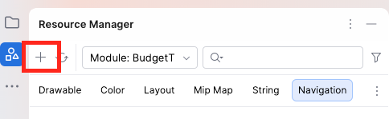
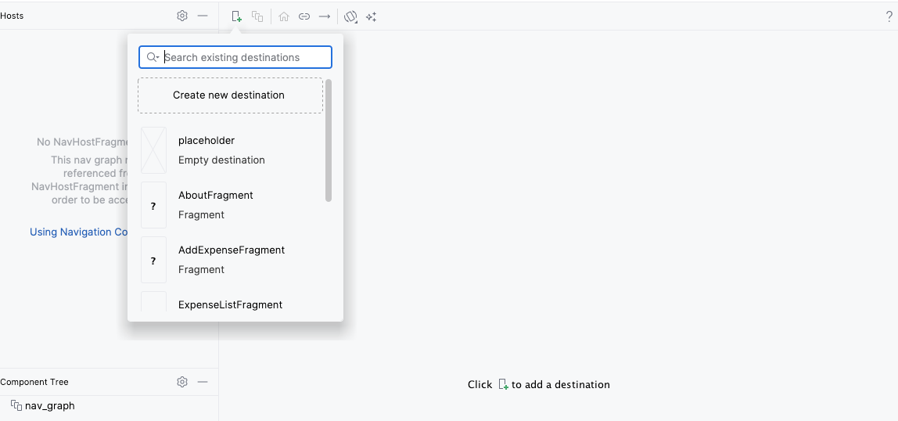
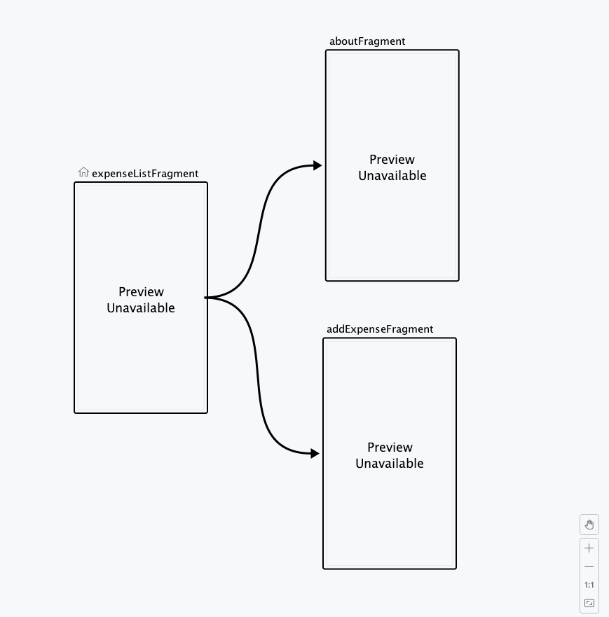

# Labor03 - Fragmentek és RecyclerView

A második labor végén már képesek voltunk kiadásokat rögzíteni, és a főképernyőn megjeleníteni azok összegét és listáját. Az alkalmazás felépítésében azonban minden képernyőhöz külön `Activity` tartozik, a kiadáslista pedig egy egyszerű `TextView` segítségével jelenik meg.

Ez a megoldás kezdetnek nem rossz, de ahogy egyre több funkcióval bővítjük az alkalmazást, érdemes megváltoztatni a felépítést.

Mi lenne, ha részletesebb listaelemeket vagy egyes elemekhez tartozó műveleteket is szeretnénk megjeleníteni? Illetve valóban szükségünk van minden egyes képernyőhöz egy külön `Activity`-re?

## A labor célkitűzése

A labor során a következő koncepciókkal ismerkedünk meg:

*   `Fragment`-ek használata az Activity-k helyett az egyes képernyők megvalósítására

*   `Jetpack Navigation` és a navigációs gráf használata

*   Fragmentek és a Fragment view-életciklusa

*   Fragmentek közötti kommunikáció a `Fragment Result API` segítségével

*   `RecyclerView`, `Adapter` és `ViewHolder` használata dinamikus listához

*   Kotlin `data class` használata listaelemek reprezentálására

A labor végére ugyanazt az alapvető funkcionalitást kapjuk meg, mint a második laborban, azonban az alkalmazás képernyőit már Fragmentek kezelik, a korábbi `TextView` alapú kiadáslista helyett pedig egy valódi `RecyclerView` jeleníti meg a tételeket. Ezen kívül egy új képernyővel is bővítjük az alkalmazást.

<!-- KÉP HELYE: Az elkészült BudgetTracker főképernyője néhány kiadással, valamint az új kiadás hozzáadása, névjegy és kimutatás képernyő. Javasolt fájlnév: overview.png -->

## A kezdeti koncepció

A második labor végén az alkalmazásban három különálló képernyővel dolgoztunk:

*   a főképernyőn láthattuk az összes kiadás összegét és a korábban rögzített tételeket,

*   az új kiadás rögzítésére egy külön `Activity` szolgált,

*   a `Névjegy` funkció szintén külön `Activity`-ben kapott helyet.

A második laborban a képernyők közötti navigációt az `Activity`-k indításával oldottuk meg, a kiadás adatait pedig `Intent` extra mezők segítségével adtuk vissza az előző képernyőre.

Most ezt a felépítést alakítjuk át.

A célunk:

*   legyen egyetlen `MainActivity`, amely az alkalmazás képernyőinek helyet biztosít,

*   a tényleges képernyőket `Fragment`-ek valósítsák meg,

*   a képernyők közötti útvonalakat egy navigációs gráf írja le,

*   az egyes kiadásokat önálló listaelemként jelenítsük meg,

*   a kiadáslistát egy `RecyclerView` kezelje,

*   egy új kiadás rögzítése után a lista automatikusan bővüljön.

Ezzel a változtatással maga az alkalmazás funkcionalitása nem lesz gyökeresen más, viszont a szerkezete sokkal alkalmasabb lesz későbbi bővítésekre.

## A megvalósítás

A labor során két nagyobb lépésben haladunk:

1.   Először eltávolítjuk a felesleges Activity-ket és beépítjük a Fragment-alapú navigációt. Ezen a ponton még a régi `TextView`-os kiadáslista marad.

2.   Ezután lecseréljük a kiadások listáját `RecyclerView`-ra, és elkészítjük hozzá a listaelem layoutját, az `Adapter`-t és a `ViewHolder`-t.

A következő ábra a végső felépítést szemlélteti.

```text
MainActivity
    ├── ExpenseListFragment
    │       └── RecyclerView
    ├── AddExpenseFragment
    └── AboutFragment
```

## A projekt továbbfejlesztése

A második labor során elkészített BudgetTracker projektből indulunk ki.

Ellenőrizzük, hogy a projektben továbbra is engedélyezve van a `ViewBinding`, majd egészítsük ki a projektet a navigációhoz szükséges függőségekkel.

Nyissuk meg a `gradle/libs.versions.toml` fájlt, és a meglévő bejegyzések mellé vegyük fel a következőket:

```toml
[versions]
navigation = "2.10.2"

[libraries]
androidx-navigation-fragment-ktx = { group = "androidx.navigation", name = "navigation-fragment-ktx", version.ref = "navigation" }
androidx-navigation-ui-ktx = { group = "androidx.navigation", name = "navigation-ui-ktx", version.ref = "navigation" }
```

Az `app` modul `build.gradle.kts` fájljában adjuk hozzá a szükséges könyvtárakat:

```kotlin
dependencies {
    // ...
    implementation(libs.androidx.navigation.fragment.ktx)
    implementation(libs.androidx.navigation.ui.ktx)
}
```

A projekt szinkronizálása után kezdjük meg a képernyők átalakítását.

## Áttérés Activity-kről Fragmentekre

A második labor végén minden képernyőhöz külön `Activity` tartozott. Most ezt a felépítést fogjuk átalakítani úgy, hogy az alkalmazásban egyetlen `Activity` maradjon, a különböző képernyőket pedig `Fragment`-ek valósítsák meg.

Az átalakítást nem egy lépésben végezzük el. Először létrehozzuk az egyes Fragmenteket, és áthelyezzük beléjük a második labor képernyőit. Ezután alakítjuk ki a navigációt, végül pedig kipróbáljuk, hogy a RecyclerView bevezetése nélkül is minden működik-e.

!!!info "Mi a Fragment?"
    A `Fragment` egy Activity-n belül megjelenő, önálló UI-komponens, amely saját életciklussal és saját layouttal rendelkezik. Ugyanazon Activity-n belül több különböző Fragmentet is megjeleníthetünk, és ezek között navigálhatunk.

## A Fragmentek létrehozása

Először hozzuk létre azokat a Fragmenteket, amelyek az alkalmazás képernyőit fogják helyettesíteni.

### ExpenseListFragment

A gyökér package-en jobb klikk után válasszuk a `New -> Fragment -> Fragment (Blank)` lehetőséget, majd hozzuk létre `ExpenseListFragment` néven.

Ehhez automatikusan létrejönnek az alábbi fájlok:

```text
ExpenseListFragment.kt
fragment_expense_list.xml
```

A `fragment_expense_list.xml` fájlba helyezzük át a korábbi laborból ismert főképernyő felületét. Egyelőre még semmit nem változtatunk a kiadáslista működésén, tehát a korábbi `TextView` marad a helyén.

???info "A layout kódja"

    ```xml
    <?xml version="1.0" encoding="utf-8"?>
    <androidx.constraintlayout.widget.ConstraintLayout
        xmlns:android="http://schemas.android.com/apk/res/android"
        xmlns:app="http://schemas.android.com/apk/res-auto"
        android:id="@+id/main"
        android:layout_width="match_parent"
        android:layout_height="match_parent"
        android:padding="16dp"
        android:fitsSystemWindows="true">

        <com.google.android.material.appbar.MaterialToolbar
            android:id="@+id/topAppBar"
            android:layout_width="match_parent"
            android:layout_height="?attr/actionBarSize"
            android:background="?attr/colorPrimary"
            app:title="BudgetTracker"
            app:titleTextColor="@color/white"
            app:layout_constraintEnd_toEndOf="parent"
            app:layout_constraintStart_toStartOf="parent"
            app:layout_constraintTop_toTopOf="parent">

            <ImageButton
                android:id="@+id/btnInfo"
                android:layout_width="wrap_content"
                android:layout_height="wrap_content"
                android:layout_gravity="end"
                android:contentDescription="@string/info"
                android:padding="16dp"
                android:background="?attr/selectableItemBackgroundBorderless"
                android:src="@android:drawable/ic_dialog_info"
                app:tint="@color/white" />

        </com.google.android.material.appbar.MaterialToolbar>

        <TextView
            android:id="@+id/tvTotalLabel"
            android:layout_width="wrap_content"
            android:layout_height="wrap_content"
            android:layout_marginTop="24dp"
            android:text="@string/total_label"
            android:textSize="18sp"
            android:textStyle="bold"
            app:layout_constraintTop_toBottomOf="@id/topAppBar"
            app:layout_constraintStart_toStartOf="parent"
            app:layout_constraintEnd_toEndOf="parent" />

        <TextView
            android:id="@+id/tvTotalSum"
            android:layout_width="wrap_content"
            android:layout_height="wrap_content"
            android:layout_marginTop="8dp"
            android:text="@string/base_total"
            android:textSize="42sp"
            android:textStyle="bold"
            android:textColor="?attr/colorPrimary"
            app:layout_constraintEnd_toEndOf="parent"
            app:layout_constraintStart_toStartOf="parent"
            app:layout_constraintTop_toBottomOf="@id/tvTotalLabel" />

        <Button
            android:id="@+id/btnAddExpense"
            android:layout_width="0dp"
            android:layout_height="wrap_content"
            android:layout_marginStart="16dp"
            android:layout_marginTop="16dp"
            android:layout_marginEnd="16dp"
            android:text="@string/add_expense"
            app:layout_constraintEnd_toEndOf="parent"
            app:layout_constraintStart_toStartOf="parent"
            app:layout_constraintTop_toBottomOf="@id/tvTotalSum" />

        <TextView
            android:id="@+id/tvExpensesTitle"
            android:layout_width="0dp"
            android:layout_height="wrap_content"
            android:layout_marginStart="16dp"
            android:layout_marginTop="24dp"
            android:layout_marginEnd="16dp"
            android:text="@string/prev_expenses"
            android:textSize="18sp"
            android:textStyle="bold"
            app:layout_constraintEnd_toEndOf="parent"
            app:layout_constraintStart_toStartOf="parent"
            app:layout_constraintTop_toBottomOf="@id/btnAddExpense" />

        <TextView
            android:id="@+id/tvExpensesList"
            android:layout_width="0dp"
            android:layout_height="0dp"
            android:layout_marginStart="16dp"
            android:layout_marginTop="12dp"
            android:layout_marginEnd="16dp"
            android:hint="@string/expense_placeholder"
            android:text=""
            android:textSize="16sp"
            app:layout_constraintBottom_toBottomOf="parent"
            app:layout_constraintEnd_toEndOf="parent"
            app:layout_constraintStart_toStartOf="parent"
            app:layout_constraintTop_toBottomOf="@id/tvExpensesTitle" />

    </androidx.constraintlayout.widget.ConstraintLayout>
    ```

Most nézzük meg, hogyan néz ki egy Fragment Kotlin oldalon.

!!!info "A Fragment és a View életciklusa"
    Activity esetén eddig főként az `onCreate()` metódussal dolgoztunk. Fragmenteknél fontos különbség, hogy maga a Fragment és a hozzá tartozó View-hierarchia nem feltétlenül ugyanaddig él. Emiatt a binding objektumot nem a Fragment teljes életciklusára, hanem annak View-életciklusára kötjük.

A `ExpenseListFragment` alapja:

```kotlin
class ExpenseListFragment : Fragment() {
    private var _binding: FragmentExpenseListBinding? = null
    private val binding get() = _binding!!
    private var totalSum = 0
    private val expenses = mutableListOf<String>()

    override fun onCreateView(
        inflater: LayoutInflater,
        container: ViewGroup?,
        savedInstanceState: Bundle?
    ): View {
        _binding = FragmentExpenseListBinding.inflate(inflater, container, false)
        return binding.root
    }

    override fun onViewCreated(view: View, savedInstanceState: Bundle?) {
        super.onViewCreated(view, savedInstanceState)

        binding.btnAddExpense.setOnClickListener {
            // Hozzáadás Fragmentre navigáció kódjának a helye
        }

        binding.btnInfo.setOnClickListener {
            // Névjegy Fragmentre navigáció kódjának a helye
        }

        // Result kezelésének (lista frissítése) helye
    }

    override fun onDestroyView() {
        super.onDestroyView()
        _binding = null
    }
}
```

Ebben a kódban három olyan metódust láthatunk, amelyekkel eddig még nem találkoztunk együtt:

* az `onCreateView()` feladata a Fragment View-jának létrehozása,
* az `onViewCreated()` akkor fut le, amikor a View már elkészült, így itt kezelhetjük az UI-elemeket,
* az `onDestroyView()` akkor fut le, amikor a Fragmenthez tartozó View megszűnik.

A ViewBinding is ezekhez igazodik. Létrehozzuk az `onCreateView()` során, és elengedjük az `onDestroyView()` során.

!!!warning "Miért nem használunk egyszerű `lateinit` bindinget?"
    A Fragment továbbra is létezhet akkor is, amikor a hozzá tartozó View már megszűnt. Ha a binding ekkor is a régi View-hierarchiára mutatna, feleslegesen tartanánk életben azt.
    Ezért a Fragment ViewBindingjét a View életciklusához igazítjuk:

    ```text
    onCreateView()
        ↓
    View létrejön
        ↓
    onViewCreated()
        ↓
    a View használata
        ↓
    onDestroyView()
        ↓
    View megszűnik
    ```

A `binding` getter miatt a View létrejötte után ugyanúgy használhatjuk a UI-elemeket, mint Activity esetén:

```kotlin
binding.tvTotalSum.text = "5000 Ft"
binding.btnAddExpense.setOnClickListener { ... }
```

Most, hogy az `ExpenseListFragment` létrejött, térjünk át a másik két képernyőre.

### AddExpenseFragment

Hozzunk létre egy új `Fragment (Blank)`-et `AddExpenseFragment` néven.

A hozzá tartozó layout:

```text
fragment_add_expense.xml
```

A layout változatlan maradhat a második laborhoz képest. Továbbra is szükségünk lesz a kiadás nevéhez és összegéhez egy-egy mezőre, valamint a `Mentés` és `Mégse` gombokra.

???info "A layout kódja"
    ```xml
    <?xml version="1.0" encoding="utf-8"?>
    <androidx.constraintlayout.widget.ConstraintLayout
        xmlns:android="http://schemas.android.com/apk/res/android"
        xmlns:app="http://schemas.android.com/apk/res-auto"
        android:layout_width="match_parent"
        android:layout_height="match_parent"
        android:padding="16dp"
        android:fitsSystemWindows="true">

        <com.google.android.material.textfield.TextInputEditText
            android:id="@+id/etExpenseName"
            android:layout_width="match_parent"
            android:layout_height="wrap_content"
            android:layout_marginStart="16dp"
            android:layout_marginTop="24dp"
            android:layout_marginEnd="16dp"
            android:hint="@string/expense_name"
            app:layout_constraintEnd_toEndOf="parent"
            app:layout_constraintStart_toStartOf="parent"
            app:layout_constraintTop_toTopOf="parent" />

        <com.google.android.material.textfield.TextInputEditText
            android:id="@+id/etExpenseAmount"
            android:layout_width="match_parent"
            android:layout_height="wrap_content"
            android:layout_marginStart="16dp"
            android:layout_marginTop="16dp"
            android:layout_marginEnd="16dp"
            android:hint="@string/sum"
            android:inputType="number"
            app:layout_constraintEnd_toEndOf="parent"
            app:layout_constraintStart_toStartOf="parent"
            app:layout_constraintTop_toBottomOf="@+id/etExpenseName" />

        <Button
            android:id="@+id/btnSave"
            android:layout_width="match_parent"
            android:layout_height="wrap_content"
            android:layout_marginStart="16dp"
            android:layout_marginTop="32dp"
            android:layout_marginEnd="16dp"
            android:text="@string/save"
            app:layout_constraintEnd_toEndOf="parent"
            app:layout_constraintStart_toStartOf="parent"
            app:layout_constraintTop_toBottomOf="@+id/etExpenseAmount" />

        <Button
            android:id="@+id/btnCancel"
            style="@style/Widget.Material3.Button.OutlinedButton"
            android:layout_width="match_parent"
            android:layout_height="wrap_content"
            android:layout_marginStart="16dp"
            android:layout_marginTop="16dp"
            android:layout_marginEnd="16dp"
            android:text="@string/cancel"
            app:layout_constraintEnd_toEndOf="parent"
            app:layout_constraintStart_toStartOf="parent"
            app:layout_constraintTop_toBottomOf="@+id/btnSave" />

    </androidx.constraintlayout.widget.ConstraintLayout>
    ```

A Fragment Kotlin kódja:

```kotlin
class AddExpenseFragment : Fragment() {
    private var _binding: FragmentAddExpenseBinding? = null
    private val binding get() = _binding!!

    override fun onCreateView(
        inflater: LayoutInflater,
        container: ViewGroup?,
        savedInstanceState: Bundle?
    ): View {
        _binding = FragmentAddExpenseBinding.inflate(inflater, container, false)
        return binding.root
    }

    override fun onViewCreated(view: View, savedInstanceState: Bundle?) {
        super.onViewCreated(view, savedInstanceState)
        binding.btnSave.setOnClickListener {
            val name = binding.etExpenseName.text.toString()
            val amount = binding.etExpenseAmount.text.toString()
            if (name.isEmpty() || amount.isEmpty()) {
                Toast.makeText(
                    requireContext(),
                    "Kérlek töltsd ki mindkét mezőt!",
                    Toast.LENGTH_SHORT
                ).show()
                return@setOnClickListener
            }
            parentFragmentManager.setFragmentResult(
                "expense_result",
                Bundle().apply {
                    putString("EXPENSE_NAME", name)
                    putInt("EXPENSE_AMOUNT", amount.toInt())
                }
            )
            // Visszalépés kódjának a helye
        }
        binding.btnCancel.setOnClickListener {
            // Visszalépés kódjának a helye
        }
    }

    override fun onDestroyView() {
        super.onDestroyView()
        _binding = null
    }
}
```

Figyeljük meg, hogy itt már nem használunk `Intent` objektumot. Fragmentek esetén a korábbi `setResult()` és `finish()` helyett a `Fragment Result API` segítségével adjuk vissza az adatokat, a navigációt pedig majd később implementáljuk.

!!!tip "requireContext()"
    Figyeljük meg azt is, hogy a Toast üzenethez a Fragmenten belül egy `requireContext()` hívással tudjuk biztosítani a megfelelő kontextust, nem úgy, mint az Activity esetében, ahol elég volt egy `this`-t átadni.

!!!tip "Bundle"
    Itt már Intent helyett egy `Bundle` objektumba csomagoljuk az átadni kívánt adatokat, de a módszer szinte ugyanaz. 

### AboutFragment

Végül hozzuk létre az `AboutFragment`-et is.

A layoutban a második laborhoz hasonlóan jelenítsük meg a fejlesztő NEPTUN kódját.

???info "A layout kódja"
    ```xml
    <?xml version="1.0" encoding="utf-8"?>
    <androidx.constraintlayout.widget.ConstraintLayout
        xmlns:android="http://schemas.android.com/apk/res/android"
        xmlns:app="http://schemas.android.com/apk/res-auto"
        android:layout_width="match_parent"
        android:layout_height="wrap_content"
        android:padding="32dp">

        <TextView
            android:id="@+id/textView"
            android:layout_width="wrap_content"
            android:layout_height="wrap_content"
            android:text="@string/made_by"
            android:textAlignment="center"
            android:textSize="18sp"
            app:layout_constraintBottom_toBottomOf="parent"
            app:layout_constraintEnd_toEndOf="parent"
            app:layout_constraintStart_toStartOf="parent"
            app:layout_constraintTop_toTopOf="parent" />

    </androidx.constraintlayout.widget.ConstraintLayout>
    ```

A Fragment Kotlin kódja:

```kotlin
class AboutFragment : DialogFragment() {
    private var _binding: FragmentAboutBinding? = null
    private val binding get() = _binding!!

    override fun onCreateView(
        inflater: LayoutInflater,
        container: ViewGroup?,
        savedInstanceState: Bundle?
    ): View {
        _binding = FragmentAboutBinding.inflate(inflater, container, false)
        return binding.root
    }

    override fun onDestroyView() {
        super.onDestroyView()
        _binding = null
    }
}
```

Ezzel elkészült mindhárom Fragment. Még egyiket sem kötöttük be a valódi navigációs gráfba, ezért most következhet ennek a létrehozása.

## Navigációs gráf létrehozása

Hozzunk létre egy új navigációs erőforrást a resources mappába az Android Studio Resource Manager segítségével `nav_graph.xml` néven.



Nyissuk meg a gráfot `Design` nézetben, és adjuk hozzá a már elkészített Fragmenteket. A kiinduló Fragment az `ExpenseListFragment` legyen.



Ezután hozzuk létre a képen látható kapcsolatokat:



Az `AddExpenseFragment`-ből és az `AboutFragment`-ből nem feltétlenül kell külön visszafelé vezető kapcsolatot létrehozni a gráfban.

!!!info "Navigation Graph tartalma"
    Menjünk át kód nézetbe, és nézzük meg hogyan vannak az egyes csomópontok és a köztük menő élek reprezentálva a kódban.

## A MainActivity átalakítása

Mivel a képernyőket most már Fragmentek valósítják meg, a `MainActivity`-nek nem kell többé a teljes főképernyő UI-ját tartalmaznia. Egyetlen feladata marad: helyet biztosítani annak a Fragmentnek, amelyet a navigációs rendszer éppen megjelenít.

A `res/layout/activity_main.xml` fájlban ezért a korábbi UI helyett egy `FragmentContainerView` maradjon:

```xml
<?xml version="1.0" encoding="utf-8"?>
<androidx.constraintlayout.widget.ConstraintLayout
    xmlns:android="http://schemas.android.com/apk/res/android"
    xmlns:app="http://schemas.android.com/apk/res-auto"
    android:layout_width="match_parent"
    android:layout_height="match_parent">
    <androidx.fragment.app.FragmentContainerView
        android:id="@+id/nav_host_fragment"
        android:name="androidx.navigation.fragment.NavHostFragment"
        android:layout_width="0dp"
        android:layout_height="0dp"
        app:defaultNavHost="true"
        app:navGraph="@navigation/nav_graph"
        app:layout_constraintBottom_toBottomOf="parent"
        app:layout_constraintEnd_toEndOf="parent"
        app:layout_constraintStart_toStartOf="parent"
        app:layout_constraintTop_toTopOf="parent" />
</androidx.constraintlayout.widget.ConstraintLayout>
```

!!!info "FragmentContainerView"
    A `FragmentContainerView` egy olyan View, amelyben a navigációs rendszer által kiválasztott Fragment megjelenhet. Az `android:name` megadja, hogy milyen `NavHost` implementációt használunk, az `app:navGraph` pedig azt a navigációs gráfot jelöli, amely meghatározza, milyen Fragmentek között lehet navigálni.

A `MainActivity` Kotlin kódja ezután nagyon egyszerű lehet:

```kotlin
class MainActivity : AppCompatActivity() {
    private lateinit var binding: ActivityMainBinding

    override fun onCreate(savedInstanceState: Bundle?) {
        super.onCreate(savedInstanceState)
        binding = ActivityMainBinding.inflate(layoutInflater)
        setContentView(binding.root)
    }
}
```

A korábbi képernyőkhöz tartozó eseménykezelők tehát eltűnnek a `MainActivity`-ből. Ezek most már az adott Fragmentekben találhatók.

## A navigáció használata

A `NavController` objektum felelős a navigáció tényleges végrehajtásáért.

Az `ExpenseListFragment`-ben például az `Új kiadás hozzáadása` gombbal:

```kotlin
binding.btnAddExpense.setOnClickListener {
    findNavController().navigate(
        R.id.action_expenseListFragment_to_addExpenseFragment
    )
}
```

A `Névjegy` gomb pedig:

```kotlin
binding.btnInfo.setOnClickListener {
    findNavController().navigate(
        R.id.action_expenseListFragment_to_aboutFragment
    )
}
```

A másik két Fragmentből a `popBackStack()` segítségével léphetünk vissza:

```kotlin
findNavController().popBackStack()
```

Ezeket helyettesítsük is be a kommentek helyére.

Ezzel a második laborban megszokott:

```kotlin
Intent(...)
startActivity(...)
```

helyett most:

```kotlin
findNavController().navigate(...)
```

megoldást használunk.

Az adatátadásnál pedig a korábbi:

```kotlin
setResult(...)
finish()
```

helyett:

```kotlin
setFragmentResult(...)
findNavController().popBackStack()
```

megoldást alkalmazzuk.

## A Fragment Result fogadása

Már elkészítettük az `AddExpenseFragment`-et, amely a `Fragment Result API` segítségével visszaküldi az új kiadás adatait. A fogadó oldalt az `ExpenseListFragment`-ben kell megvalósítanunk.

Az `onViewCreated()` metódusban regisztráljuk a listenert:

```kotlin
parentFragmentManager.setFragmentResultListener(
    "expense_result",
    viewLifecycleOwner
) { _, bundle ->
    val name = bundle.getString("EXPENSE_NAME") ?: return@setFragmentResultListener
    val amount = bundle.getInt("EXPENSE_AMOUNT")
    totalSum += amount
    binding.tvTotalSum.text = "$totalSum Ft"
    expenses.add("• $name: $amount Ft")
    binding.tvExpensesList.text = expenses.joinToString("\n")
}
```

Így az alkalmazás működése lényegében változatlan marad az előző laborhoz képest, csak az Activity-k közötti adatátadás helyett már Fragmentek kommunikálnak egymással.

!!!warning "Activity-k törlése"
    Ezen a ponton törölhetjük a `MainActivity`-n kívül létező 2 másik Activity-t, hiszen már nem használjuk őket. Töröljük őket az `AndroidManifest.xml` fájlból is!

## A navigáció kipróbálása

Ezen a ponton álljunk meg, és futtassuk az alkalmazást.

A RecyclerView-val még egyáltalán nem foglalkoztunk. A főképernyőn továbbra is a második laborból ismert `TextView` jeleníti meg a kiadásokat.

Ellenőrizzük, hogy:

1. az alkalmazás az `ExpenseListFragment`-tel indul,
2. az `Új kiadás hozzáadása` gomb megnyitja az `AddExpenseFragment`-et,
3. egy új kiadás elmenthető és mentéskor visszakerül a korábbi képernyőre,
4. a teljes összeg frissül,
5. a `Mégse` gomb is visszalép,
6. a `Névjegy` gomb megnyitja az `AboutFragment`-et,
7. az `AboutFragment`-ből vissza lehet lépni.

!!!warning "Bug"
    Ajjaj...amikor pl. a Mégse gombbal lépünk vissza a lista Fragmentre, akkor a TextView-k visszaállnak alapállapotra. Ez azért van, mert újra létrejön a Fragment view-ja, és bár a memóriában benne vannak az aktuális állapotok, ez nem tükröződik rajta vissza.

    Ezt orvosolhatjuk a megfelelő TextView-k értékeinek beállításával az `onViewCreated()` metódusban, de a valódi megoldás egy `ViewModel` használata lenne, amire majd egy későbbi laborban látunk példát.

!!!tip "Mérföldkő"
    Ha eddig minden működik, akkor egy teljesen működő Fragment-alapú alkalmazásunk van.
    A kiadások listája még ugyanúgy egy `TextView`, mint a második laborban, de már nincs szükség külön Activity-re minden képernyőhöz.
    Innen kezdve külön foglalkozhatunk azzal, hogyan alakítsuk át ezt a listát egy valódi `RecyclerView`-vá.

!!!example "BEADANDÓ (1 pont)"

    Készíts egy **képernyőképet**, amin látszódik a **`nav_graph.xml` a három Fragmenttel**, valamint a működő alkalmazásból a **főképernyő → új kiadás → visszatérés** navigáció valamelyik állapota.

    A képet a megoldásban a repository-ba `f1.png` néven töltsd föl.

    A képernyőkép szükséges feltétele a pontszám megszerzésének.

## RecyclerView

Most, hogy a Fragmentes navigáció már működik, térjünk át a lista átalakítására.

!!!info "RecyclerView"
    A `RecyclerView` nagyobb elemszámú adathalmazok hatékony megjelenítésére szolgáló komponens. Nem kell minden egyes listaelemhez külön View-t létrehoznunk és kézzel hozzáadnunk a layoutunkhoz. Ehelyett megadjuk, hogyan néz ki egyetlen listaelem, milyen adatokból áll a lista, és hogyan kell egy adatot megjeleníteni egy listaelemben.

A megvalósítást három fő részre bonthatjuk:

1.   a listaelem layoutjának elkészítése,

2.   az `Adapter` és `ViewHolder` megvalósítása,

3.   a `RecyclerView` inicializálása és az adatok átadása.

De még ezek előtt kellene valami normális formátum, amiben a kiadásainkat reprezentálhatjuk a kódban.

## Kiadások modellje Kotlinban
Eddig a kiadásokat egyszerű `String` értékekként tároltuk. A `RecyclerView` használata mellett praktikusabb, ha egy kiadásnak saját típusa van.

Hozzunk létre egy `model` package-et, majd benne egy `Expense` nevű `data class`-t:

```kotlin
data class Expense(
    val name: String,
    val amount: Int
)
```

Ezután a főképernyőn a korábbi `String` lista helyett használjuk ezt a típust:

```kotlin
private val expenses = mutableListOf<Expense>()
```

A teljes összeg kiszámítása így ehhez hasonlóan fog majd kinézni:

```kotlin
expenses.sumOf { it.amount }
```

!!!info "Miért jobb ez a String-be fűzésnél?"

    Egy `Expense` objektum külön mezőkben tárolja a kiadás nevét és összegét. Később könnyen bővíthetjük például dátummal, kategóriával vagy azonosítóval anélkül, hogy egyetlen Stringben kellene összefűznünk minden adatot.

## A szükséges függőség felvétele

Nyissuk meg a `gradle/libs.versions.toml` fájlt, és adjuk hozzá ezt:

```toml
[versions]
recyclerview = "1.4.0"

[libraries]
androidx-recyclerview = { group = "androidx.recyclerview", name = "recyclerview", version.ref = "recyclerview" }
```

Ezután az `app` modul `build.gradle.kts` fájljában is adjuk ezt hozzá:

```kotlin
dependencies {
    // ...
    implementation(libs.androidx.recyclerview)
}
```

A projekt szinkronizálása után neki is láthatunk a fejlesztésnek.

## A RecyclerView felületének kialakítása

Az `ExpenseListFragment` layoutjában most lecseréljük a korábbi `tvExpensesList` `TextView`-t egy `RecyclerView` komponensre.

A listaelemek függőleges megjelenítéséhez `LinearLayoutManager`-t fogunk használni.

A korábbi `TextView` helyére kerüljön:

```xml
<androidx.recyclerview.widget.RecyclerView
    android:id="@+id/expensesRecyclerView"
    android:layout_width="0dp"
    android:layout_height="0dp"
    android:padding="12dp"
    app:layoutManager="androidx.recyclerview.widget.LinearLayoutManager"
    app:layout_constraintTop_toBottomOf="@id/tvExpensesTitle"
    app:layout_constraintBottom_toBottomOf="parent"
    app:layout_constraintStart_toStartOf="parent"
    app:layout_constraintEnd_toEndOf="parent" />
```

A `RecyclerView` már gondoskodik a lista görgethető megjelenítéséről. Nekünk az lesz a feladatunk, hogy megadjuk neki, hogyan nézzen ki egyetlen listaelem, és hogyan kapcsolódjon hozzá az adathalmaz. Ezt **3 nagyobb lépésben** fogjuk megtenni.

### 1. A listaelem layoutja

Hozzunk létre egy új fájlt:

`res/layout/view_expense_item.xml`

Ez írja le azt a View-hierarchiát, amelyből minden egyes kiadáselem felépül.

A layout lehet egy egyszerű vízszintes `LinearLayout`, benne a kiadás neve és összege:

```xml
<?xml version="1.0" encoding="utf-8"?>
<LinearLayout 
    xmlns:android="http://schemas.android.com/apk/res/android" 
    android:id="@+id/expenseItem" 
    android:layout_width="match_parent" 
    android:layout_height="wrap_content" 
    android:layout_margin="6dp" 
    android:orientation="horizontal" 
    android:gravity="center_vertical">
    <TextView
        android:id="@+id/tvExpenseName"
        android:layout_width="0dp"
        android:layout_height="wrap_content"
        android:layout_weight="1"
        android:textSize="18sp" />
    <TextView
        android:id="@+id/tvExpenseAmount"
        android:layout_width="wrap_content"
        android:layout_height="wrap_content"
        android:textSize="18sp"
        android:textStyle="bold" />
</LinearLayout>
```

### 2. ViewHolder

A `RecyclerView` nem közvetlenül az XML layout elemeivel dolgozik, hanem egy `ViewHolder` objektumon keresztül jeleníti meg őket.

A `ViewHolder` feladata, hogy tartalmazza az adott listaelem View-jaira mutató referenciákat. Ezt a kódban egy `inner class`-ként fogjuk megvalósítani egy adapter osztályon belül.

Hozzunk létre egy `adapter` package-et, majd benne egy `ExpenseAdapter` osztályt.

```kotlin
class ExpenseAdapter(private val expenses: List<Expense>) : RecyclerView.Adapter<ExpenseAdapter.ViewHolder>() {
    inner class ViewHolder(private val binding: ViewExpenseItemBinding) : RecyclerView.ViewHolder(binding.expenseItem) {
        fun bind(expense: Expense) {
            binding.tvExpenseName.text = expense.name
            binding.tvExpenseAmount.text = "${expense.amount} Ft"
        }
    }
}
```

A `ViewBinding` miatt a listaelemhez automatikusan létrejön a `ViewExpenseItemBinding` osztály.

A `bind()` metódus feladata tehát az, hogy egy adott `Expense` objektum adatait ráhelyezze a listaelem View-jaira.

### 3. Az Adapter

Az `Adapter` metódusai fogják összekötni az adathalmazt és a listaelemeket.

Három fontos metódust kell megvalósítanunk:

*   `onCreateViewHolder()` – létrehozza a listaelem View-ját,

*   `onBindViewHolder()` – az adott pozícióhoz tartozó adatot megjeleníti,

*   `getItemCount()` – megmondja, hány elem található az adathalmazban.

A teljes alapimplementáció:

```kotlin
class ExpenseAdapter(private val expenses: List<Expense>) : RecyclerView.Adapter<ExpenseAdapter.ViewHolder>() {
    inner class ViewHolder(private val binding: ViewExpenseItemBinding) : RecyclerView.ViewHolder(binding.expenseItem) {
        fun bind(expense: Expense) {
            binding.tvExpenseName.text = expense.name
            binding.tvExpenseAmount.text = "${expense.amount} Ft"
        }
    }
    override fun onCreateViewHolder(parent: ViewGroup, viewType: Int): ViewHolder {
        val binding = ViewExpenseItemBinding.inflate(LayoutInflater.from(parent.context), parent, false)
        return ViewHolder(binding)
    }
    override fun onBindViewHolder(holder: ViewHolder, position: Int) {
        holder.bind(expenses[position])
    }
    override fun getItemCount(): Int = expenses.size
}
```

!!!info "Mi történik görgetéskor?"

    A `RecyclerView` nem minden egyes elemhez hoz létre új View-hierarchiát. A már létrehozott ViewHolder-eket újra felhasználja, és az `onBindViewHolder()` segítségével új adatot köt hozzájuk.

## A RecyclerView inicializálása

Az `ExpenseListFragment` `onViewCreated()` metódusában hozzuk létre az Adapter példányát, majd rendeljük hozzá a `RecyclerView`-hoz.

```kotlin
private lateinit var adapter: ExpenseAdapter

override fun onViewCreated(view: View, savedInstanceState: Bundle?) {
    super.onViewCreated(view, savedInstanceState)
    adapter = ExpenseAdapter(expenses)
    binding.expensesRecyclerView.adapter = adapter
}
```

## A kiadás mentésének átállítása a RecyclerView-ra

A navigációs részben létrehozott `Fragment Result` listener most még Stringeket pakol a `TextView`-ba. Most írjuk ezt át úgy, hogy az `Expense` elemeket adja át a `RecyclerView`-nak.

Az `ExpenseListFragment`-ben a result listener legyen:

```kotlin
parentFragmentManager.setFragmentResultListener("expense_result", viewLifecycleOwner) { _, bundle ->
    val name = bundle.getString("EXPENSE_NAME") ?: return@setFragmentResultListener
    val amount = bundle.getInt("EXPENSE_AMOUNT")
    expenses.add(Expense(name, amount))
    adapter.notifyItemInserted(expenses.lastIndex)
    binding.tvTotalSum.text = "${expenses.sumOf { it.amount }} Ft"
}
```

A `RecyclerView` nem figyeli automatikusan a mögötte lévő `MutableList` módosításait. Ha csak szimplán ezt írnánk:

```kotlin
expenses.add(newExpense)
```

attól a `RecyclerView` még nem feltétlenül tudná, hogy új elem jelent meg. Ezért értesíteni kell az Adaptert:

```kotlin
adapter.notifyItemInserted(expenses.lastIndex)
```

!!!tip "Értesítések"

    Mindig olyan értesítést használjunk, amely a lehető legpontosabban leírja, mi változott a listában. Például törlésnél `notifyItemRemoved()`, módosításnál `notifyItemChanged()` használható.


## A RecyclerView működésének ellenőrzése

Most ismét futtassuk le az alkalmazást.

Vegyünk fel több kiadást, majd ellenőrizzük, hogy:

1.   minden kiadás külön listaelemként jelenik meg,
2.   több elem esetén a lista görgethető,
3.   új kiadás mentésekor a lista új elemmel bővül,
4.   a teljes összeg továbbra is megfelelően frissül.

Ezek után pedig adjunk hozzá egy teljesen új `Fragment`-et, amit a semmiből építünk fel!

!!!example "BEADANDÓ (2 pont)"

    Készíts egy **képernyőképet**, amin látszódik az **`ExpenseListFragment` működő főképernyője legalább 3 kiadással**, valamint az **`ExpenseListFragment` vagy `ExpenseAdapter` egy lényeges kódrészlete**, és a **Neptun kódod a kódban valahol kommentként**.

    A képet a megoldásban a repository-ba `f2.png` néven töltsd föl.

    A képernyőkép szükséges feltétele a pontszám megszerzésének.

## Önálló feladatok

A következő feladatok mindegyike 1 pontot ér, vagyis nem szükséges mindegyik teljesítése a maximális pontszámhoz.

### 1. Kiadás törlése a listából

Egészítsd ki az egyes listaelemeket egy `Törlés` gombbal.

A gomb megnyomásakor:

1.   az Adapter jelezze vissza, hogy melyik elemhez tartozott a kattintás,

2.   a Fragmentben töröljük a megfelelő `Expense` objektumot a listából,

3.   az Adapter kapjon megfelelő értesítést a változásról.

A megoldáshoz használd például ezt a metódust:

```kotlin
adapter.notifyItemRemoved(position)
```

!!!example "BEADANDÓ (1 pont)"
    Készíts egy **képernyőképet**, amin látszódik egy kiadás törlése, a hozzá tartozó `Adapter`-beli eseménykezelés, valamint a **Neptun kódod kommentként**.

    A képet a megoldásban a repository-ba `f3.png` néven töltsd föl.

### 2. Üres lista állapot

Jelenleg a `RecyclerView` akkor is megjelenik, amikor még egyetlen kiadásunk sincs.

Egészítsd ki a főképernyőt egy üzenettel:

> Még nincsenek felvett kiadások.

Ha a lista üres, jelenjen meg ez az üzenet, a `RecyclerView` pedig legyen elrejtve. Ha bekerül az első elem, már cseréld ezt le a listával. Figyelj arra, hogy a lista utolsó elemének törlése esetén is megjelenjen ez az üzenet.

!!!example "BEADANDÓ (1 pont)"
    Készíts egy **képernyőképet**, amin látszódik az üres lista állapot a képernyőn, egy ahhoz tartozó kódrészlet, valamint a **Neptun kódod kommentként**.

    A képet a megoldásban a repository-ba `f4.png` néven töltsd föl.

### 3. A nagyobb kiadások kiemelése

Módosítsd a `RecyclerView` listaelemeit úgy, hogy a **10000 Ft feletti kiadások** vizuálisan eltérjenek a többitől.

A megoldást az `Adapter` `bind()` vagy `onBindViewHolder()` részében valósítsd meg.

A cél annak megfigyelése, hogy az Adapter nem csak adatokat írhat ki, hanem az adott adat alapján a View-k állapotát is beállíthatja.

!!!warning "ViewHolderek állapotkezelése"
    Ügyelj arra, hogy egy újrahasznosított ViewHolder esetében az minden esetben állítsd vissza a normál állapotot! Ellenkező esetben egy korábban kiemelt listaelem megjelenése egy másik elemre is átszivároghat.

!!!example "BEADANDÓ (1 pont)"
    Készíts egy **képernyőképet**, amin látszódnak a különböző megjelenésű elemek, egy ehhez a funkcióhoz tartozó kódrészlet, valamint a **Neptun kódod kommentként**.

    A képet a megoldásban a repository-ba `f5.png` néven töltsd föl.

### 4. Kiadások rendezése összeg szerint

Adj egy új gombot vagy menüelemet a főképernyőhöz, amellyel a kiadások összeg szerint rendezhetők.

Készíts két állapotot:

*   növekvő sorrend,
*   csökkenő sorrend.

A feladat során érdemes felhasználni a Kotlin kollekciókezelő függvényeit, például:

```kotlin
expenses.sortedBy { it.amount }
```

vagy:

```kotlin
expenses.sortedByDescending { it.amount }
```

Figyelj arra is, hogy az Adapter által használt adathalmaz és a képernyőn látható sorrend összhangban maradjon.

!!!example "BEADANDÓ (1 pont)"
    Készíts egy **képernyőképet**, amin látszódik a rendezett lista a főképernyőn, egy rendezéshez tartozó kódrészlet, valamint a **Neptun kódod kommentként**.

    A képet a megoldásban a repository-ba `f6.png` néven töltsd föl.

### 5. Kiadás részleteinek megjelenítése

!!!warning "Ez már egy kicsit összetettebb feladat"
    Nem véletlenül hagytuk ezt a feladatot utoljára, mert a megoldásához már kicsit többet kell kutakodni, mint a többihez. Ettől függetlenül bátorítunk mindenkit arra, hogy megpróbálja megoldani ezt is, mert sokat lehet belőle tanulni, és fejleszti az önálló problémamegoldó készségeteket.

Tedd kattinthatóvá a `RecyclerView` egyes elemeit. 
!!!info "Segítség"
    https://antonioleiva.com/recyclerview-listener/

Kattintáskor navigáljunk egy új `ExpenseDetailFragment`-re, ahol jelenjen meg:

*   a kiadás neve,
*   a kiadás összege,
*   egy vissza gomb,
*   esetleg egy külön törlés gomb, aminek megnyomására törlődik az elem és visszalépünk a listára.

A feladat során a navigációs gráfhoz új Fragmentet és új navigációs útvonalat kell felvenni.

A kiadás adatainak átadására használhatsz Navigation argumentumot vagy `Bundle`-t.
!!!info "Segítség"
    https://developer.android.com/guide/navigation/use-graph/pass-data#bundle

!!!info "Position"
    Ennél a feladatnál érdemes megfigyelni, hogy a RecyclerView `position` értéke önmagában nem maga a kiadás. A pozíció alapján meg kell keresni az adott `Expense` objektumot, majd annak adataival kell navigálni.

## Mit érdemes megjegyezni ebből a laborból?

*   A `Fragment` egy Activity-n belüli UI-komponens, amely saját életciklussal rendelkezik.
*   A `NavController` és a navigációs gráf segítségével a Fragmentek közötti útvonalak imperatívan és deklaratívan is kezelhetők.
*   A Fragment ViewBinding-ja a View életciklusához kötött, ezért a bindinget az `onDestroyView()` során elengedjük.
*   A `RecyclerView` az adatokat egy `Adapter` segítségével jeleníti meg, az egyes újrahasznosítható View-hierarchiákat pedig `ViewHolder`-ek kezelik.
*   Ha a lista adatai megváltoznak, az Adaptert megfelelő `notify...()` hívással értesítenünk kell.
*   A laborban elkészített megoldás már jó kiindulópont a következő fejlesztésekhez: valódi adattárolás, kategóriák, dátumok, szerkesztés, törlés, szűrés és rendezés is ráépíthető anélkül, hogy az alkalmazás teljes szerkezetét újra kellene gondolni.
