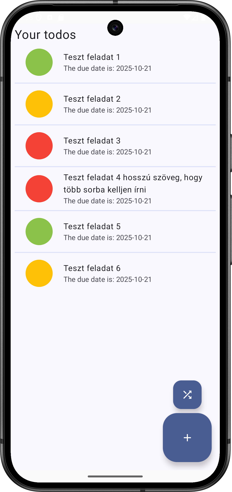
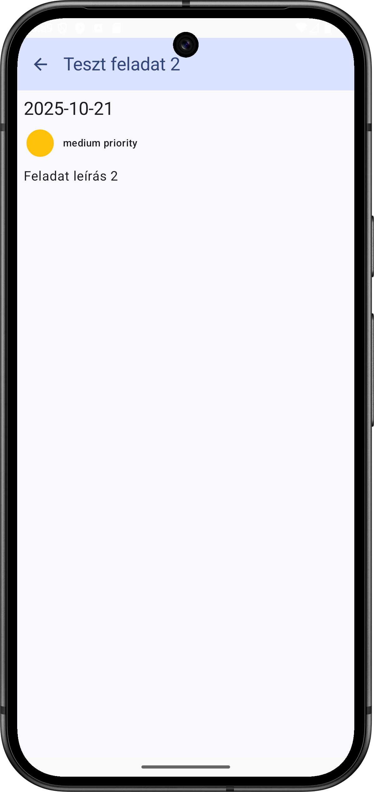
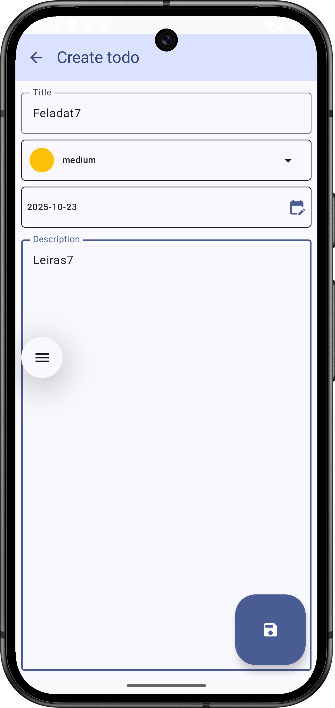
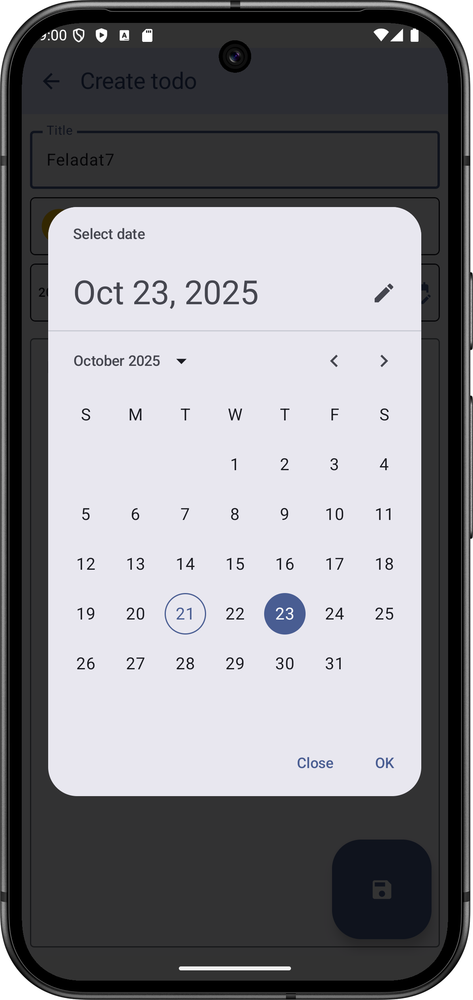

# Labor06 - Perzisztens adattárolás a Room könyvtárral

## Bevezetés

A labor célja a perzisztens adattárolás megismerése ORM technikával, a Room könyvtár segítségével.
A labor egyúttal azt is bemutatja, hogy egy modern, összetett alkalamzás különböző részeit (adatelérés, üzleti logika, felhasználói felület) hogyan tudunk megfelelő rétegezéssel, áttekinthető és jól karban tartható architektúrával kifejleszteni.

Ezeknek az elveknek a megismeréséhez az ötödik laboron megismert Todo alkalmazás kidolgozottabb verzióját készítjük el.


<p float="left">




</p>


## Előkészületek

A feladatok megoldása során ne felejtsd el követni a [feladat beadás folyamatát](../../tudnivalok/github/GitHub.md).

### Git repository létrehozása és letöltése

1. Moodle-ben keresd meg a laborhoz tartozó meghívó URL-jét és annak segítségével hozd létre a saját repository-dat.

1. Várd meg, míg elkészül a repository, majd checkout-old ki.

    !!! tip ""
        Egyetemi laborokban, ha a checkout során nem kér a rendszer felhasználónevet és jelszót, és nem sikerül a checkout, akkor valószínűleg a gépen korábban megjegyzett felhasználónévvel próbálkozott a rendszer. Először töröld ki a mentett belépési adatokat (lásd [itt](../../tudnivalok/github/GitHub-credentials.md)), és próbáld újra.

1. Hozz létre egy új ágat `megoldas` néven, és ezen az ágon dolgozz.

1. A `neptun.txt` fájlba írd bele a Neptun kódodat. A fájlban semmi más ne szerepeljen, csak egyetlen sorban a Neptun kód 6 karaktere.


## A projekt létrehozása

Első lépésként indítsuk el az Android Studio-t, majd:

1. Hozzunk létre egy új projektet, válasszuk az *Empty Compose Activity (Material3)* lehetőséget.
2. A projekt neve legyen `Todo`, a kezdő package pedig `hu.bme.aut.android.todo`.
3. A minimum API szint legyen *API24: Android 7.0 (Nougat)*.

!!!danger "FILE PATH"
	A projekt mindenképpen a repository-ban lévő Todo könyvtárba kerüljön, és beadásnál legyen is felpusholva! A kód nélkül nem tudunk maximális pontot adni a laborra!

## A szöveges erőforrások létrehozása

Először is vegyük fel a majdan használandó szöveges címkéket a `strings.xml` fájlba:

```xml
<resources>
    <string name="app_name">Todo Room</string>
    <string name="priority_title_low">low</string>
    <string name="priority_title_medium">medium</string>
    <string name="priority_title_high">high</string>
    <string name="dialog_ok_button_text">Ok</string>
    <string name="dialog_dismiss_button_text">Close</string>
    <string name="textfield_label_title">Title</string>
    <string name="textfield_label_description">Description</string>
    <string name="list_item_supporting_text">The due date is: %1$s</string>
    <string name="text_empty_todo_list">You haven\'t added any todos yet.</string>
    <string name="text_null_todo_list">Null response</string>
    <string name="text_your_todo_list">Your todos</string>
    <string name="app_bar_title_edit_todo">Edit todo</string>
    <string name="app_bar_title_create_todo">Create todo</string>
    <string name="some_error_message">Error</string>
    <string name="priority_title_none">none</string>
</resources>
```

## A domainmodell és az üzleti logika elkészítése

Először a domain réteget fogjuk elkészíteni. Ez a domain (a megoldandó feladat) nagyjából technológiafüggetlen része, amelybe még nem vegyülnek a konkrét adattárolási technológiával vagy megjelenítéssel kapcsolatos részletek. Ezzel a közbülső réteggel az alkalmazásunk komponensei lazábban csatolttá válnak, és megkönnyítik, hogy kevés módosítással lecseréljük akár az adatbáziskezelésért felelős Roomot, akár a megjelenítést. Az itt megvalósított üzleti logika műveletek nem függenek közvetlen a Roomtól, csak a reposiory komponensektől, és mivel a tennivalók független domainmodelljével dolgoznak, a megjelenítéstől is függetlenek.

Természetesen más architektúrával is lehet működőképes alkalmazást készíteni, de ez a megoldás vált Android platformon konvencionálissá, ezért ha ezt követjük, akkor könnyebben tudunk együtt dolgozni más fejlesztőkkel. A hivatalos dokumentáció is szentel ennek a kérdésnek egy fejezetet:
[https://developer.android.com/topic/architecture/domain-layer](https://developer.android.com/topic/architecture/domain-layer)

A kódrészletek beillesztése után még maradni fog néhány fordítási hiba a hiányzó definíciók miatt, ezek majd fokozatosan eltűnnek, ahogyan elkészülünk a többi kóddal is.

Készítsünk egy `domain.model` package-et, majd ebbe az alábbi enumot, amely a lehetséges prioritásokat írja le:

```kotlin
enum class Priority {
    NONE,
    LOW,
    MEDIUM,
    HIGH;

    companion object {
        val priorities = listOf(NONE, LOW, MEDIUM, HIGH)
    }
}
```

Most vegyük fel a tennivalók domainmodelljét:

```kotlin
data class Todo(
    val id: Int,
    val title: String,
    val priority: Priority,
    val dueDate: LocalDate,
    val description: String
)

fun TodoEntity.asTodo(): Todo = Todo(
    id = id,
    title = title,
    priority = priority,
    dueDate = dueDate,
    description = description
)

fun Todo.asTodoEntity(): TodoEntity = TodoEntity(
    id = id,
    title = title,
    priority = priority,
    dueDate = dueDate,
    description = description
)
```

Megfigyelhetjük, hogy a `Todo` ugyanazokkal a tagváltozókkal rendelkezik, mint a `TodoEntity`, de előbbi független modellje a tennivalóknak, míg utóbbi majd a Roomhoz kötődik, annak az annotációit is alkalmazza. Definiáltunk még a két típushoz konverziós logikát, és ezeket extension functionökként hoztuk létre. A tagváltozók egyezése miatt ebben az alkalmazásban ezek elég magától értetődő módon működnek. Előfordulhat olyan eset is, hogy a két modell némileg eltér egymástól.

Most készítsük el a `domain.usecases` package-et. Ebbe kerülnek az egyes üzletilogika-műveletek megvalósításai. Kezdjük a tennivaló létrehozásával:

```kotlin
class SaveTodoUseCase(private val repository: TodoRepository) {

    suspend operator fun invoke(todo: Todo) {
        repository.insertTodo(todo.asTodoEntity())
    }

}
```

Ennek a kódrészletnek a szerepe, hogy - akárcsak a domainmodell - leválasztja az üzleti logikát az adatrétegről. Jelen esetben az üzleti logikánk igen egyszerű, és ezért ezek a műveletek tulajdonképpen csak meghívják az adatréteget a repository komponenseken keresztül, illetve konvertálják a domainmodelleket entitásokká. Egy összetettebb alkalmazásban ez nem feltétlen van így, és ez a réteg akár bonyolultabb is lehet, több adatműveletből nagyobb léptékű, összetettebb műveleteket valósíthat meg.

A fentihez hasonló készítsük el a módosítás use case osztályát:

```kotlin
class UpdateTodoUseCase(private val repository: TodoRepository) {

    suspend operator fun invoke(todo: Todo) {
        repository.updateTodo(todo.asTodoEntity())
    }

}
```

Majd a lekérdezést:


```kotlin
class LoadTodoUseCase(private val repository: TodoRepository) {

    suspend operator fun invoke(id: Int): Result<Todo> {
        return try {
            Result.success(repository.getTodoById(id).first().asTodo())
        } catch (e: IOException) {
            Result.failure(e)
        }
    }

}
```

A törlést:

```kotlin
class DeleteTodoUseCase(private val repository: TodoRepository) {

    suspend operator fun invoke(id: Int) {
        repository.deleteTodo(id)
    }

}
```

És legyen egy listázásunk is, amikor minden tennivalót betöltünk:

```kotlin
class LoadTodosUseCase(private val repository: TodoRepository) {

    suspend operator fun invoke(): Result<List<Todo>> {
        return try {
            val todos = repository.getAllTodos().first()
            Result.success(todos.map { it.asTodo() })
        } catch (e: IOException) {
            Result.failure(e)
        }
    }
}
```

Végül ezeket összefogjuk egy osztály tagváltozóiban:


```kotlin
class TodoUseCases(repository: TodoRepository) {
    val loadTodos = LoadTodosUseCase(repository)
    val loadTodo = LoadTodoUseCase(repository)
    val saveTodo = SaveTodoUseCase(repository)
    val updateTodo = UpdateTodoUseCase(repository)
    val deleteTodo = DeleteTodoUseCase(repository)
}
```

## A felhasználói felület elkészítése

Először a felhasznált adatok UI modelljével kezdünk. Ezek a korábban létrehozott domainmodellhez igen hasonlatosak, de a rugalmasabb architektúra és a laza csatolás megvalósítása miatt külön modelleket készítünk a felületen megjelenített adatokhoz. Ez egy ilyen egyszerű alkalmazásnál először indokolatlan duplikációnak tűnhet, az az érzésünk, hogy bizonyos dolgokat többször implementálunk. Azonban ahogy egy alkalmazás fejlődik, bővül, egy ilyen lazán csatolt és átlátható architektúra mindenképp kifizetődővé válik.

Hozzuk létre a `ui.model` package-et, majd ebbe a prioritások modelljét:

```kotlin
sealed class PriorityUi(
    val title: Int,
    val color: Color
) {
    object None: PriorityUi(
        title =  R.string.priority_title_none,
        color = Color(0xFFE6E4E4)
    )
    object Low: PriorityUi(
        title = R.string.priority_title_low,
        color = Color(0xFF8BC34A)
    )
    object Medium: PriorityUi(
        title = R.string.priority_title_medium,
        color = Color(0xFFFFC107)
    )
    object High: PriorityUi(
        title = R.string.priority_title_high,
        color = Color(0xFFF44336)
    )
}

fun PriorityUi.asPriority(): Priority {
    return when(this) {
        is PriorityUi.None -> Priority.NONE
        is PriorityUi.Low -> Priority.LOW
        is PriorityUi.Medium -> Priority.MEDIUM
        is PriorityUi.High -> Priority.HIGH
    }
}

fun Priority.asPriorityUi(): PriorityUi {
    return when(this) {
        Priority.NONE -> PriorityUi.None
        Priority.LOW -> PriorityUi.Low
        Priority.MEDIUM -> PriorityUi.Medium
        Priority.HIGH -> PriorityUi.High
    }
}
```

A tennivalók modelljét:

```kotlin
data class TodoUi(
    val id: Int = 0,
    val title: String = "",
    val priority: PriorityUi = PriorityUi.None,
    val dueDate: String = LocalDate(
        LocalDateTime.now().year,
        LocalDateTime.now().monthValue,
        LocalDateTime.now().dayOfMonth
    ).toString(),
    val description: String = ""
)

fun Todo.asTodoUi(): TodoUi = TodoUi(
    id = id,
    title = title,
    priority = priority.asPriorityUi(),
    dueDate = dueDate.toString(),
    description = description
)

fun TodoUi.asTodo(): Todo = Todo(
    id = id,
    title = title,
    priority = priority.asPriority(),
    dueDate = dueDate.toLocalDate(),
    description = description
)
```

És végül egy segédosztályt, amely a felületen megjelenő szöveges címkék és hibajelzések
kezelésében segít:

```kotlin
sealed class UiText {
    data class DynamicString(val value: String): UiText()
    data class StringResource(@StringRes val id: Int): UiText()

    fun asString(context: Context): String {
        return when(this) {
            is DynamicString -> this.value
            is StringResource -> context.getString(this.id)
        }
    }
}

fun Throwable.toUiText(): UiText {
    val message = this.message.orEmpty()
    return if (message.isBlank()) {
        UiText.StringResource(R.string.some_error_message)
    } else {
        UiText.DynamicString(message)
    }
}
```

Hozzuk még létre a `ui.util` package-et, és ebbe az alábbi osztályt, amely a sikeres és
sikertelen felhasználói felületi események leírója lesz:

```kotlin
sealed class UiEvent {
    object Success: UiEvent()
    data class Failure(val message: UiText): UiEvent()
}
```

Most hozzáfogunk a felületi elemek tényleges megvalósításához. A korábbi laborokon már megismertük a felhasználói felület felépítését, ezért itt ezeknek az ismertetése kisebb hangsúlyt kap, mivel ebben a témakörben már kevés újdonság merül fel.

A modul szintű `build.gradle` fájlunkba vegyük fel a szükséges függőségeket a Compose használatához. Egyelőre csak az alábbiak legyenek benne, minden más függőséget töröljünk:

```groovy
    def composeBom = platform('androidx.compose:compose-bom:2023.01.00')
    implementation composeBom
    androidTestImplementation composeBom

    implementation 'androidx.compose.material3:material3'
    implementation 'androidx.compose.ui:ui'
    implementation 'androidx.compose.ui:ui-tooling-preview'
    implementation 'androidx.compose.material:material-icons-extended'

    androidTestImplementation 'androidx.compose.ui:ui-test-junit4'
    debugImplementation 'androidx.compose.ui:ui-test-manifest'
    debugImplementation 'androidx.compose.ui:ui-tooling'

    implementation 'androidx.core:core-ktx:1.9.0'
    implementation 'androidx.activity:activity-compose:1.7.0'

    def lifecycle_version = '2.6.1'
    implementation "androidx.lifecycle:lifecycle-runtime-compose:$lifecycle_version"
    implementation "androidx.lifecycle:lifecycle-viewmodel-compose:$lifecycle_version"

    implementation "androidx.navigation:navigation-compose:2.5.3"

    // To use java.time lib
    coreLibraryDesugaring 'com.android.tools:desugar_jdk_libs:2.0.2'
```

Szintén a modul szintű fájlban váltsunk egy frissebb Compose compiler bővítményre:

```groovy
    composeOptions {
        kotlinCompilerExtensionVersion "1.4.4"
    }
```

A projekt szintű `build.gradle` fájlban pedig az androidos Kotlin plugin verzióját frissítsük, majd szinkronizáljuk a projektet:

```groovy
id 'org.jetbrains.kotlin.android' version '1.8.10' apply false
```

A legutolsó függőség arra szolgál, hogy a modern dátum- és időkezelő osztályokat is használhassuk, amelyek egyébként még nem lennének elérhetőek Android platformon. A többi függőséget elvileg a korábbi laborokból már ismerjük. Még a `compileOptions` részbe is fel kell vennünk egy új sort a dátum- és időkezelés használatához:

```groovy
    compileOptions {
        // To use java.time lib
        coreLibraryDesugaringEnabled true
        sourceCompatibility JavaVersion.VERSION_1_8
        targetCompatibility JavaVersion.VERSION_1_8
    }
```

Készítsünk egy `ui.common` package-et, ahova az alapvető felületi építőelemeink kerülnek. Hozzunk létre egy `DatePicker` komponenst, ez egy szövegmező jellegű dátumválasztó lesz, amelynek végén egy ikonra kattintva feljön egy dátumválasztó dialógus:

```kotlin
@ExperimentalMaterial3Api
@Composable
fun DatePicker(
    pickedDate: LocalDate,
    onClick: () -> Unit,
    modifier: Modifier = Modifier,
    enabled: Boolean = true
) {
    val shape = RoundedCornerShape(5.dp)

    Surface(
        modifier = modifier
            .width(TextFieldDefaults.MinWidth)
            .background(MaterialTheme.colorScheme.background)
            .height(TextFieldDefaults.MinHeight)
            .clip(shape = shape)
            .clickable(enabled = enabled, onClick = onClick),
        shape = shape
    ) {
        Row(
            modifier = modifier
                .width(TextFieldDefaults.MinWidth)
                .height(TextFieldDefaults.MinHeight)
                .clip(shape = shape),
            verticalAlignment = Alignment.CenterVertically
        ) {
            Text(
                modifier = Modifier
                    .weight(weight = 8f)
                    .padding(start = 20.dp),
                text = pickedDate.toString(),
                style = MaterialTheme.typography.labelMedium
            )
            IconButton(
                modifier = Modifier
                    .weight(weight = 1.5f),
                onClick = onClick
            ) {
                Icon(
                    imageVector = Icons.Default.EditCalendar,
                    contentDescription = null,
                    modifier = Modifier.padding(start = 5.dp),
                    tint = MaterialTheme.colorScheme.primary
                )
            }
        }
    }
}

@Preview
@Composable
@ExperimentalMaterial3Api
fun DatePicker_Preview() {
    val d = LocalDateTime.now()
    DatePicker(
        pickedDate = LocalDate(d.year, d.month, d.dayOfMonth),
        onClick = { }
    )
}
```

Most a dialógus következik, de ehhez egy külső könyvtárat veszünk igénybe, ezért előbb ezt fel kell vennünk a modulszintű `build.gradle` fájlunkba, és szinkronizálnunk is kell a projektet:

```kotlin
    implementation"com.himanshoe:kalendar:1.2.0"
```

Most következik a dialógus kódja:

```kotlin
@Composable
fun DatePickerDialog(
    currentDate: LocalDate,
    onConfirm: (LocalDate) -> Unit,
    onDismiss: () -> Unit
) {
    var selectedDate by remember { mutableStateOf(currentDate) }
    AlertDialog(
        text = {
            Kalendar(
                onCurrentDayClick = { kalendarDay, _ ->
                    selectedDate = kalendarDay.localDate
                },
                kalendarThemeColor = KalendarThemeColor(
                    backgroundColor = Color.Transparent,
                    dayBackgroundColor = MaterialTheme.colorScheme.primaryContainer,
                    headerTextColor = MaterialTheme.colorScheme.onPrimaryContainer
                ),
                kalendarDayColors = KalendarDayColors(
                    selectedTextColor = MaterialTheme.colorScheme.primary,
                    textColor = MaterialTheme.colorScheme.onPrimaryContainer
                ),
                kalendarType = KalendarType.Firey,
                takeMeToDate = currentDate
            )
        },
        confirmButton = {
            Button(onClick = { onConfirm(selectedDate) }) {
                Text(text = stringResource(id = R.string.dialog_ok_button_text))
            }
        },
        dismissButton = {
            Button(onClick = onDismiss) {
                Text(text = stringResource(id = R.string.dialog_dismiss_button_text))
            }
        },
        onDismissRequest = onDismiss
    )
}
```

Az általános szövegmezőknek a következő komponenst készítjük el:

```kotlin
@OptIn(ExperimentalMaterial3Api::class)
@Composable
fun NormalTextField(
    value: String,
    label: String,
    onValueChange: (String) -> Unit,
    modifier: Modifier = Modifier,
    leadingIcon: @Composable (() -> Unit)? = null,
    trailingIcon: @Composable (() -> Unit)? = null,
    singleLine: Boolean = false,
    enabled: Boolean = true,
    onDone: (KeyboardActionScope.() -> Unit)?
) {
    val shape = RoundedCornerShape(5.dp)

    TextField(
        value = value,
        onValueChange = onValueChange,
        label = { Text(text = label) },
        leadingIcon = leadingIcon,
        trailingIcon = trailingIcon,
        modifier = modifier.clip(shape),
        singleLine = singleLine,
        enabled = enabled,
        keyboardOptions = KeyboardOptions(
            keyboardType = KeyboardType.Text,
            imeAction = ImeAction.Done
        ),
        keyboardActions = KeyboardActions(
            onDone = onDone
        ),
        colors = TextFieldDefaults.textFieldColors(
            textColor = MaterialTheme.colorScheme.onBackground,
            containerColor = MaterialTheme.colorScheme.background
        ),
        shape = shape
    )
}
```

Most jöhet a legördülő lista kódja:

```kotlin
@ExperimentalMaterial3Api
@Composable
fun PriorityDropDown(
    priorities: List<PriorityUi>,
    selectedPriority: PriorityUi,
    onPrioritySelected: (PriorityUi) -> Unit,
    modifier: Modifier = Modifier,
    enabled: Boolean = true
) {
    var expanded by remember { mutableStateOf(false) }
    val angle: Float by animateFloatAsState(
        targetValue = if (expanded) 180f else 0f
    )

    val shape = RoundedCornerShape(5.dp)

    Surface(
        modifier = modifier
            .width(TextFieldDefaults.MinWidth)
            .background(MaterialTheme.colorScheme.background)
            .height(TextFieldDefaults.MinHeight)
            .clip(shape = shape)
            .clickable(enabled = enabled) { expanded = true },
        shape = shape
    ) {
        Row(
            modifier = modifier
                .width(TextFieldDefaults.MinWidth)
                .height(TextFieldDefaults.MinHeight)
                .clip(shape = shape),
            verticalAlignment = Alignment.CenterVertically
        ) {
            Spacer(modifier = Modifier.width(20.dp))
            Icon(
                imageVector = Icons.Default.Circle,
                contentDescription = null,
                tint = selectedPriority.color,
                modifier = Modifier
                    .size(20.dp)
            )
            Spacer(modifier = Modifier.width(5.dp))
            Text(
                modifier = Modifier
                    .weight(weight = 8f),
                text = stringResource(id = selectedPriority.title),
                style = MaterialTheme.typography.labelMedium
            )
            IconButton(
                modifier = Modifier
                    .rotate(degrees = angle)
                    .weight(weight = 1.5f),
                onClick = { expanded = true }
            ) {
                Icon(
                    imageVector = Icons.Default.ArrowDropDown,
                    contentDescription = null,
                    modifier = Modifier.padding(start = 5.dp)
                )
            }
            DropdownMenu(
                modifier = modifier
                    .width(TextFieldDefaults.MinWidth),
                expanded = expanded,
                onDismissRequest = { expanded = false }
            ) {
                priorities.forEach { priority ->
                    DropdownMenuItem(
                        text = {
                            Text(
                                text = stringResource(id = priority.title),
                                style = MaterialTheme.typography.labelMedium
                            )
                        },
                        onClick = {
                            expanded = false
                            onPrioritySelected(priority)
                        },
                        leadingIcon = {
                            Icon(
                                imageVector = Icons.Default.Circle,
                                contentDescription = null,
                                tint = priority.color,
                                modifier = Modifier.size(22.dp)
                            )
                        }
                    )
                }
            }
        }
    }


}

@ExperimentalMaterial3Api
@Composable
@Preview
fun PriorityDropdown_Preview() {
    val priorities = listOf(PriorityUi.Low, PriorityUi.Medium, PriorityUi.High)
    var selectedPriority by remember { mutableStateOf(priorities[0]) }

    Column(
        modifier = Modifier.fillMaxSize(),
        verticalArrangement = Arrangement.Center,
        horizontalAlignment = Alignment.CenterHorizontally
    ) {
        PriorityDropDown(
            priorities = priorities,
            selectedPriority = selectedPriority,
            onPrioritySelected = {
                selectedPriority = it
            }
        )

    }
}
```

!!!example "BEADANDÓ (1 pont)" 
	Készíts egy **képernyőképet**, amelyen látszik a **legördülő lista komponens előnézete**,
    az **ahhoz tartozó kódrészlet**, valamint a **neptun kódod a kódban valahol kommentként**. 

	A képet a megoldásban a repository-ba f1.png néven töltsd föl.

	A képernyőkép szükséges feltétele a pontszám megszerzésének.

Most felhasználjuk az eddigieket, hogy létrehozzuk a szerkesztőt, ahol egy tennivaló jellemzőit tudjuk szerkeszteni:


```kotlin
@ExperimentalComposeUiApi
@ExperimentalMaterial3Api
@Composable
fun TodoEditor(
    titleValue: String,
    titleOnValueChange: (String) -> Unit,
    descriptionValue: String,
    descriptionOnValueChange: (String) -> Unit,
    modifier: Modifier = Modifier,
    priorities: List<PriorityUi> = Priority.priorities.map { it.asPriorityUi() },
    selectedPriority: PriorityUi,
    onPrioritySelected: (PriorityUi) -> Unit,
    pickedDate: LocalDate,
    onDatePickerClicked: () -> Unit,
    enabled: Boolean = true,
) {
    val fraction = 0.95f

    val keyboardController = LocalSoftwareKeyboardController.current

    Column(
        modifier = modifier
            .fillMaxSize()
            .background(MaterialTheme.colorScheme.secondaryContainer),
        horizontalAlignment = Alignment.CenterHorizontally,
        verticalArrangement = Arrangement.SpaceAround,
    ) {
        if (enabled) {
            NormalTextField(
                value = titleValue,
                label = stringResource(id = R.string.textfield_label_title),
                onValueChange = titleOnValueChange,
                singleLine = true,
                onDone = { keyboardController?.hide()  },
                modifier = Modifier
                    .weight(1f)
                    .fillMaxWidth(fraction)
                    .padding(top = 5.dp)
            )
        }
        Spacer(modifier = Modifier.height(5.dp))
        PriorityDropDown(
            priorities = priorities,
            selectedPriority = selectedPriority,
            onPrioritySelected = onPrioritySelected,
            modifier = Modifier
                .weight(1f)
                .fillMaxWidth(fraction),
            enabled = enabled
        )
        Spacer(modifier = Modifier.height(5.dp))
        DatePicker(
            pickedDate = pickedDate,
            onClick = onDatePickerClicked,
            modifier = Modifier
                .weight(1f)
                .fillMaxWidth(fraction),
            enabled = enabled
        )
        Spacer(modifier = Modifier.height(5.dp))
        NormalTextField(
            value = descriptionValue,
            label = stringResource(id = R.string.textfield_label_description),
            onValueChange = descriptionOnValueChange,
            singleLine = false,
            onDone = { keyboardController?.hide() },
            modifier = Modifier
                .weight(10f)
                .fillMaxWidth(fraction)
                .padding(bottom = 5.dp),
            enabled = enabled
        )
    }
}

@ExperimentalComposeUiApi
@ExperimentalMaterial3Api
@Composable
@Preview(showBackground = true)
fun TodoEditor_Preview() {
    var title by remember { mutableStateOf("") }
    var description by remember { mutableStateOf("") }

    val priorities = listOf(PriorityUi.Low, PriorityUi.Medium, PriorityUi.High)
    var selectedPriority by remember { mutableStateOf(priorities[0]) }

    val c = LocalDateTime.now()
    var pickedDate by remember { mutableStateOf(LocalDate(c.year,c.month,c.dayOfMonth)) }

    Box(Modifier.fillMaxSize()) {
        TodoEditor(
            titleValue = title,
            titleOnValueChange = { title = it },
            descriptionValue = description,
            descriptionOnValueChange = { description = it },
            priorities = priorities,
            selectedPriority = selectedPriority,
            onPrioritySelected = { selectedPriority = it },
            pickedDate = pickedDate,
            onDatePickerClicked = {

            },
        )

        DatePickerDialog(
            currentDate = LocalDate(c.year,c.month,c.dayOfMonth),
            onConfirm = { pickedDate = it },
            onDismiss = {
 
            }
        )
    }
}
```

!!!example "BEADANDÓ (1 pont)" 
	Készíts egy **képernyőképet**, amelyen látszik a **szerkesztő komponens előnézete**,
    az **ahhoz tartozó kódrészlet**, valamint a **neptun kódod a kódban valahol kommentként**. 

	A képet a megoldásban a repository-ba f2.png néven töltsd föl.

	A képernyőkép szükséges feltétele a pontszám megszerzésének.

Végül egy `AppBart` készítünk, amely az alkalmazás képernyőinek tetején fog megjelenni:

```kotlin
@ExperimentalMaterial3Api
@Composable
fun TodoAppBar(
    modifier: Modifier = Modifier,
    title: String,
    actions: @Composable() RowScope.() -> Unit,
    onNavigateBack: () -> Unit
) {
    TopAppBar(
        modifier = modifier,
        title = { Text(text = title) },
        navigationIcon = {
            IconButton(onClick = onNavigateBack) {
                Icon(imageVector = Icons.Default.ArrowBack, contentDescription = null)

            }
        },
        actions = actions,
        colors = TopAppBarDefaults.smallTopAppBarColors(
            containerColor = MaterialTheme.colorScheme.primary,
            titleContentColor = MaterialTheme.colorScheme.onPrimary,
            actionIconContentColor = MaterialTheme.colorScheme.onPrimary,
            navigationIconContentColor = MaterialTheme.colorScheme.onPrimary
        )
    )
}

@ExperimentalMaterial3Api
@Composable
@Preview
fun TodoAppBar_Preview() {
    TodoAppBar(
        title = "Title",
        actions = {},
        onNavigateBack = {}
    )
}
```

Most az elemi felületi elemekkel végeztünk, elkezdhetjük a képernyőket felépíteni. Készítsünk egy `feature` csomagot. Ezen belül három fő funkciót fogunk megkülönböztetni: létrehozás, listázás, megjelenítés. Ezek egy-egy subpackage-be kerülnek. Kezdjük a létrehozással, és a `feature.todo_create` package elkészítésével. Először a létrehozás állapotát egy külön osztályba szervezzük:

```kotlin
data class CreateTodoState(
    val todo: TodoUi = TodoUi()
)
```

Ezután modellezzük a szerkesztés során bekövetkezhető egyes eseményeket:

```kotlin
sealed class CreateTodoEvent {
    data class ChangeTitle(val text: String): CreateTodoEvent()
    data class ChangeDescription(val text: String): CreateTodoEvent()
    data class SelectPriority(val priority: PriorityUi): CreateTodoEvent()
    data class SelectDate(val date: LocalDate): CreateTodoEvent()
    object SaveTodo: CreateTodoEvent()
}
```

Majd pedig egy teljes `ViewModel` is összeáll:

```kotlin
class CreateTodoViewModel(
    private val todoOperations: TodoUseCases
) : ViewModel() {

    private val _state = MutableStateFlow(CreateTodoState())
    val state = _state.asStateFlow()

    private val _uiEvent = Channel<UiEvent>()
    val uiEvent = _uiEvent.receiveAsFlow()

    fun onEvent(event: CreateTodoEvent) {
        when(event) {
            is CreateTodoEvent.ChangeTitle -> {
                val newValue = event.text
                _state.update { it.copy(
                    todo = it.todo.copy(title = newValue)
                ) }
            }
            is CreateTodoEvent.ChangeDescription -> {
                val newValue = event.text
                _state.update { it.copy(
                    todo = it.todo.copy(description = newValue)
                ) }
            }
            is CreateTodoEvent.SelectPriority -> {
                val newValue = event.priority
                _state.update { it.copy(
                    todo = it.todo.copy(priority = newValue)
                ) }
            }
            is CreateTodoEvent.SelectDate -> {
                val newValue = event.date
                _state.update { it.copy(
                    todo = it.todo.copy(dueDate = newValue.toString())
                ) }
            }
            CreateTodoEvent.SaveTodo -> {
                onSave()
            }
        }
    }

    private fun onSave() {
        viewModelScope.launch {
            try {
                todoOperations.saveTodo(state.value.todo.asTodo())
                _uiEvent.send(UiEvent.Success)
            } catch (e: Exception) {
                _uiEvent.send(UiEvent.Failure(e.toUiText()))
            }
        }
    }

    companion object {
        val Factory: ViewModelProvider.Factory = viewModelFactory {
            initializer {
                val todoOperations = TodoUseCases(TodoApplication.repository)
                CreateTodoViewModel(
                    todoOperations = todoOperations
                )
            }
        }
    }

}
```

Ezek után már elkészíthetjük a teljes képernyő komponensét:

```kotlin
@ExperimentalComposeUiApi
@ExperimentalMaterial3Api
@Composable
fun CreateTodoScreen(
    onNavigateBack: () -> Unit,
    viewModel: CreateTodoViewModel = viewModel(factory = CreateTodoViewModel.Factory)
) {
    val state by viewModel.state.collectAsStateWithLifecycle()

    var showDialog by remember { mutableStateOf(false) }
    val hostState = remember { SnackbarHostState() }

    val scope = rememberCoroutineScope()

    val context = LocalContext.current

    LaunchedEffect(key1 = true) {
        viewModel.uiEvent.collect { uiEvent ->
            when(uiEvent) {
                is UiEvent.Success -> { onNavigateBack() }
                is UiEvent.Failure -> {
                    scope.launch {
                        hostState.showSnackbar(uiEvent.message.asString(context))
                    }
                }
            }
        }
    }

    Scaffold(
        snackbarHost = { SnackbarHost(hostState) },
        topBar = {
            TodoAppBar(
                title = stringResource(id = R.string.app_bar_title_create_todo),
                onNavigateBack = onNavigateBack,
                actions = { }
            )
        },
        floatingActionButton = {
            LargeFloatingActionButton(
                onClick = { viewModel.onEvent(CreateTodoEvent.SaveTodo) },
                containerColor = MaterialTheme.colorScheme.primary,
                contentColor = MaterialTheme.colorScheme.onPrimary
            ) {
                Icon(imageVector = Icons.Default.Save, contentDescription = null)
            }
        }
    ) { padding ->
        Box(
            modifier = Modifier
                .fillMaxSize()
                .padding(padding),
            contentAlignment = Alignment.Center
        ) {
            TodoEditor(
                titleValue = state.todo.title,
                titleOnValueChange = { viewModel.onEvent(CreateTodoEvent.ChangeTitle(it)) },
                descriptionValue = state.todo.description,
                descriptionOnValueChange = { viewModel.onEvent(CreateTodoEvent.ChangeDescription(it)) },
                selectedPriority = state.todo.priority,
                onPrioritySelected = { viewModel.onEvent(CreateTodoEvent.SelectPriority(it)) },
                pickedDate = state.todo.dueDate.toLocalDate(),
                onDatePickerClicked = {
                    showDialog = true
                },
                modifier = Modifier
            )
            if (showDialog) {
                DatePickerDialog(
                    currentDate = state.todo.dueDate.toLocalDate(),
                    onConfirm = { date ->
                        viewModel.onEvent(CreateTodoEvent.SelectDate(date))
                        showDialog = false
                    },
                    onDismiss = {
                        showDialog = false
                    }
                )
            }
        }
    }
}
```

Most a tennivalók megtekintésének implementációja következik, ez a `feature.todo_check` package-be kerüljön. A megoldásunk felépítése itt is hasonló, először a megtekintéshez kapcsolódó állapotot modellezük, aminek része a megtekintett tennivaló, hogy épp még betöltés zajlik-e, hogy éppen szerkesztés van-e folyamatban, illetve az esetlegesen fellépett hiba:

```kotlin
data class CheckTodoState(
    val todo: TodoUi? = null,
    val isLoadingTodo: Boolean = false,
    val isEditingTodo: Boolean = false,
    val error: Throwable? = null
)
```

Ezután leírjuk az itt bekövetkezhető eseményeket:

```kotlin
sealed class CheckTodoEvent {
    object EditingTodo: CheckTodoEvent()
    object StopEditingTodo: CheckTodoEvent()
    data class ChangeTitle(val text: String): CheckTodoEvent()
    data class ChangeDescription(val text: String): CheckTodoEvent()
    data class SelectPriority(val priority: PriorityUi): CheckTodoEvent()
    data class SelectDate(val date: LocalDate): CheckTodoEvent()
    object DeleteTodo: CheckTodoEvent()
    object UpdateTodo: CheckTodoEvent()
}
```

Ezzel összeáll a teljes `ViewModel`:

```kotlin
class CheckTodoViewModel(
    private val savedState: SavedStateHandle,
    private val todoOperations: TodoUseCases,
) : ViewModel() {

    private val _state = MutableStateFlow(CheckTodoState())
    val state: StateFlow<CheckTodoState> = _state

    private val _uiEvent = Channel<UiEvent>()
    val uiEvent = _uiEvent.receiveAsFlow()

    fun onEvent(event: CheckTodoEvent) {
        when(event) {
            CheckTodoEvent.EditingTodo -> {
                _state.update { it.copy(
                    isEditingTodo = true
                ) }
            }
            CheckTodoEvent.StopEditingTodo -> {
                _state.update { it.copy(
                    isEditingTodo = false
                ) }
            }
            is CheckTodoEvent.ChangeTitle -> {
                val newValue = event.text
                _state.update { it.copy(
                    todo = it.todo?.copy(title = newValue)
                ) }
            }
            is CheckTodoEvent.ChangeDescription -> {
                val newValue = event.text
                _state.update { it.copy(
                    todo = it.todo?.copy(description = newValue)
                ) }
            }
            is CheckTodoEvent.SelectPriority -> {
                val newValue = event.priority
                _state.update { it.copy(
                    todo = it.todo?.copy(priority = newValue)
                ) }
            }
            is CheckTodoEvent.SelectDate -> {
                val newValue = event.date.toString()
                _state.update { it.copy(
                    todo = it.todo?.copy(dueDate = newValue)
                ) }
            }
            CheckTodoEvent.DeleteTodo -> {
                onDelete()
            }
            CheckTodoEvent.UpdateTodo -> {
                onUpdate()
            }
        }
    }

    init {
        load()
    }

    private fun load() {
        val todoId = checkNotNull<Int>(savedState["id"])
        viewModelScope.launch {
            _state.update { it.copy(isLoadingTodo = true) }
            try {
                val todo = todoOperations.loadTodo(todoId)
                CoroutineScope(coroutineContext).launch(Dispatchers.IO) {
                    _state.update { it.copy(
                        isLoadingTodo = false,
                        todo = todo.getOrThrow().asTodoUi()
                    ) }
                }
            } catch (e: Exception) {
                _uiEvent.send(UiEvent.Failure(e.toUiText()))
            }
        }
    }

    private fun onUpdate() {
        viewModelScope.launch(Dispatchers.IO) {
            try {
                todoOperations.updateTodo(
                    _state.value.todo?.asTodo()!!
                )
                _uiEvent.send(UiEvent.Success)
            } catch (e: Exception) {
                _uiEvent.send(UiEvent.Failure(e.toUiText()))
            }
        }
    }

    private fun onDelete() {
        viewModelScope.launch {
            try {
                todoOperations.deleteTodo(state.value.todo!!.id)
                _uiEvent.send(UiEvent.Success)
            } catch (e: Exception) {
                _uiEvent.send(UiEvent.Failure(e.toUiText()))
            }
        }
    }

    companion object {
        val Factory: ViewModelProvider.Factory = viewModelFactory {
            initializer {
                val savedStateHandle = createSavedStateHandle()
                val todoOperations = TodoUseCases(TodoApplication.repository)
                CheckTodoViewModel(
                    savedState = savedStateHandle,
                    todoOperations = todoOperations
                )
            }
        }
    }
}
```

És így már létrehozhatjuk a teljes képernyőt is:

```kotlin
@ExperimentalComposeUiApi
@ExperimentalMaterial3Api
@Composable
fun CheckTodoScreen(
    onNavigateBack: () -> Unit,
    viewModel: CheckTodoViewModel = viewModel(factory = CheckTodoViewModel.Factory)
) {

    val state by viewModel.state.collectAsStateWithLifecycle()

    var showDialog by remember { mutableStateOf(false) }
    val hostState = remember { SnackbarHostState() }

    val scope = rememberCoroutineScope()

    val context = LocalContext.current

    LaunchedEffect(key1 = true) {
        viewModel.uiEvent.collect { uiEvent ->
            when (uiEvent) {
                is UiEvent.Success -> { onNavigateBack() }
                is UiEvent.Failure -> {
                    scope.launch {
                        hostState.showSnackbar(uiEvent.message.asString(context))
                    }
                }
            }
        }
    }

    Scaffold(
        snackbarHost = { SnackbarHost(hostState) },
        topBar = {
            if (!state.isLoadingTodo) {
                TodoAppBar(
                    title = if (state.isEditingTodo) {
                        stringResource(id = R.string.app_bar_title_edit_todo)
                    } else state.todo?.title ?: "Todo",
                    onNavigateBack = onNavigateBack,
                    actions = {
                        IconButton(
                            onClick = {
                                if (state.isEditingTodo) {
                                    viewModel.onEvent(CheckTodoEvent.StopEditingTodo)
                                } else {
                                    viewModel.onEvent(CheckTodoEvent.EditingTodo)
                                }
                            }
                        ) {
                            Icon(imageVector = Icons.Default.Edit, contentDescription = null)
                        }
                        IconButton(
                            onClick = {
                                viewModel.onEvent(CheckTodoEvent.DeleteTodo)
                            }
                        ) {
                            Icon(imageVector = Icons.Default.Delete, contentDescription = null)
                        }
                    }
                )
            }
        },
        floatingActionButton = {
            if (state.isEditingTodo) {
                LargeFloatingActionButton(
                    onClick = {
                        viewModel.onEvent(CheckTodoEvent.UpdateTodo)
                    },
                    containerColor = MaterialTheme.colorScheme.primary,
                    contentColor = MaterialTheme.colorScheme.onPrimary
                ) {
                    Icon(imageVector = Icons.Default.Save, contentDescription = null)
                }
            }
        }
    ) { padding ->
        Box(
            modifier = Modifier
                .fillMaxSize()
                .padding(padding),
            contentAlignment = Alignment.Center
        ) {
            if (state.isLoadingTodo) {
                CircularProgressIndicator(
                    color = MaterialTheme.colorScheme.secondaryContainer
                )
            } else {
                val todo = state.todo ?: TodoUi()
                TodoEditor(
                    titleValue = todo.title,
                    titleOnValueChange = { viewModel.onEvent(CheckTodoEvent.ChangeTitle(it)) },
                    descriptionValue = todo.description,
                    descriptionOnValueChange = { viewModel.onEvent(CheckTodoEvent.ChangeDescription(it)) },
                    selectedPriority = todo.priority,
                    onPrioritySelected = { viewModel.onEvent(CheckTodoEvent.SelectPriority(it)) },
                    pickedDate = todo.dueDate.toLocalDate(),
                    onDatePickerClicked = {
                        showDialog = true
                    },
                    modifier = Modifier,
                    enabled = state.isEditingTodo
                )
                if (showDialog) {
                    DatePickerDialog(
                        currentDate = todo.dueDate.toLocalDate(),
                        onConfirm = { date ->
                            viewModel.onEvent(CheckTodoEvent.SelectDate(date))
                            showDialog = false
                        },
                        onDismiss = {
                            showDialog = false
                        }
                    )
                }
            }
        }
    }
}
```

Végül a tennivalók listája maradt hátra. Ez némileg egyszerűbb, mert itt nincs szükségünk események modellezésére. Az ehhez kapcsolódó kódokat a `feature.todo_list` package-be tegyük. Kezdjük az állapottal. Ez tárolja, hogy még zajlik-e a betöltés, történt-e hiba, illetve a betöltött tennivalók listáját:

```kotlin
data class TodosState(
    val isLoading: Boolean = false,
    val error: Throwable? = null,
    val isError: Boolean = error != null,
    val todos: List<TodoUi> = emptyList()
)
```

Most következik a `ViewModel`:

```kotlin
class TodosViewModel(
    private val todoOperations: TodoUseCases
) : ViewModel() {

    private val _state = MutableStateFlow(TodosState())
    val state = _state.asStateFlow()

    init {
        loadTodos()
    }
    private fun loadTodos() {

        viewModelScope.launch {
            _state.update { it.copy(isLoading = true) }
            try {
                CoroutineScope(coroutineContext).launch(Dispatchers.IO) {
                    val todos = todoOperations.loadTodos().getOrThrow().map { it.asTodoUi() }
                    _state.update { it.copy(
                        isLoading = false,
                        todos = todos
                    ) }
                }
            } catch (e: Exception) {
                _state.update {  it.copy(
                    isLoading = false,
                    error = e
                ) }
            }
        }
    }

    companion object {
        val Factory: ViewModelProvider.Factory = viewModelFactory {
            initializer {
                val todoOperations = TodoUseCases(TodoApplication.repository)
                TodosViewModel(
                    todoOperations = todoOperations
                )
            }
        }
    }
}
```

Végül pedig a teljes képernyő:

```kotlin
@ExperimentalMaterial3Api
@Composable
fun TodosScreen(
    onListItemClick: (Int) -> Unit,
    onFabClick: () -> Unit,
    viewModel: TodosViewModel = viewModel(factory = TodosViewModel.Factory),
) {
    val state by viewModel.state.collectAsStateWithLifecycle()

    val context = LocalContext.current

    Scaffold(
        modifier = Modifier.fillMaxSize(),
        floatingActionButton = {
            LargeFloatingActionButton(
                onClick = onFabClick,
                containerColor = MaterialTheme.colorScheme.primary,
                contentColor = MaterialTheme.colorScheme.onPrimary
            ) {
                Icon(imageVector = Icons.Default.Add, contentDescription = null)
            }
        }
    ) {
        Box(
            modifier = Modifier
                .fillMaxSize()
                .padding(it)
                .background(
                    color = if (!state.isLoading && !state.isError) {
                        MaterialTheme.colorScheme.secondaryContainer
                    } else {
                        MaterialTheme.colorScheme.background
                    }
                ),
            contentAlignment = Alignment.Center
        ) {
            if (state.isLoading) {
                CircularProgressIndicator(
                    color = MaterialTheme.colorScheme.secondaryContainer
                )
            } else if (state.isError) {
                Text(
                    text = state.error?.toUiText()?.asString(context)
                        ?: stringResource(id = R.string.some_error_message)
                )
            } else {
                if (state.todos.isEmpty()) {
                    Text(text = stringResource(id = R.string.text_empty_todo_list))
                } else {
                    Text(text = stringResource(id = R.string.text_your_todo_list))

                    LazyColumn(
                        modifier = Modifier
                            .fillMaxSize(0.98f)
                            .padding(it)
                            .clip(RoundedCornerShape(5.dp))
                    ) {
                        items(state.todos.size) { i ->
                            ListItem(
                                headlineText = {
                                    Row(verticalAlignment = Alignment.CenterVertically) {
                                        Text(text = state.todos[i].title)
                                        Icon(
                                            imageVector = Icons.Default.Circle,
                                            contentDescription = null,
                                            tint = state.todos[i].priority.color,
                                            modifier = Modifier
                                                .size(22.dp)
                                                .padding(start = 10.dp),
                                        )
                                    }
                                },
                                supportingText = {
                                    Text(
                                        text = stringResource(
                                            id = R.string.list_item_supporting_text,
                                            state.todos[i].dueDate
                                        )
                                    )
                                },
                                modifier = Modifier.clickable(onClick = { onListItemClick(state.todos[i].id) })
                            )
                            if (i != state.todos.lastIndex) {
                                Divider(
                                    thickness = 2.dp,
                                    color = MaterialTheme.colorScheme.secondaryContainer
                                )
                            }
                        }
                    }
                }
            }
        }
    }
}
```

Most készítsük el a navigációt a `navigation` package-ben. Ehhez először szükséges
az útvonalakat leíró `Screen`:

```kotlin
sealed class Screen(val route: String) {
    object Todos: Screen("todos")
    object CreateTodo: Screen("create")
    object CheckTodo: Screen("check/{id}") {
        fun passId(id: Int) = "check/$id"
    }
}
```

Majd pedig a navigációs gráf:

```kotlin
@OptIn(ExperimentalMaterial3Api::class, ExperimentalComposeUiApi::class)
@Composable
fun NavGraph(
    navController: NavHostController = rememberNavController(),
) {
    NavHost(
        navController = navController,
        startDestination = Screen.Todos.route
    ) {
        composable(Screen.Todos.route) {
            TodosScreen(
                onListItemClick = {
                    navController.navigate(Screen.CheckTodo.passId(it))
                },
                onFabClick = {
                    navController.navigate(Screen.CreateTodo.route)
                }
            )
        }
        composable(Screen.CreateTodo.route) {
            CreateTodoScreen(onNavigateBack = {
                navController.popBackStack(
                    route = Screen.Todos.route,
                    inclusive = true
                )
                navController.navigate(Screen.Todos.route)
            })
        }
        composable(
            route = Screen.CheckTodo.route,
            arguments = listOf(
                navArgument("id") {
                    type = NavType.IntType
                }
            )
        ) {
            CheckTodoScreen(
                onNavigateBack = {
                    navController.popBackStack(
                        route = Screen.Todos.route,
                        inclusive = true
                    )
                    navController.navigate(Screen.Todos.route)
                }
            )
        }
    }
}
```

És be is köthetjük mindezt a `MainActivity`-be:

```kotlin
class MainActivity : ComponentActivity() {

    override fun onCreate(savedInstanceState: Bundle?) {
        super.onCreate(savedInstanceState)
        setContent {
            TodoTheme {
                NavGraph()
            }
        }
    }
}
```

## Az adatréteg elkészítése

Az alkalmazásunk rétegesen épül fel, és a különböző felelősségek, mint az adatbázis kezelése, valamint a megjelenés jól elkülönül egymástól. A felelősségek szétválasztásának az elve (separation of concerns) nem egyedi az Android platoformon, hanem minden szoftveres alkalmazásban elvárt, hiszen az iparági tapasztalatok azt mutatják, hogy így tudunk jól átlátható, és így magas minőségű, könnyen továbbfejleszthető és módosítható szoftvereket készíteni. Ennek köszönhető az is, hogy könnyen el tudtuk készíteni a felhasználói felületünket, anélkül, hogy az adatbáziskezeléssel eddig foglalkoznunk kellett volna. 

Most elkészítjük az adatbázis kezeléséért felelős komponenseket. Néhol úgy tűnhet majd, hogy bizonyos dolgokat "duplán" valósítunk meg, azonban ennek az előnyei egy valós komplex alkalmazásban mindig érvényesülnek, ezért érdemes megismernünk, és használnunk ezt az architekturális szervezést.

Az első lépés, hogy a Roomot mint függőséget vegyük fel a `build.gradle` fájlba:

```kotlin
    // Room
    def room_version = "2.5.1"
    implementation "androidx.room:room-runtime:$room_version"
    kapt "androidx.room:room-compiler:$room_version"
    implementation "androidx.room:room-ktx:$room_version"
```

És a Room használatához a kapt pluginra is szükség van, ezért a fájl tetején a `plugins` szekcióba ezt vegyük fel:

```kotlin
plugins {
    id 'com.android.application'
    id 'org.jetbrains.kotlin.android'
    id 'kotlin-kapt'
}
```

Most szükségünk van az elmentett tennivalók adatmodelljére. Mivel a megközelítésünkben a Room könyvtárat használjuk, ez azt jelenti, hogy egy olyan osztályt készítünk, amellyel a szoftverünkben futásidőben egy teendő jól modellezhető, és ezt az osztályt megfeleltetjük az SQLite adatbázisunk egy táblájával. Ez így kényelmes, hiszen a relációs adatmodell kiforrott, közismert, ezért az adatokat gyakran táblákban akarjuk tárolni, ugyanakkor a programunkban az objektumorientált szemléletben mozgunk otthonosan, és az adatokat ezért objektumokban szeretjük tárolni. Ezeket az osztályokat a szoftverfejlesztési terminológiában entitásoknak szoktuk nevezni.

Hozzunk létre ezért egy `data.entities` package-et, és ebbe vegyük fel a következőt:


```kotlin
@Entity(tableName = "todo_table")
data class TodoEntity(
    @PrimaryKey(autoGenerate = true) val id: Int,
    val title: String,
    val priority: Priority,
    val dueDate: LocalDate,
    val description: String
)
```

Ebben a kódban a Room könyvtár annotációval meg van jelölve, hogy az osztály egy entitás lesz, és a `todo_table` nevű táblába lesznek a példányai leképezve, valamint az `id` nevű tagváltozójának megfelelő oszlop lesz az elsődleges kulcs, és ennek értékeit beszúráskor fogja egyedi értékként generálni a környezet, vagyis nem kell nekünk gondoskodnunk róla, hogy minden új teendő új egyedi azonosítót kapjon.

A következő lépés, hogy az entitáshoz kapcsolódó alapműveleteket is támogassuk a Room könyvtár segítségével. Ezt egy DAO (Data Access Object) komponenssel fogjuk megvalósítani. A DAO egy - szintén nem csak Android alatt alkalmazott - tervezési minta, amelynek a lényege, hogy az egy entitáshoz kapcsolódó összes adatbázisműveleteket egy komponensbe gyűjtjük össze. Ez egyrészt jól áttekinthető, illetve ha az adatbázist le szeretnénk cserélni más technológiára, akkor elvileg elegendő lenne a DAO komponens módosítása, bár ilyen jellegű módosításra manapság általában nincs szükség.

Hozzunk létre egy `data.dao` package-et, és ebbe vegyük fel az alábbit:

```kotlin
@Dao
interface TodoDao {

    @Insert(onConflict = OnConflictStrategy.REPLACE)
    suspend fun insertTodo(todo: TodoEntity)

    @Query("SELECT * FROM todo_table")
    fun getAllTodos(): Flow<List<TodoEntity>>

    @Query("SELECT * FROM todo_table WHERE id = :id")
    fun getTodoById(id: Int): Flow<TodoEntity>

    @Update
    suspend fun updateTodo(todo: TodoEntity)

    @Query("DELETE FROM todo_table WHERE id = :id")
    suspend fun deleteTodo(id: Int)
}
```

Láthatjuk, hogy egyrészt maga az interfész is meg van jelölve, mint DAO komponens, másrészt az egyes műveleteken is Room annotációk vannak. A Room az annotációból, illetve az annotált metódus paramétereiből és visszatérési értékéből ki tudja következtetni a szándékunkat. Beszéljük át az egyes metódusok jelentését a gyakorlatvezetővel! Mivel ez a komponens egy interfész, ezt nem mi fogjuk implementálni, hanem a Room készíti el futásidőben az implementációját.

Ezután egy repository komponenst készítünk. Ez némileg úgy tűnik, mintha nem adna hozzá túl sokat a DAO-hoz, azonban fontos célja, hogy a felsőbb rétegeket függetlenítse a Roomtól, hogy ne közvetlen attól függjenek.

Készítsünk egy `data.repository` package-et, majd ebben először egy interfészt:

```kotlin
interface TodoRepository {
    fun getAllTodos(): Flow<List<TodoEntity>>

    fun getTodoById(id: Int): Flow<TodoEntity>

    suspend fun insertTodo(todo: TodoEntity)

    suspend fun updateTodo(todo: TodoEntity)

    suspend fun deleteTodo(id: Int)
}
```

Majd pedig ennek az implementációját is:

```kotlin
class TodoRepositoryImpl(private val dao: TodoDao) : TodoRepository {

    override fun getAllTodos(): Flow<List<TodoEntity>> = dao.getAllTodos()

    override fun getTodoById(id: Int): Flow<TodoEntity> = dao.getTodoById(id)

    override suspend fun insertTodo(todo: TodoEntity) { dao.insertTodo(todo) }

    override suspend fun updateTodo(todo: TodoEntity) { dao.updateTodo(todo) }

    override suspend fun deleteTodo(id: Int) { dao.deleteTodo(id) }
}
```

Még három feladatunk van az adatréteg kialakításában. Az első, hogy a letárolni kívánt Java-típusok és az SQLite beépített típusai közt nem teljes az egyezés. Ezt konverterekkel kell áthidalnunk. Készítsünk egy `data.converters` package-et, és ebbe először a dátumokkal kapcsolatos konverterek implementációját:

```kotlin
object LocalDateConverter {

    @TypeConverter
    fun LocalDate.asString(): String = this.toString()

    @TypeConverter
    fun String.asLocalDateTime(): LocalDate = this.toLocalDate()
}
```

A metódusokon levő `@TypeConverter` annotáció jelzi a Room számára, hogy ezeket a függvényeket konverzióhoz használhatja, a szignatúrából pedig egyértelműen kikövetkeztethető, hogy milyen típusok közt tud velük konvertálni. Most a prioritás enumerációt is támogassuk a megfelelő konverterekkel:

```kotlin
object TodoPriorityConverter {

    @TypeConverter
    fun Priority.asString(): String = this.name

    @TypeConverter
    fun String.asPriority(): Priority {
        return when(this) {
            Priority.LOW.name -> Priority.LOW
            Priority.MEDIUM.name -> Priority.MEDIUM
            Priority.HIGH.name -> Priority.HIGH
            else -> Priority.LOW
        }
    }
}
```

A második lépés, hogy az elkészült komponensekből össze kell állítanunk az adatbáziskezelés globális beállításait összefogó `RoomDatabase` implementációnkat. Ezt tegyük a `data` package gyökerébe:

```kotlin
@Database(entities = [TodoEntity::class], version = 1)
@TypeConverters(TodoPriorityConverter::class, LocalDateConverter::class)
abstract class TodoDatabase : RoomDatabase() {
    abstract val dao: TodoDao
}
```

Figyeljük meg az annotációkat! Itt meg vannak hivatkozva a használni kívánt entitások és konverterek, illetve az adatbázisséma egy verziószámot is kap. Ez azért hasznos, mert ahogy fejlődik az alkalmazás, az adatbázis sémája is változhat, fejlődhet. Ilyen esetekben arra is lehetőséget ad a Room, hogy migrációkat biztosítsunk a régebbi adatbázissémákról történő frissítésre. Ha telepítve van az alkalmazás régi verziója, amely már mentett el adatokat az eszközre, és frissítjük az alkalmazást, akkor a következő indulás után a Room megvizsgálja, hogy történt-e változás az adatbázis verziójában, és szükség esetén futtatja a migrációkat.

Az utolsó lépés az adatbáziskezelés implementációjához, hogy az alkalmazás indulásakor inicializáljuk az adatbázist. Ehhez egy `Application` osztállyal kell kiegészítenünk az alkalmazásunkat. Az `Application` osztály a teljes alkalmazás életciklus-eseményeit tudja kezelni, illetve arra is alkalmas, hogy itt globális adatokat mentsünk el, amelyeket majd az alkalmazás tetszőleges komponenseiből elérhetővé akarunk tenni. Ezt az alkalmazás "root package"-ébe, a `MainActivity` mellé tegyük:

```kotlin
class TodoApplication : Application() {

    companion object {
        private lateinit var db: TodoDatabase

        lateinit var repository: TodoRepositoryImpl
    }

    override fun onCreate() {
        super.onCreate()
        db = Room.databaseBuilder(
            applicationContext,
            TodoDatabase::class.java,
            "todo_database"
        ).fallbackToDestructiveMigration().build()

        repository = TodoRepositoryImpl(db.dao)
    }
}
```

Látható, hogy az alkalmazás indulásakor létrehozzuk az adatbázist és a `TodoRepositoryImpl`-et, majd ezeket az osztály companion objectjébe el is mentjük. Hogy az `Application` osztály tényleg az elvásárunk szerint működjünk, még meg is kell hivatkozni a `Manifest.xml` fájl `application` elemében. Cseréljük az `application` elem nyitó tagjét az alábbira:

```xml
    <application
        android:name=".TodoApplication"
        android:allowBackup="true"
        android:dataExtractionRules="@xml/data_extraction_rules"
        android:fullBackupContent="@xml/backup_rules"
        android:icon="@mipmap/ic_launcher"
        android:label="@string/app_name"
        android:supportsRtl="true"
        android:theme="@style/Theme.Todo"
        tools:targetApi="31" >
```

Ezzel így már összeállt az alkalmazás, és ki is próbálhatjuk!

!!!example "BEADANDÓ (1 pont)" 
	Készíts egy **képernyőképet**, amelyen látszik a **futó alkalmazásban a teendők listája**,
    az **ahhoz tartozó kódrészlet**, valamint a **neptun kódod a kódban valahol kommentként,
    illetve egy teendő címében**. 

	A képet a megoldásban a repository-ba f3.png néven töltsd föl.

	A képernyőkép szükséges feltétele a pontszám megszerzésének.

## Önálló feladat 1

Valósítsd meg az összes tennivaló törlését, pl. az AppBaron elhelyezett gombbal! A laboron látott architektúrához hasonlóan rétegről-rétegre valósítsd meg a szükséges funkciókat.

!!!example "BEADANDÓ (1 pont)" 
	Készíts egy **képernyőképet**, amelyen látszik a **futó alkalmazásban a mindent töröl funkció**,
    az **ahhoz tartozó kódrészlet**, valamint a **neptun kódod a kódban valahol kommentként**. 

	A képet a megoldásban a repository-ba f4.png néven töltsd föl.

	A képernyőkép szükséges feltétele a pontszám megszerzésének.

## Önálló feladat 2

Hosszú kattintásra lenyíló menüből lehessen megosztani a tennivalókat más alkalmazásokkal szöveges üzenetként. Az üzenet tartalmazza a tennivaló jellemzőit.

Segítség: [https://developer.android.com/training/sharing/send](https://developer.android.com/training/sharing/send)

!!!example "BEADANDÓ (1 pont)" 
	Készíts egy **képernyőképet**, amelyen látszik a **futó alkalmazásban a megosztás funkció**,
    az **ahhoz tartozó kódrészlet**, valamint a **neptun kódod a kódban valahol kommentként**. 

	A képet a megoldásban a repository-ba f5.png néven töltsd föl.

	A képernyőkép szükséges feltétele a pontszám megszerzésének.