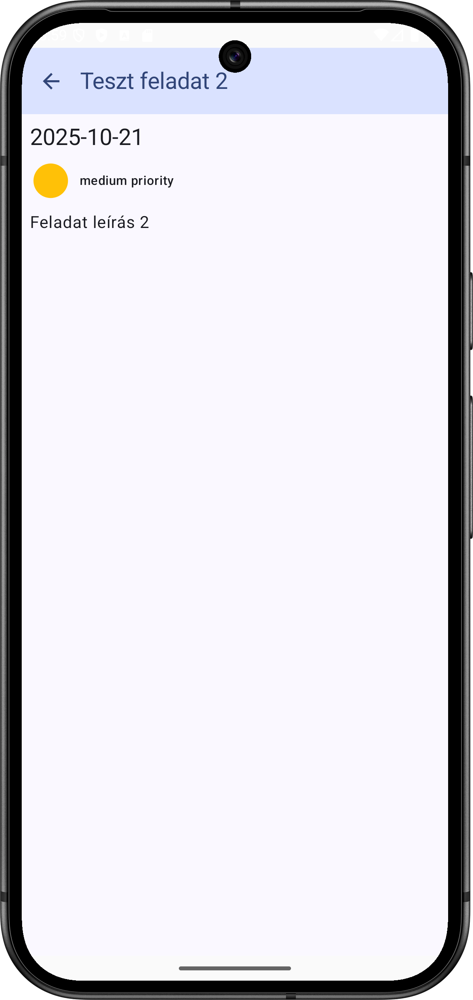
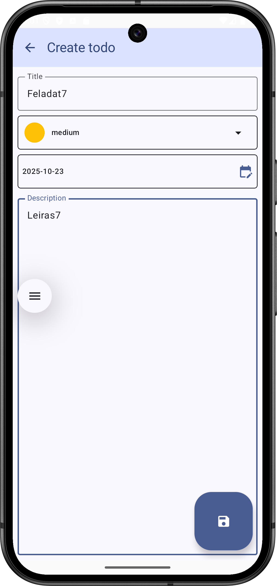
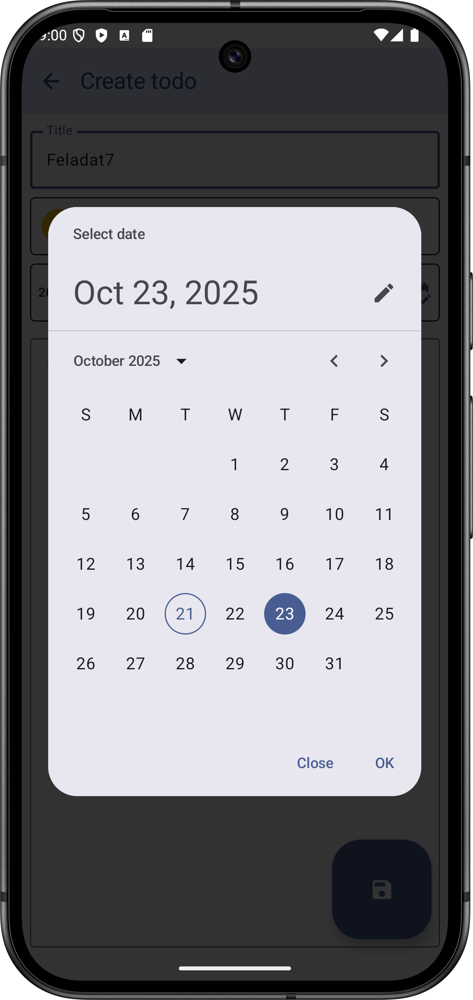
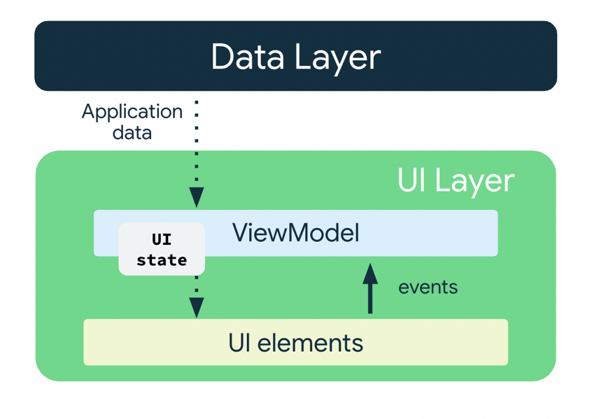

# Labor05 - Todo Alkalmazás

A labor célja, hogy bemutassa, hogyan lehet egy egyszerű ToDo alkalmazást megvalósítani a Compose keretrendszerben.

<p float="left">




</p>

## Előkészületek

A feladatok megoldása során ne felejtsd el követni a [feladat beadás folyamatát](../../tudnivalok/github/GitHub.md).

### Git repository létrehozása és letöltése

1. Moodle-ben keresd meg a laborhoz tartozó meghívó URL-jét és annak segítségével hozd létre a saját repository-dat.

2. Várd meg, míg elkészül a repository, majd checkout-old ki.

    !!! tip ""
        Egyetemi laborokban, ha a checkout során nem kér a rendszer felhasználónevet és jelszót, és nem sikerül a checkout, akkor valószínűleg a gépen korábban megjegyzett felhasználónévvel próbálkozott a rendszer. Először töröld ki a mentett belépési adatokat (lásd [itt](../../tudnivalok/github/GitHub-credentials.md)), és próbáld újra.

3. Hozz létre egy új ágat `megoldas` néven, és ezen az ágon dolgozz.

4. A `neptun.txt` fájlba írd bele a Neptun kódodat. A fájlban semmi más ne szerepeljen, csak egyetlen sorban a Neptun kód 6 karaktere.

## Projekt létrehozása

Ezután indítsuk el az Android Studio-t, majd:

1. Hozzunk létre egy új projektet, válasszuk az *Empty Activity* lehetőséget.
2. A projekt neve legyen `Todo`, a kezdő *package* pedig `hu.bme.aut.android.todo`.
3.  A projektet a repository-n belül egy külön mappában hozzuk létre. 
4. A minimum API szint legyen 26 (Android 8.0).
5. A Build configuration language-nél válasszuk a Kotlin DSL-t.

!!!danger "FILE PATH"
	A projekt a repository-ban lévő `Todo` könyvtárba kerüljön, és beadásnál legyen is felpusholva! A kód nélkül nem tudunk maximális pontot adni a laborra!

Ellenőrízzük, hogy a létrejött projekt lefordul és helyesen működik!

### Verziók frissítése

Először frissítsük a verziószámokat a `libs.versions.toml` fájlban:

```toml
[versions]
agp = "8.12.3"
kotlin = "2.2.20"
coreKtx = "1.17.0"
junit = "4.13.2"
junitVersion = "1.3.0"
espressoCore = "3.7.0"
lifecycleRuntimeKtx = "2.9.4"
activityCompose = "1.11.0"
composeBom = "2025.10.00"
```

Utána vegyük fel a pluszban szükséges könyvtárakat és plugineket:

```toml
[versions]
...
kotlinxDatetime = "0.4.1"
viewModel = "2.9.4"
nav3Core = "1.0.0-alpha11"
kotlinSerialization = "2.2.20"
kotlinxSerializationCore = "1.9.0"

[libraries]
...
androidx-material-icons-extended = { group = "androidx.compose.material", name="material-icons-extended" }
kotlinx-datetime = { group = "org.jetbrains.kotlinx", name = "kotlinx-datetime", version.ref = "kotlinxDatetime" }
androidx-lifecycle-viewmodel-compose = {group = "androidx.lifecycle", name="lifecycle-viewmodel-compose", version.ref = "viewModel" }
androidx-navigation3-runtime = { module = "androidx.navigation3:navigation3-runtime", version.ref = "nav3Core" }
androidx-navigation3-ui = { module = "androidx.navigation3:navigation3-ui", version.ref = "nav3Core" }
kotlinx-serialization-core = { module = "org.jetbrains.kotlinx:kotlinx-serialization-core", version.ref = "kotlinxSerializationCore" }

[plugins]
...
jetbrains-kotlin-serialization = { id = "org.jetbrains.kotlin.plugin.serialization", version.ref = "kotlinSerialization"}
```

Majd pedig használjuk is ezeket a modul szintű `build.gradle.kts` fájlban:

```gradle
plugins {
	...
    alias(libs.plugins.jetbrains.kotlin.serialization)
}
...
dependencies {
    ...

    //Material Icons
    implementation(libs.androidx.material.icons.extended)

    //Kotlin Extensions DateTime - LocalDate
    implementation(libs.kotlinx.datetime)

	//ViewModel
    implementation(libs.androidx.lifecycle.viewmodel.compose)

	//Navigation3
    implementation(libs.androidx.navigation3.ui)
    implementation(libs.androidx.navigation3.runtime)
    implementation(libs.kotlinx.serialization.core)
}
```

A projekt szintű `build.gradle.kts` fájlban is kapcsoljuk ki a megfelelő plugint:

```kts
plugins {
    ...
    alias(libs.plugins.jetbrains.kotlin.serialization) apply false
}
```

!!!danger "Függőségek"
	Az itt található kódban minden függőség szerepel, a labor során újat hozzáadni nem kell. Azonban az egyértelműség kedvéért a későbbiekben mindenhol feltüntetjük az adott területhez szükséges függőségeket.

A fenti függőségekhez 36-os SDK-val kell fordítanunk a projektet, ha a legenerált alkalmazásban korábbi lenne megadva, akkor frissítsük ezt is a modul szintű `build.gradle.kts` fájlunkban:

```gradle
    compileSdk = 36
```

### Szöveges erőforrások definiálása

A `strings.xml` fájl működését már ismerjük, töltsük fel ezt előre a később szükséges szöveges címkékkel, hogy később a lényeges elemekre tudjunk koncentrálni:

```xml
<resources>
    <string name="app_name">Todo</string>
    <string name="some_error_message">Error</string>
    <string name="priority_title_none">none</string>
    <string name="priority_title_low">low</string>
    <string name="priority_title_medium">medium</string>
    <string name="priority_title_high">high</string>
    <string name="text_empty_todo_list">"You haven\\'t added any todos yet. "</string>
    <string name="text_your_todo_list">Your todos</string>
    <string name="text_priority">priority</string>
    <string name="list_item_supporting_text">The due date is: %1$s</string>
    <string name="textfield_label_description">Description</string>
    <string name="textfield_label_title">Title</string>
    <string name="app_bar_title_create_todo">Create todo</string>
    <string name="dialog_ok_button_text">OK</string>
    <string name="dialog_dismiss_button_text">Close</string>
</resources>
```


## Alapok

### Adatosztályok létrehozása

Mielőtt nekilátnánk az alkalmazás felületeinek, illetve logikájának kialakításába, érdemes létrehozni azokat a modellosztályokat, amiket az alkalmazáson belül használni fogunk. Az alkalmazásunkban feladatokat akarunk tárolni, melyek a következő tulajdonságokkal fognak rendelkezni:

 - Név
 - Leírás
 - Feladat határideje
 - Fontosság
 - Azonosító

Hozzunk létre egy új `domain` *package*-et létre a projektünk gyökerében, mely az alkalmazásunk adatrétegének részeit fogja tartalmazni, majd ezen belül hozzunk létre egy `model` *package*-et, mely az adatmodellek osztály megfelelőit fogja tartalmazni. Ebben hozzuk létre az alábbi két fájlt:

`Todo.kt`:

```kotlin
package hu.bme.aut.android.todo.domain.model

import kotlinx.datetime.LocalDate

data class Todo(
    val id: Int,
    val title: String,
    val priority: Priority,
    val dueDate: LocalDate,
    val description: String  
)
```

`Priority.kt`:

```kotlin
package hu.bme.aut.android.todo.domain.model

enum class Priority {  
    NONE,  
    LOW,  
    MEDIUM,  
    HIGH,  
}
```

??? info "LocalDate"

	A `LocalDate` egy általános implementációja az idő kezelésének, mely multiplatform környezetben is használható, ehhez a következő függőséget kell hozzáadnunk a _modul_ szintű build.gradle fájlhoz:

	```tml
	[versions]
	kotlinxDatetime = "0.7.1"

	[libraries]
	kotlinx-datetime = { group = "org.jetbrains.kotlinx", name = "kotlinx-datetime", version.ref = "kotlinxDatetime" }
	```

!!!danger "Idő osztályok kezelése"
	A labor során a `LocalDate` mindig a `kotlinx`, mig a `LocalDateTime` mindig a `java` könyvtárból legyen importálva.

Az adat típusú osztályok esetében a Kotlin automatikusan deklarál gyakran használt függvényeket, mint például az `equals()` és `hashCode()` függvényeket különböző objektumok összehasonlításához, illetve egy `toString()` függvényt, mely visszaadja a tárolt változók értékét.

### Komponensek

A felhasználói felület kódjának egyszerűsítése érdékében érdemes olyan segédosztályokat is definiálni, melyek már közvetlenül a felületen használt értékeket fogják használni. Hozzunk létre egy `model` *package*-et a már létező `ui` *package*-en belül, és vegyük fel a következő osztályokat:

`UiText.kt`:

```kotlin
package hu.bme.aut.android.todo.ui.model

import android.content.Context
import androidx.annotation.StringRes
import hu.bme.aut.android.todo.R

sealed class UiText {
    data class DynamicString(val value: String): UiText()
    data class StringResource(@StringRes val id: Int): UiText()

    fun asString(context: Context): String {
        return when(this) {
            is DynamicString -> this.value
            is StringResource -> context.getString(this.id)
        }
    }
}

fun Throwable.toUiText(): UiText {
    val message = this.message.orEmpty()
    return if (message.isBlank()) {
        UiText.StringResource(R.string.some_error_message)
    } else {
        UiText.DynamicString(message)
    }
}
```

Vizsgáljuk meg, hogy tudjuk a `sealed class` segítségével általánosan definiálni a szövegeket, melyek így jöhetnek a erőforrásból, vagy érkezhetnek egy külső forrásból.

`PriorityUi.kt`:

```kotlin
package hu.bme.aut.android.todo.ui.model

import androidx.compose.ui.graphics.Color
import hu.bme.aut.android.todo.R
import hu.bme.aut.android.todo.domain.model.Priority

enum class PriorityUi(
    val title: Int,
    val color: Color
) {
    None(
        title =  R.string.priority_title_none,
        color = Color(0xFFE6E4E4)
    ),
    Low(
        title = R.string.priority_title_low,
        color = Color(0xFF8BC34A)
    ),
    Medium(
        title = R.string.priority_title_medium,
        color = Color(0xFFFFC107)
    ),
    High(
        title = R.string.priority_title_high,
        color = Color(0xFFF44336)
    ),
}

fun PriorityUi.asPriority(): Priority {
    return when(this) {
        PriorityUi.None -> Priority.NONE
        PriorityUi.Low -> Priority.LOW
        PriorityUi.Medium -> Priority.MEDIUM
        PriorityUi.High -> Priority.HIGH
    }
}

fun Priority.asPriorityUi(): PriorityUi {
    return when(this) {
        Priority.NONE -> PriorityUi.None
        Priority.LOW -> PriorityUi.Low
        Priority.MEDIUM -> PriorityUi.Medium
        Priority.HIGH -> PriorityUi.High
    }
}
```

`TodoUi.kt`

```kotlin
package hu.bme.aut.android.todo.ui.model

import hu.bme.aut.android.todo.domain.model.Todo
import kotlinx.datetime.LocalDate
import kotlinx.datetime.toLocalDate
import java.time.LocalDateTime

data class TodoUi(
    val id: Int = 0,
    val title: String = "",
    val priority: PriorityUi = PriorityUi.None,
    val dueDate: String = LocalDate(  
            LocalDateTime.now().year,  
            LocalDateTime.now().monthValue,  
            LocalDateTime.now().dayOfMonth  
        ).toString(),
    val description: String = ""  
)  

fun Todo.asTodoUi(): TodoUi = TodoUi(
    id = id,  
    title = title,  
    priority = priority.asPriorityUi(),  
    dueDate = dueDate.toString(),  
    description = description  
)  

fun TodoUi.asTodo(): Todo = Todo(
    id = id,  
    title = title,  
    priority = priority.asPriority(),  
    dueDate = dueDate.toLocalDate(),  
    description = description  
)
```

### Navigáció kialakítása

Az előző laborhoz hasonlóan alakítsuk ki a projektben a navigációnál használt osztályokat! 

??? info "Navigáció"
	Itt is a Compose Navigation 3 könyvtárat fogjuk használni, ezért adjuk ezt hozzá a _modul_ szintű build.gradle fájlunkhoz.

	```kotlin
	[versions]
	nav3Core = "1.0.0-alpha11"
	kotlinSerialization = "2.2.20"
	kotlinxSerializationCore = "1.9.0"

	[libraries]
	androidx-navigation3-runtime = { module = "androidx.navigation3:navigation3-runtime", version.ref = "nav3Core" }
	androidx-navigation3-ui = { module = "androidx.navigation3:navigation3-ui", version.ref = "nav3Core" }
	kotlinx-serialization-core = { module = "org.jetbrains.kotlinx:kotlinx-serialization-core", version.ref = "kotlinxSerializationCore" }

	[plugins]
	jetbrains-kotlin-serialization = { id = "org.jetbrains.kotlin.plugin.serialization", version.ref = "kotlinSerialization"}
	```

Hozzunk létre a gyökérkönyvtárban egy új *package*-et `navigation` néven, majd hozzuk létre benne az útvonalakat reprezentáló `Screen` osztályt:

```kotlin
package hu.bme.aut.android.todo.navigation

import androidx.navigation3.runtime.NavKey

sealed interface Screen : NavKey {  

}
```

 Illetve hozzuk létre a navigációt végző *Composable* függvényt is az `AppNavigation.kt` fájlban:

```kotlin
package hu.bme.aut.android.todo.navigation

import androidx.compose.runtime.Composable
import androidx.compose.ui.Modifier
import androidx.navigation3.runtime.entryProvider
import androidx.navigation3.runtime.rememberNavBackStack
import androidx.navigation3.ui.NavDisplay

@Composable
fun AppNavigation(
    modifier: Modifier = Modifier) {

    val backStack = rememberNavBackStack()

    NavDisplay(
        modifier = modifier,
        backStack = backStack,
        onBack = { backStack.removeLastOrNull() },
        entryProvider = entryProvider {

        }
    )
}
```

Az `AppNavigation` kezelje a képernyőre kerülő *Composable* felületeket, karban tartsa az útvonalakat. Itt fogjuk a navgiációs eseményeket és útvonalakat feldolgozni.

Végül frissítsük a `MainActivity` tartalmát úgy, hogy az `AppNavigation` *Composable*-t használja:

```kotlin
package hu.bme.aut.android.todo

import android.os.Bundle
import androidx.activity.ComponentActivity
import androidx.activity.compose.setContent
import androidx.compose.foundation.layout.safeDrawingPadding
import androidx.compose.runtime.Composable
import androidx.compose.ui.Modifier
import androidx.compose.ui.tooling.preview.Preview
import hu.bme.aut.android.todo.navigation.AppNavigation
import hu.bme.aut.android.todo.ui.theme.TodoTheme

class MainActivity : ComponentActivity() {
    override fun onCreate(savedInstanceState: Bundle?) {
        super.onCreate(savedInstanceState)
        setContent {
            MainActivityContent()
        }
    }
}

@Preview
@Composable
private fun MainActivityContent() {
    TodoTheme {
        AppNavigation(modifier = Modifier.safeDrawingPadding())
    }
}
```

### A felület kialakítása

Ahhoz, hogy az alkalmazásunk működjön, szükségünk lesz egy oldalra, amit induláskor meg tudunk jeleníteni. Az első oldal, melyet létrehozunk, a feladatokat megjelenítő lista oldal lesz. Gondoljuk végig, milyen feladatokat kell elvégezni, illetve milyen interakciók történnek ezen a felületen:

- Az oldalra való navigáláskor be kell tölteni az összes feladatot.
- Egy feladatra való kattintás után el kell navigálni egy részletező oldalra.
- Elérhetővé kell tenni egy új feladat létrehozását, melynek hatására új oldalra kell navigálnunk.

Az új oldalakra való navigáláshoz szükségünk van a navigációt vezérlő kontrollerre, melyet az `AppNavigation` *Composable* kezel, ezért ezeknél az eseményeknél az oldal olyan függvény callback objektumokat fog meghívni, melyeket a konstruktorán keresztül kap meg, így a `AppNavigation` könnyen tud értesülni róluk.

Az adatok kezeléséhez tipikusan a `ViewModel` osztályt használjuk. A `ViewModel` segítségével biztosítjuk azt, hogy elkülönüljenek az alkalmazásunk megjelenítésért szolgáló kódjai az alkalmazás logikáját biztosító kódjaitól. Míg az előbbiek a felület megjelenéséért felelnek, a `ViewModel` tárolja és dolgozza fel a UI-nak szükséges adatokat.


??? info "ViewModel"
	Vegyük fel a szükséges függőségeket:
	```toml
	[versions]
	viewModel = "2.9.4"

	[libraries]
	androidx-lifecycle-viewmodel-compose = {group = "androidx.lifecycle", name="lifecycle-viewmodel-compose", version.ref = "viewModel" }
	``` 

Hozzuk létre a `ui` *package*-en belül a `screen` *package*-et, mely az egyes oldalak *Composable* és *ViewModel* osztályait fogja tartalmazni funkciónként külön *package*-ben, majd hozzuk létre ebben a `todo_list` *package*-et.

Először foglalkozzunk az oldalhoz tartozó *ViewModel* osztállyal. A `TodoListViewModel.kt` osztályunk fogja tárolni és kezelni a Lista képernyőnk állapotát. Ez a `TodoListState.kt` osztály az alábbiak szerint fog kinézni:

```kotlin
package hu.bme.aut.android.todo.ui.screen.todo_list

import hu.bme.aut.android.todo.ui.model.TodoUi


sealed class TodoListState {
    object Loading : TodoListState()
    data class Error(val error: Throwable) : TodoListState()
    data class Result(val todoList : List<TodoUi>) : TodoListState()
}
```

Látható, hogy a felületünk három állapotban lehet:

- betöltés alatt,
- hibás állapotban, ahol a hiba paraméterként megjelenik,
- vagy eredményes állapotban, ahol az eredményt szintén paraméterként kapjuk meg.

Ezeknek az állapotoknak az összefogására itt is egy `sealed class`-t fogunk alkalmazni a korábban kifejtett előnyei miatt.

Miután megvan az állapotunk, készítsük el az ezt kezelő `TodoListViewModel` osztályt:

`TodoListViewModel.kt`:

```kotlin
package hu.bme.aut.android.todo.ui.screen.todo_list

import androidx.lifecycle.ViewModel
import androidx.lifecycle.ViewModelProvider
import androidx.lifecycle.viewModelScope
import androidx.lifecycle.viewmodel.initializer
import androidx.lifecycle.viewmodel.viewModelFactory
import hu.bme.aut.android.todo.ui.model.PriorityUi
import hu.bme.aut.android.todo.ui.model.TodoUi
import kotlinx.coroutines.delay
import kotlinx.coroutines.flow.MutableStateFlow
import kotlinx.coroutines.flow.asStateFlow
import kotlinx.coroutines.launch


class TodoListViewModel() : ViewModel() {
    private val _state = MutableStateFlow<TodoListState>(TodoListState.Loading)
    val state = _state.asStateFlow()

    init {
        loadTodos()
    }

    private fun loadTodos() {
        viewModelScope.launch {
            try {
                _state.value = TodoListState.Loading
                delay(2000)
                //TODO: Add todo loading logic
                _state.value = TodoListState.Result(
                    todoList = listOf(
                        TodoUi(
                            id = 1,
                            title = "Teszt feladat 1",
                            priority = PriorityUi.Low,
                            description = "Feladat leírás 1",
                        ),
                        TodoUi(
                            id = 2,
                            title = "Teszt feladat 2",
                            priority = PriorityUi.Medium,
                            description = "Feladat leírás 2",
                        ),
                        TodoUi(
                            id = 3,
                            title = "Teszt feladat 3",
                            priority = PriorityUi.High,
                            description = "Feladat leírás 3",
                        ),
                    ),
                )
            } catch (e: Exception) {
                _state.value = TodoListState.Error(e)
            }
        }
    }

    companion object {
        val Factory: ViewModelProvider.Factory = viewModelFactory {
            initializer {
                TodoListViewModel()
            }
        }
    }
}
```

A felületet leíró állapotot egy `MutableStateFlow` segítségével kezeljük, melyet egy csak olvasható változatában osztunk meg az oldalt reprezentáló *Composable*l-el. Az adatok betöltését egyelőre a *ViewModel* magában végzi el, ez azonban hamarosan ki lesz bővítve külső adatbetöltés támogatásával.

Mivel a *ViewModel* képes túlélni az őt létrehozó komponenst, ezért a kódból mi nem a konstruktor hívásával fogjuk létrehozni a példányt, hanem a keretrendszernek tudunk átadni egy speciális _factory_ metódust, amit a rendszer az első alkalommal meg fog hívni. Ezt a metódust szerveztük ki a `companion object` részbe, ami jelenleg csak létrehoz egy példányt, a későbbiekben azonban hasznos lesz különböző külső értékek inicializálására.

Hozzuk létre a felületet megvalósító `TodoListScreen.kt` fájlt is ugyanebben a *package*-ben:

```kotlin
package hu.bme.aut.android.todo.ui.screen.todo_list

import androidx.compose.foundation.background
import androidx.compose.foundation.clickable
import androidx.compose.foundation.layout.Box
import androidx.compose.foundation.layout.Column
import androidx.compose.foundation.layout.fillMaxSize
import androidx.compose.foundation.layout.padding
import androidx.compose.foundation.layout.size
import androidx.compose.foundation.lazy.LazyColumn
import androidx.compose.material.icons.Icons
import androidx.compose.material.icons.filled.Add
import androidx.compose.material.icons.filled.Circle
import androidx.compose.material3.CircularProgressIndicator
import androidx.compose.material3.HorizontalDivider
import androidx.compose.material3.Icon
import androidx.compose.material3.LargeFloatingActionButton
import androidx.compose.material3.ListItem
import androidx.compose.material3.MaterialTheme
import androidx.compose.material3.Scaffold
import androidx.compose.material3.Text
import androidx.compose.runtime.Composable
import androidx.compose.ui.Alignment
import androidx.compose.ui.Modifier
import androidx.compose.ui.platform.LocalContext
import androidx.compose.ui.res.stringResource
import androidx.compose.ui.unit.dp
import androidx.compose.ui.unit.sp
import androidx.lifecycle.compose.collectAsStateWithLifecycle
import androidx.lifecycle.viewmodel.compose.viewModel
import hu.bme.aut.android.todo.R
import androidx.compose.foundation.lazy.items
import androidx.compose.ui.tooling.preview.Preview
import hu.bme.aut.android.todo.ui.model.toUiText

@Composable
fun TodoListScreen(
    onListItemClick: (Int) -> Unit,
    onFabClick: () -> Unit,
    viewModel: TodoListViewModel = viewModel(factory = TodoListViewModel.Factory),
) {
    val state = viewModel.state.collectAsStateWithLifecycle().value
    val context = LocalContext.current

    Scaffold(
        modifier = Modifier
            .fillMaxSize(),
        floatingActionButton = {
            LargeFloatingActionButton(
                onClick = onFabClick,
                containerColor = MaterialTheme.colorScheme.primary,
                contentColor = MaterialTheme.colorScheme.onPrimary
            ) {
                Icon(imageVector = Icons.Default.Add, contentDescription = null)
            }
        }
    ) { innerPadding ->
        Box(
            modifier = Modifier
                .fillMaxSize()
                .padding(innerPadding)
                .padding(8.dp)
                .background(
                    color = if (state is TodoListState.Loading || state is TodoListState.Error) {
                        MaterialTheme.colorScheme.secondaryContainer
                    } else {
                        MaterialTheme.colorScheme.background
                    }
                ),
            contentAlignment = Alignment.Center
        ) {
            when (state) {
                is TodoListState.Loading -> CircularProgressIndicator(
                    color = MaterialTheme.colorScheme.onSecondaryContainer
                )

                is TodoListState.Error -> Text(
                    text = state.error.toUiText().asString(context),
                    color = MaterialTheme.colorScheme.onSecondaryContainer
                )

                is TodoListState.Result -> {
                    if (state.todoList.isEmpty()) {
                        Text(text = stringResource(id = R.string.text_empty_todo_list))
                    } else {
                        ///TODO: handle list
                    }
                }
            }
        }
    }
}

@Preview
@Composable
fun TodoListScreenPreview() {
    TodoListScreen(
        onListItemClick = {},
        onFabClick = {}
    )
}
``` 

Mint a legtöbb esetben, itt is egy `Scaffold`-ot használunk az oldalunk kezelésére, melyhez most egy `LargeFloatingActionButton`-t is adunk, amellyel majd új feladatokat lehet létrehozni. Ne felejtsük el a Scaffold fő tartalmában `innerPadding` névvel megkapott `PaddingValues` értékeket a megfelelő helyre beszúrni (ez ebben az esetben a fő `Box` köré kerül. Ezek mellett látható, hogyan tudunk az aktuális állapot különböző értékeinek függvényében elágazni, és különböző elemeket megjeleníteni.

Vizsgáljuk meg, hogyan történik az oldal frissítése! A `collectAsStateWithLifecycle()` függvényhívással automatikusan feliratkozunk a *ViewModelben* tárolt állapotra. Ha változás történik ebben, újra le fog futni a *Composable*, mely így már a frisebb állapotot fogja megjeleníteni.

Valósítsuk meg a lista megjelenítését is! Másoljuk be az alábbi kódot a megfelelő `else` ágba:

```kotlin
Column {
    Text(
        text = stringResource(id = R.string.text_your_todo_list),
        fontSize = 24.sp
    )
    LazyColumn(
        modifier = Modifier
            .fillMaxSize()
    ) {
        items(items = state.todoList,
            key = { todo -> todo.id }) { todo ->
            ListItem(
                leadingContent = {
                    Icon(
                        imageVector = Icons.Default.Circle,
                        contentDescription = null,
                        tint = todo.priority.color,
                        modifier = Modifier
                            .size(64.dp)
                    )
                },
                headlineContent = {
                    Text(text = todo.title)
                },
                supportingContent = {
                    Text(
                        text = stringResource(
                            id = R.string.list_item_supporting_text,
                            todo.dueDate
                        )
                    )
                },
                modifier = Modifier.clickable(onClick = {
                    onListItemClick(
                        todo.id
                    )
                })
            )
            if (state.todoList.last() != todo) {
                HorizontalDivider(
                    thickness = 2.dp,
                    color = MaterialTheme.colorScheme.secondaryContainer
                )
            }
        }
    }
}
```

??? info "Material Icon"
	A `Circle` ikon csak a kiegészítő Material Icon könyvtárban található meg, melyet az alábbi függőséggel tudunk hozzáadni a projekthez:
	
	```toml
	[libraries]
	androidx-material-icons-extended = { group = "androidx.compose.material", name="material-icons-extended" }
	```

!!!warning "items"
	Ha hibát dobna az `items`-re, és nem találja az importot, adjuk hozzá az alábbi importot a fájl tetejéhez:
	
	```kotlin 
	import androidx.compose.foundation.lazy.items
	```

Látható, hogy a lista megjelenítésére a `LazyColumn` *Composable*-t használjuk, mely képes nagy elemszámú listát hatékonyan megjeleníteni. Ahhoz, hogy jól működjön a lista módosítása esetén is (pl. hozzáadás, törlés, átrendezés), mindenképp érdemes a `key` paramétert úgy definiálni, hogy az adott listaelemet egyértelműen beazonosítsa.

Lista elemnek most egy egyszerű `ListItem`-et használunk, ami esetünkben tökéletesen elég. A 

- *leadingContent* helyére a *priority* ikon, 
- a *headlineContent* helyére a *todo* címe, 
- a *supportingContent* helyére a határidő kerül.

Természetesen komplexebb listaelemek esetén külön *Composable* készítése ajánlott.

Az oldal elkészült, már csak a navigációt kell frissíteni az oldalhoz. Vegyük fel az útvonalat a `Screen` osztályba:

```kotlin
package hu.bme.aut.android.todo.navigation

import androidx.navigation3.runtime.NavKey
import kotlinx.serialization.Serializable

sealed interface Screen : NavKey {
    @Serializable
    data object TodoListScreenDestination : Screen

}
```

Illetve az `AppNavigation` *Composable*-t:

```kotlin
package hu.bme.aut.android.todo.navigation

import androidx.compose.runtime.Composable
import androidx.compose.ui.Modifier
import androidx.navigation3.runtime.entryProvider
import androidx.navigation3.runtime.rememberNavBackStack
import androidx.navigation3.ui.NavDisplay
import hu.bme.aut.android.todo.ui.screen.todo_list.TodoListScreen

@Composable
fun AppNavigation(
    modifier: Modifier = Modifier
) {

    val backStack = rememberNavBackStack(Screen.TodoListScreenDestination)

    NavDisplay(
        modifier = modifier,
        backStack = backStack,
        onBack = { backStack.removeLastOrNull() },
        entryProvider = entryProvider {

            entry<Screen.TodoListScreenDestination> {
                TodoListScreen(
                    onListItemClick = {
                        //TODO: Navigate to detailed screen
                    },
                    onFabClick = {
                        //TODO: Navigate to create screen
                    }
                )
            }
        }
    )
}
```

Futtassuk az alkalmazás!

!!!example "BEADANDÓ (1 pont)" 
	Készíts egy **képernyőképet**, amelyen látszik a **futó alkalmazás** (emulátoron, készüléket tükrözve vagy képernyőfelvétellel), az **ahhoz tartozó kódrészlet**, valamint a **neptun kódod a kódban valahol kommentként**! 

	A képet a megoldásban a repository-ba f1.png néven töltsd föl!

	A képernyőkép szükséges feltétele a pontszám megszerzésének.


## Adatréteg kialakítása

Ezen a laboron egy egyszerűsített megoldást mutatunk be a feladatok tárolására, mely csak a memóriában menti el az értékeket. Hozzunk létre egy `data.repository` *package*-et a gyökérkönyvtáron belül, majd hozzuk létre az alábbi két fájlt:

`TodoRepository.kt`:

```kotlin
package hu.bme.aut.android.todo.data.repository

import hu.bme.aut.android.todo.domain.model.Todo

interface ITodoRepository {
    suspend fun insertTodo(todo: Todo)
    suspend fun deleteTodo(todo: Todo)
    suspend fun getTodoById(id: Int): Todo
    suspend fun getAllTodos(): List<Todo>
    suspend fun updateTodo(updatedTodo: Todo)
}
``` 

`MemoryTodoRepository.kt` :

```kotlin
package hu.bme.aut.android.todo.data.repository

import hu.bme.aut.android.todo.domain.model.Priority
import hu.bme.aut.android.todo.domain.model.Todo
import kotlinx.coroutines.delay
import kotlinx.datetime.toKotlinLocalDateTime
import java.time.LocalDateTime

object MemoryTodoRepository : ITodoRepository {
    private val todos = mutableListOf(
        Todo(
            id = 1,
            title = "Teszt feladat 1",
            priority = Priority.LOW,
            description = "Feladat leírás 1",
            dueDate = LocalDateTime.now().toKotlinLocalDateTime().date,
        ),
        Todo(
            id = 2,
            title = "Teszt feladat 2",
            priority = Priority.MEDIUM,
            description = "Feladat leírás 2",
            dueDate = LocalDateTime.now().toKotlinLocalDateTime().date,
        ),
        Todo(
            id = 3,
            title = "Teszt feladat 3",
            priority = Priority.HIGH,
            description = "Feladat leírás 3",
            dueDate = LocalDateTime.now().toKotlinLocalDateTime().date,
        ),
        Todo(
            id = 4,
            title = "Teszt feladat 4 hosszú szöveg, hogy több sorba kelljen írni",
            priority = Priority.HIGH,
            description = "Feladat leírás 4",
            dueDate = LocalDateTime.now().toKotlinLocalDateTime().date,
        ),
        Todo(
            id = 5,
            title = "Teszt feladat 5",
            priority = Priority.LOW,
            description = "Feladat leírás 5",
            dueDate = LocalDateTime.now().toKotlinLocalDateTime().date,
        ),
        Todo(
            id = 6,
            title = "Teszt feladat 6",
            priority = Priority.MEDIUM,
            description = "Feladat leírás 6",
            dueDate = LocalDateTime.now().toKotlinLocalDateTime().date,
        )
    )

    override suspend fun insertTodo(todo: Todo) {
        delay(1000)
        todos.add(todo)
    }

    override suspend fun deleteTodo(todo: Todo) {
        delay(1000)
        todos.remove(todo)
    }

    override suspend fun getTodoById(id: Int): Todo {
        delay(1000)
        for (todo in todos) {
            if (todo.id == id) return todo
        }
        return todos.first()
    }

    override suspend fun getAllTodos(): List<Todo> {
        delay(1000)
        return todos.toList()
    }

    override suspend fun updateTodo(updatedTodo: Todo) {
        delay(1000)
        for (todo in todos) {
            if (todo.id == updatedTodo.id)
                todos[todos.indexOf(todo)] = updatedTodo
        }
    }
}
```

Az `ITodoRepository` egy általános *interface*-t ír le, mellyel elérhetővé válnak a feladatok az alkalmazás számára, míg a `MemoryTodoRepository` egy memória alapú megvalósítását mutatja be. Bár itt most nem lenne szükség a `suspend` kulcsszó használatára, ezzel tudjuk biztosítani, hogy a későbbiekben egy adatbázis vagy hálózati `TodoRepository` elkészítése után könnyedén tudjuk migrálni a projektet. Ezt a késleltetést imitáljuk a `delay()` függvény hívásával is. Az `object` kulcsszóval a _Singleton_ mintát tudjuk egyszerűen megvalósítani.

Frissítsük a `TodoListViewModel` osztályt, hogy ezt a memória alapú megvalósítást használja:

```kotlin
package hu.bme.aut.android.todo.ui.screen.todo_list

import androidx.lifecycle.ViewModel
import androidx.lifecycle.ViewModelProvider
import androidx.lifecycle.viewModelScope
import androidx.lifecycle.viewmodel.initializer
import androidx.lifecycle.viewmodel.viewModelFactory
import hu.bme.aut.android.todo.data.repository.ITodoRepository
import hu.bme.aut.android.todo.data.repository.MemoryTodoRepository
import hu.bme.aut.android.todo.ui.model.asTodoUi
import kotlinx.coroutines.delay
import kotlinx.coroutines.flow.MutableStateFlow
import kotlinx.coroutines.flow.asStateFlow
import kotlinx.coroutines.launch


class TodoListViewModel(private val repository: ITodoRepository) : ViewModel() {
    private val _state = MutableStateFlow<TodoListState>(TodoListState.Loading)
    val state = _state.asStateFlow()

    init {
        loadTodos()
    }

    private fun loadTodos() {
        viewModelScope.launch {
            try {
                _state.value = TodoListState.Loading
                delay(2000)
                val list = repository.getAllTodos()
                _state.value = TodoListState.Result(
                    todoList = list.map { it.asTodoUi() }
                )
            } catch (e: Exception) {
                _state.value = TodoListState.Error(e)
            }
        }
    }

    companion object {
        val Factory: ViewModelProvider.Factory = viewModelFactory {
            initializer {
                TodoListViewModel(
                    MemoryTodoRepository
                )
            }
        }
    }
}
```

Futassuk az alkalmazást, és ellenőrizzük, hogy továbbra is megjelennek a feladatok a listában!


## Részletes feladat felület

Következő lépésként készítsük fel a részletező felületet, melyen a feladat leírását tudjuk megnézni. Készítsük el az oldalt a lista oldal mintájára.

Kezdjük a navigáció implementálásával. Az új útvonal paramétereként adjuk át az azonosítót az alábbi módon:

`Screen.kt`:

```kotlin
package hu.bme.aut.android.todo.navigation

import androidx.navigation3.runtime.NavKey
import kotlinx.serialization.Serializable

sealed interface Screen : NavKey {
    @Serializable
    data object TodoListScreenDestination : Screen

    @Serializable
    data class TodoDetailScreenDestination(val todoId: Int) : Screen

}
```

Ezek után az `AppNavigation` a következők szerint alakul:

`AppNavigation.kt`:

```kotlin
package hu.bme.aut.android.todo.navigation

import androidx.compose.runtime.Composable
import androidx.compose.ui.Modifier
import androidx.navigation3.runtime.entryProvider
import androidx.navigation3.runtime.rememberNavBackStack
import androidx.navigation3.ui.NavDisplay
import hu.bme.aut.android.todo.ui.screen.todo_list.TodoListScreen

@Composable
fun AppNavigation(
    modifier: Modifier = Modifier
) {

    val backStack = rememberNavBackStack(Screen.TodoListScreenDestination)

    NavDisplay(
        modifier = modifier,
        backStack = backStack,
        onBack = { backStack.removeLastOrNull() },
        entryProvider = entryProvider {

            entry<Screen.TodoListScreenDestination> {
                TodoListScreen(
                    onListItemClick = {
                        backStack.add(Screen.TodoDetailScreenDestination(todoId = it))
                    },
                    onFabClick = {
                        //TODO: Navigate to create screen
                    }
                )
            }

            entry<Screen.TodoDetailScreenDestination> { key ->
                TodoDetailScreen(
                    todoId = key.todoId,
                    onNavigateBack = { backStack.removeLastOrNull() })
            }
        }
    )
}
```

Az azonosítót az *entry*-ben is fel kell tüntetnünk. Itt a lambdában megkapjuk a navigációs célpontot a `key` paraméterként. Ez jelen esetben egy `TodoDetailScreenDestination` lesz, így ki tudjuk olvasni belőle a `todoId` paramétert.

Hozzunk létre egy új *package*-et a `screen` *package*-en belül `todo_detail` néven. Ebben vegyük fel az állapotokat, a *ViewModelt* és a *screent*:

`TodoDetailState.kt`:

```kotlin
package hu.bme.aut.android.todo.ui.screen.todo_detail

import hu.bme.aut.android.todo.ui.model.TodoUi


sealed class TodoDetailState {
    object Loading : TodoDetailState()
    data class Error(val error: Throwable) : TodoDetailState()
    data class Result(val todo: TodoUi) : TodoDetailState()
}
```

`TodoDetailViewModel.kt`:

```kotlin
package hu.bme.aut.android.todo.ui.screen.todo_detail

import androidx.lifecycle.ViewModel
import androidx.lifecycle.ViewModelProvider
import androidx.lifecycle.viewModelScope
import androidx.lifecycle.viewmodel.initializer
import androidx.lifecycle.viewmodel.viewModelFactory
import hu.bme.aut.android.todo.data.repository.ITodoRepository
import hu.bme.aut.android.todo.data.repository.MemoryTodoRepository
import hu.bme.aut.android.todo.ui.model.asTodoUi
import kotlinx.coroutines.delay
import kotlinx.coroutines.flow.MutableStateFlow
import kotlinx.coroutines.flow.asStateFlow
import kotlinx.coroutines.launch

class TodoDetailViewModel(private val repository: ITodoRepository) :
    ViewModel() {

    private val _state = MutableStateFlow<TodoDetailState>(TodoDetailState.Loading)
    val state = _state.asStateFlow()

    fun loadTodo(todoId: Int) {
        viewModelScope.launch {
            try {
                _state.value = TodoDetailState.Loading
                delay(2000)
                val todo = repository.getTodoById(todoId)
                _state.value = TodoDetailState.Result(
                    todo.asTodoUi()
                )
            } catch (e: Exception) {
                _state.value = TodoDetailState.Error(e)
            }
        }
    }

    companion object {
        val Factory: ViewModelProvider.Factory = viewModelFactory {
            initializer {
                TodoDetailViewModel(
                    MemoryTodoRepository
                )
            }
        }
    }
}
```

`TodoDetailScreen.kt`:

```kotlin
package hu.bme.aut.android.todo.ui.screen.todo_detail

import androidx.compose.foundation.background
import androidx.compose.foundation.layout.Box
import androidx.compose.foundation.layout.Column
import androidx.compose.foundation.layout.Row
import androidx.compose.foundation.layout.Spacer
import androidx.compose.foundation.layout.fillMaxSize
import androidx.compose.foundation.layout.fillMaxWidth
import androidx.compose.foundation.layout.height
import androidx.compose.foundation.layout.padding
import androidx.compose.foundation.layout.size
import androidx.compose.foundation.layout.width
import androidx.compose.foundation.shape.RoundedCornerShape
import androidx.compose.material.icons.Icons
import androidx.compose.material.icons.automirrored.filled.ArrowBack
import androidx.compose.material.icons.filled.Circle
import androidx.compose.material3.CircularProgressIndicator
import androidx.compose.material3.ExperimentalMaterial3Api
import androidx.compose.material3.Icon
import androidx.compose.material3.IconButton
import androidx.compose.material3.MaterialTheme
import androidx.compose.material3.Scaffold
import androidx.compose.material3.Text
import androidx.compose.material3.TextFieldDefaults
import androidx.compose.material3.TopAppBar
import androidx.compose.material3.TopAppBarDefaults
import androidx.compose.runtime.Composable
import androidx.compose.runtime.LaunchedEffect
import androidx.compose.ui.Alignment
import androidx.compose.ui.Modifier
import androidx.compose.ui.draw.clip
import androidx.compose.ui.platform.LocalContext
import androidx.compose.ui.res.stringResource
import androidx.compose.ui.tooling.preview.Preview
import androidx.compose.ui.unit.dp
import androidx.lifecycle.compose.collectAsStateWithLifecycle
import androidx.lifecycle.viewmodel.compose.viewModel
import hu.bme.aut.android.todo.R
import hu.bme.aut.android.todo.ui.model.toUiText

@OptIn(ExperimentalMaterial3Api::class)
@Composable
fun TodoDetailScreen(
    todoId: Int,
    onNavigateBack: () -> Unit,
    viewModel: TodoDetailViewModel = viewModel(factory = TodoDetailViewModel.Factory)
) {
    val state = viewModel.state.collectAsStateWithLifecycle().value

    val context = LocalContext.current

    LaunchedEffect(key1 = todoId) {
        viewModel.loadTodo(todoId)
    }

    Box(
        contentAlignment = Alignment.Center,
        modifier = Modifier
            .fillMaxSize()
            .background(
                color = if (state is TodoDetailState.Loading || state is TodoDetailState.Error) {
                    MaterialTheme.colorScheme.secondaryContainer
                } else {
                    MaterialTheme.colorScheme.background
                }
            )

    ) {
        when (state) {
            is TodoDetailState.Loading -> CircularProgressIndicator(
                color = MaterialTheme.colorScheme.onSecondaryContainer
            )

            is TodoDetailState.Error -> Text(
                text = state.error.toUiText().asString(context),
                color = MaterialTheme.colorScheme.onSecondaryContainer
            )

            is TodoDetailState.Result -> {

                Scaffold(
                    topBar = {
                        TopAppBar(
                            title = { Text(state.todo.title) },
                            navigationIcon = {
                                IconButton(onClick = onNavigateBack) {
                                    Icon(
                                        imageVector = Icons.AutoMirrored.Filled.ArrowBack,
                                        contentDescription = null
                                    )
                                }
                            },
                            colors = TopAppBarDefaults.topAppBarColors(
                                containerColor = MaterialTheme.colorScheme.primaryContainer,
                                titleContentColor = MaterialTheme.colorScheme.onPrimaryContainer,
                                actionIconContentColor = MaterialTheme.colorScheme.onPrimaryContainer,
                                navigationIconContentColor = MaterialTheme.colorScheme.onPrimaryContainer
                            ),
                        )
                    },
                ) { contentPadding ->

                    val todo = state.todo
                    Column(
                        modifier = Modifier
                            .fillMaxSize()
                            .padding(contentPadding)
                            .padding(all = 8.dp)
                    ) {
                        Text(
                            todo.dueDate,
                            style = MaterialTheme.typography.titleLarge
                        )
                        Row(
                            modifier = Modifier
                                .height(TextFieldDefaults.MinHeight)
                                .fillMaxWidth()
                                .clip(shape = RoundedCornerShape(size = 5.dp)),
                            verticalAlignment = Alignment.CenterVertically
                        ) {
                            Icon(
                                imageVector = Icons.Default.Circle,
                                contentDescription = null,
                                tint = todo.priority.color,
                                modifier = Modifier
                                    .size(40.dp)
                            )
                            Spacer(modifier = Modifier.width(8.dp))
                            Text(
                                modifier = Modifier
                                    .weight(weight = 8f),
                                text = "${
                                    stringResource(
                                        id = todo.priority.title
                                    )
                                } ${
                                    stringResource(
                                        id = R.string.text_priority
                                    )
                                }",
                                style = MaterialTheme.typography.labelMedium
                            )
                        }
                        Text(
                            todo.description
                        )
                    }
                }
            }
        }
    }
}

@Preview
@Composable
fun TodoDetailScreenPreview() {
    TodoDetailScreen(
        todoId = 0,
        onNavigateBack = {}
    )
}
```

A navigációban átadott paramétert egy *LaunchedEffect* segítségével juttatjuk el a `TodoDetailViewModel`-hez. A *key1* beállításával azt érjük el, hogy ez a *LaunchedEffect* akkor fut, amikor létrejön a `TodoDetailScreen` (illetve amikor megváltozik a `todoId`). Ekkor minden esetben meghívjuk a `TodoDetailViewModel` `loadTodo` függvényét a kapott *id*-val.

Végül a lista oldalhoz hasonlóan kiolvassuk a *ViewModelben* tárolt állapotot és megjelenítjük a megfelelő felületi elemeket.

!!!example "BEADANDÓ (1 pont)" 
	Készíts egy **képernyőképet**, amelyen látszik a **részletes nézet** (emulátoron, készüléket tükrözve vagy képernyőfelvétellel), az **ahhoz tartozó kódrészlet**, valamint a **neptun kódod a kódban valahol kommentként**! 

	A képet a megoldásban a repository-ba f2.png néven töltsd föl!

	A képernyőkép szükséges feltétele a pontszám megszerzésének.


## Feladat létrehozása felület

### Komponensek

Az utolsó felület, melyet elkészítünk az alkalmazáshoz, a feladat létrehozása felület lesz. Ehhez több önálló felületi elemre lesz szükségünk, melyeket az oldal előtt létrehozunk. Hozzuk létre a `ui` *package*-en belül a `common` *package*-et, mely az olyan *Composable* elemeket tartalmazza, melyeket akár több oldalon is fel tudnánk használni. Ezen belül hozzuk létre az alábbi elemeket:

- Egy dátumválasztó:

`DateSelector.kt`:

```kotlin
package hu.bme.aut.android.todo.ui.common

import androidx.compose.foundation.background
import androidx.compose.foundation.border
import androidx.compose.foundation.clickable
import androidx.compose.foundation.layout.Row
import androidx.compose.foundation.layout.fillMaxSize
import androidx.compose.foundation.layout.height
import androidx.compose.foundation.layout.padding
import androidx.compose.foundation.layout.width
import androidx.compose.foundation.shape.RoundedCornerShape
import androidx.compose.material.icons.Icons
import androidx.compose.material.icons.filled.EditCalendar
import androidx.compose.material3.Icon
import androidx.compose.material3.IconButton
import androidx.compose.material3.MaterialTheme
import androidx.compose.material3.Surface
import androidx.compose.material3.Text
import androidx.compose.material3.TextFieldDefaults
import androidx.compose.runtime.Composable
import androidx.compose.ui.Alignment
import androidx.compose.ui.Modifier
import androidx.compose.ui.draw.clip
import androidx.compose.ui.tooling.preview.Preview
import androidx.compose.ui.unit.dp
import kotlinx.datetime.LocalDate
import kotlinx.datetime.toKotlinMonth
import java.time.LocalDateTime

@Composable
fun DateSelector(
    pickedDate: LocalDate,
    onClick: () -> Unit,
    modifier: Modifier = Modifier,
    enabled: Boolean = true
) {
    val shape = RoundedCornerShape(5.dp)

    Surface(
        modifier = modifier
            .width(TextFieldDefaults.MinWidth)
            .background(MaterialTheme.colorScheme.background)
            .height(TextFieldDefaults.MinHeight)
            .clip(shape = shape)
            .clickable(enabled = enabled, onClick = onClick)
            .border(
                width = 1.dp,
                color = MaterialTheme.colorScheme.onBackground,
                shape = shape
            ),
        shape = shape
    ) {
        Row(
            modifier = modifier
                .fillMaxSize()
                .clip(shape = shape)
                .padding(8.dp),
            verticalAlignment = Alignment.CenterVertically
        ) {
            Text(
                modifier = Modifier
                    .weight(1f),
                text = pickedDate.toString(),
                style = MaterialTheme.typography.labelMedium
            )
            Icon(
                imageVector = Icons.Default.EditCalendar,
                contentDescription = null,
                tint = MaterialTheme.colorScheme.primary
            )
        }
    }
}

@Preview
@Composable
fun DateSelectorPreview() {
    val d = LocalDateTime.now()
    DateSelector(
        pickedDate = LocalDate(d.year, d.month.toKotlinMonth(), d.dayOfMonth),
        onClick = { }
    )
}
```

- Az előző laboron megismert normál beviteli mező:

`NormalTextField.kt`:

```kotlin
package hu.bme.aut.android.todo.ui.common

import androidx.compose.foundation.text.KeyboardActionScope
import androidx.compose.foundation.text.KeyboardActions
import androidx.compose.foundation.text.KeyboardOptions
import androidx.compose.material.icons.Icons
import androidx.compose.material.icons.filled.ErrorOutline
import androidx.compose.material3.Icon
import androidx.compose.material3.OutlinedTextField
import androidx.compose.material3.Text
import androidx.compose.runtime.Composable
import androidx.compose.ui.Modifier
import androidx.compose.ui.text.input.ImeAction
import androidx.compose.ui.text.input.KeyboardType

@Composable
fun NormalTextField(
    modifier: Modifier = Modifier,
    value: String,
    label: String,
    onValueChange: (String) -> Unit,
    enabled: Boolean = true,
    isError: Boolean = false,
    onDone: (KeyboardActionScope.() -> Unit)?,
    leadingIcon: @Composable (() -> Unit)? = null,
    trailingIcon: @Composable (() -> Unit)? = null,
    keyboardOptions: KeyboardOptions = KeyboardOptions(
        keyboardType = KeyboardType.Text,
        imeAction = ImeAction.Done
    ),
    singleLine: Boolean = true,
) {
    OutlinedTextField(
        value = value.trim(),
        onValueChange = onValueChange,
        label = { Text(text = label) },
        leadingIcon = leadingIcon,
        trailingIcon = if (isError) {
            {
                Icon(
                    imageVector = Icons.Default.ErrorOutline,
                    contentDescription = null
                )
            }
        } else {
            {
                if (trailingIcon != null) {
                    trailingIcon()
                }
            }
        },
        modifier = modifier,
        singleLine = singleLine,
        isError = isError,
        enabled = enabled,
        keyboardOptions = keyboardOptions,
        keyboardActions = KeyboardActions(
            onDone = onDone
        )
    )
}
```

- A prioritás választásához:

`PriorityDropdown.kt`:

```kotlin
package hu.bme.aut.android.todo.ui.common

import androidx.compose.animation.core.animateFloatAsState
import androidx.compose.foundation.background
import androidx.compose.foundation.border
import androidx.compose.foundation.clickable
import androidx.compose.foundation.layout.Arrangement
import androidx.compose.foundation.layout.Column
import androidx.compose.foundation.layout.Row
import androidx.compose.foundation.layout.Spacer
import androidx.compose.foundation.layout.fillMaxSize
import androidx.compose.foundation.layout.height
import androidx.compose.foundation.layout.padding
import androidx.compose.foundation.layout.size
import androidx.compose.foundation.layout.width
import androidx.compose.foundation.shape.RoundedCornerShape
import androidx.compose.material.icons.Icons
import androidx.compose.material.icons.filled.ArrowDropDown
import androidx.compose.material.icons.filled.Circle
import androidx.compose.material3.DropdownMenu
import androidx.compose.material3.DropdownMenuItem
import androidx.compose.material3.Icon
import androidx.compose.material3.IconButton
import androidx.compose.material3.MaterialTheme
import androidx.compose.material3.Surface
import androidx.compose.material3.Text
import androidx.compose.material3.TextFieldDefaults
import androidx.compose.runtime.Composable
import androidx.compose.runtime.getValue
import androidx.compose.runtime.mutableStateOf
import androidx.compose.runtime.remember
import androidx.compose.runtime.setValue
import androidx.compose.ui.Alignment
import androidx.compose.ui.Modifier
import androidx.compose.ui.draw.clip
import androidx.compose.ui.draw.rotate
import androidx.compose.ui.res.stringResource
import androidx.compose.ui.tooling.preview.Preview
import androidx.compose.ui.unit.dp
import hu.bme.aut.android.todo.ui.model.PriorityUi

@Composable
fun PriorityDropDown(
    priorities: List<PriorityUi>,
    selectedPriority: PriorityUi,
    onPrioritySelected: (PriorityUi) -> Unit,
    modifier: Modifier = Modifier,
    enabled: Boolean = true
) {
    var expanded by remember { mutableStateOf(false) }
    val angle: Float by animateFloatAsState(
        targetValue = if (expanded) 180f else 0f,
        label = "Priority arrow angle animation"
    )

    val shape = RoundedCornerShape(5.dp)

    Surface(
        modifier = modifier
            .width(TextFieldDefaults.MinWidth)
            .height(TextFieldDefaults.MinHeight)
            .clip(shape = shape)
            .background(MaterialTheme.colorScheme.background)
            .clickable(enabled = enabled) { expanded = true }
            .border(
                width = 1.dp,
                color = MaterialTheme.colorScheme.onBackground,
                shape = shape
            ),
        shape = shape
    ) {
        Row(
            modifier = modifier
                .fillMaxSize()
                .clip(shape = shape)
                .padding(8.dp),
            verticalAlignment = Alignment.CenterVertically
        ) {
            Icon(
                imageVector = Icons.Default.Circle,
                contentDescription = null,
                tint = selectedPriority.color,
                modifier = Modifier
                    .size(40.dp)
            )
            Spacer(modifier = Modifier.width(8.dp))
            Text(
                modifier = Modifier
                    .weight(weight = 1f),
                text = stringResource(id = selectedPriority.title),
                style = MaterialTheme.typography.labelMedium
            )
            Spacer(modifier = Modifier.width(8.dp))
            IconButton(
                modifier = Modifier
                    .rotate(degrees = angle),
                onClick = { expanded = true }
            ) {
                Icon(
                    imageVector = Icons.Default.ArrowDropDown,
                    contentDescription = null,
                    modifier = Modifier.padding(5.dp)
                )
            }
            DropdownMenu(
                modifier = modifier
                    .width(TextFieldDefaults.MinWidth),
                expanded = expanded,
                onDismissRequest = { expanded = false }
            ) {
                priorities.forEach { priority ->
                    DropdownMenuItem(
                        text = {
                            Text(
                                text = stringResource(id = priority.title),
                                style = MaterialTheme.typography.labelMedium
                            )
                        },
                        onClick = {
                            expanded = false
                            onPrioritySelected(priority)
                        },
                        leadingIcon = {
                            Icon(
                                imageVector = Icons.Default.Circle,
                                contentDescription = null,
                                tint = priority.color,
                                modifier = Modifier.size(40.dp)
                            )
                        }
                    )
                }
            }
        }
    }
}

@Composable
@Preview
fun PriorityDropdown_Preview() {
    val priorities = listOf(PriorityUi.Low, PriorityUi.Medium, PriorityUi.High)
    var selectedPriority by remember { mutableStateOf(priorities[0]) }

    Column(
        modifier = Modifier.fillMaxSize(),
        verticalArrangement = Arrangement.Center,
        horizontalAlignment = Alignment.CenterHorizontally
    ) {
        PriorityDropDown(
            priorities = priorities,
            selectedPriority = selectedPriority,
            onPrioritySelected = {
                selectedPriority = it
            }
        )
    }
}
```

- Ezt a három elemet fogjuk össze a `TodoEditor` komponenssel, melyet ugyanitt hozzunk létre:

```kotlin
package hu.bme.aut.android.todo.ui.common

import androidx.compose.foundation.background
import androidx.compose.foundation.layout.Arrangement
import androidx.compose.foundation.layout.Box
import androidx.compose.foundation.layout.Column
import androidx.compose.foundation.layout.Spacer
import androidx.compose.foundation.layout.fillMaxSize
import androidx.compose.foundation.layout.fillMaxWidth
import androidx.compose.foundation.layout.height
import androidx.compose.foundation.layout.padding
import androidx.compose.foundation.layout.safeDrawingPadding
import androidx.compose.material3.MaterialTheme
import androidx.compose.runtime.Composable
import androidx.compose.runtime.getValue
import androidx.compose.runtime.mutableStateOf
import androidx.compose.runtime.remember
import androidx.compose.runtime.setValue
import androidx.compose.ui.Alignment
import androidx.compose.ui.Modifier
import androidx.compose.ui.platform.LocalSoftwareKeyboardController
import androidx.compose.ui.res.stringResource
import androidx.compose.ui.tooling.preview.Preview
import androidx.compose.ui.unit.dp
import hu.bme.aut.android.todo.R
import hu.bme.aut.android.todo.ui.model.PriorityUi
import kotlinx.datetime.LocalDate
import java.time.LocalDateTime

@Composable
fun TodoEditor(
    title: String,
    onTitleValueChange: (String) -> Unit,
    description: String,
    onDescriptionValueChange: (String) -> Unit,
    modifier: Modifier = Modifier,
    priorities: List<PriorityUi> = listOf(PriorityUi.Low, PriorityUi.Medium, PriorityUi.High),
    selectedPriority: PriorityUi,
    onPrioritySelected: (PriorityUi) -> Unit,
    pickedDate: LocalDate,
    onDateSelectorClicked: () -> Unit,
    enabled: Boolean = true,
) {
    val fraction = 0.95f

    val keyboardController = LocalSoftwareKeyboardController.current

    Column(
        modifier = modifier
            .fillMaxSize()
            .background(MaterialTheme.colorScheme.background)
            .padding(8.dp),
        horizontalAlignment = Alignment.CenterHorizontally,
        verticalArrangement = Arrangement.SpaceAround,
    ) {
        if (enabled) {
            NormalTextField(
                value = title,
                label = stringResource(id = R.string.textfield_label_title),
                onValueChange = onTitleValueChange,
                singleLine = true,
                onDone = { keyboardController?.hide() },
                modifier = Modifier
                    .fillMaxWidth()
            )
        }
        Spacer(modifier = Modifier.height(8.dp))
        PriorityDropDown(
            priorities = priorities,
            selectedPriority = selectedPriority,
            onPrioritySelected = onPrioritySelected,
            modifier = Modifier
                .fillMaxWidth(),
            enabled = enabled
        )
        Spacer(modifier = Modifier.height(8.dp))
        DateSelector(
            pickedDate = pickedDate,
            onClick = onDateSelectorClicked,
            modifier = Modifier
                .fillMaxWidth(),
            enabled = enabled
        )
        Spacer(modifier = Modifier.height(8.dp))
        NormalTextField(
            value = description,
            label = stringResource(id = R.string.textfield_label_description),
            onValueChange = onDescriptionValueChange,
            singleLine = false,
            onDone = { keyboardController?.hide() },
            modifier = Modifier
                .fillMaxWidth()
                .weight(1f),
            enabled = enabled
        )
    }
}

@Composable
@Preview(showSystemUi = true)
fun TodoEditor_Preview() {
    var title by remember { mutableStateOf("") }
    var description by remember { mutableStateOf("") }

    val priorities = listOf(PriorityUi.Low, PriorityUi.Medium, PriorityUi.High)
    var selectedPriority by remember { mutableStateOf(priorities[0]) }

    val c = LocalDateTime.now()
    val pickedDate by remember { mutableStateOf(LocalDate(c.year, c.month, c.dayOfMonth)) }

    Box(Modifier
        .fillMaxSize()
        .safeDrawingPadding()) {
        TodoEditor(
            title = title,
            onTitleValueChange = { title = it },
            description = description,
            onDescriptionValueChange = { description = it },
            priorities = priorities,
            selectedPriority = selectedPriority,
            onPrioritySelected = { selectedPriority = it },
            pickedDate = pickedDate,
            onDateSelectorClicked = {

            },
        )
    }
}
```

Ezek mellett a létrehozás oldalon szükségünk lesz egy `TopAppBar` elemre is. Egy ilyet már létrehoztunk a részletes nézeten, ezt kiemelve és általánosítva hozzuk létre az új `TodoAppBar` elemet ugyanebbe a *package*-be:

```kotlin
package hu.bme.aut.android.todo.ui.common

import androidx.compose.foundation.layout.RowScope
import androidx.compose.material.icons.Icons
import androidx.compose.material.icons.automirrored.filled.ArrowBack
import androidx.compose.material3.ExperimentalMaterial3Api
import androidx.compose.material3.Icon
import androidx.compose.material3.IconButton
import androidx.compose.material3.MaterialTheme
import androidx.compose.material3.Text
import androidx.compose.material3.TopAppBar
import androidx.compose.material3.TopAppBarDefaults
import androidx.compose.runtime.Composable
import androidx.compose.ui.Modifier
import androidx.compose.ui.tooling.preview.Preview

@OptIn(ExperimentalMaterial3Api::class)
@Composable
fun TodoAppBar(
    modifier: Modifier = Modifier,
    title: String,
    actions: @Composable() RowScope.() -> Unit = {},
    onNavigateBack: () -> Unit
) {
    TopAppBar(
        modifier = modifier,
        title = { Text(text = title) },
        navigationIcon = {
            IconButton(onClick = onNavigateBack) {
                Icon(imageVector = Icons.AutoMirrored.Filled.ArrowBack, contentDescription = null)

            }
        },
        actions = actions,
        colors = TopAppBarDefaults.topAppBarColors(
            containerColor = MaterialTheme.colorScheme.primaryContainer,
            titleContentColor = MaterialTheme.colorScheme.onPrimaryContainer,
            actionIconContentColor = MaterialTheme.colorScheme.onPrimaryContainer,
            navigationIconContentColor = MaterialTheme.colorScheme.onPrimaryContainer
        )
    )
}

@Composable
@Preview
fun TodoAppBar_Preview() {
    TodoAppBar(
        title = "Title",
        actions = {},
        onNavigateBack = {}
    )
}
```

Ezzel a `TodoDetailScreen` `TopAppBar` része az alábbi egyszerűbb deklarációra cserélhető:

```kotlin
TodoAppBar(
	title = state.todo.title,
	onNavigateBack = onNavigateBack,
)
```

## Feladat készítése oldal

Hozzuk létre a `screen` *package*-en belül a `todo_create` *package*-et. Ezen belül készítsük el az oldal logikáját megvalósító `TodoCreateViewModel`-t és a hozzá kapcsolódó osztályokat:

Az állapot ebben az esetben az újonnan felvenni kívánt TODO-t fogja tartalmazni:

`TodoCreateScreenState.kt`:

```kotlin
package hu.bme.aut.android.todo.ui.screen.todo_create

import hu.bme.aut.android.todo.ui.model.TodoUi


data class TodoCreateScreenState(
    val todo: TodoUi = TodoUi()
)
```

Az események ebből következően az egyes property-k megváltozásához tartoznak:

`TodoCreateScreenEvent.kt`:

```kotlin
package hu.bme.aut.android.todo.ui.screen.todo_create

import hu.bme.aut.android.todo.ui.model.PriorityUi
import kotlinx.datetime.LocalDate

sealed class TodoCreateScreenEvent {
    data class ChangeTitle(val text: String) : TodoCreateScreenEvent()
    data class ChangeDescription(val text: String) : TodoCreateScreenEvent()
    data class SelectPriority(val priority: PriorityUi) : TodoCreateScreenEvent()
    data class SelectDate(val date: LocalDate) : TodoCreateScreenEvent()
    object SaveTodo : TodoCreateScreenEvent()
}
```

A felület felé irányuló események:

`TodoCreateScreenUiEvent.kt`:

```kotlin
package hu.bme.aut.android.todo.ui.screen.todo_create

import hu.bme.aut.android.todo.ui.model.UiText


sealed class TodoCreateScreenUiEvent {
    object Success : TodoCreateScreenUiEvent()
    data class Failure(val error: UiText) : TodoCreateScreenUiEvent()
}
```

Végül a ViewModel:

`TodoCreateViewModel.kt`:

```kotlin
package hu.bme.aut.android.todo.ui.screen.todo_create

import androidx.lifecycle.ViewModel
import androidx.lifecycle.ViewModelProvider
import androidx.lifecycle.viewModelScope
import androidx.lifecycle.viewmodel.initializer
import androidx.lifecycle.viewmodel.viewModelFactory
import hu.bme.aut.android.todo.data.repository.ITodoRepository
import hu.bme.aut.android.todo.data.repository.MemoryTodoRepository
import hu.bme.aut.android.todo.ui.model.asTodo
import hu.bme.aut.android.todo.ui.model.toUiText
import kotlinx.coroutines.channels.Channel
import kotlinx.coroutines.flow.MutableStateFlow
import kotlinx.coroutines.flow.asStateFlow
import kotlinx.coroutines.flow.receiveAsFlow
import kotlinx.coroutines.flow.update
import kotlinx.coroutines.launch

class TodoCreateViewModel(
    private val todoRepository: ITodoRepository
) : ViewModel() {

    private val _state = MutableStateFlow(TodoCreateScreenState())
    val state = _state.asStateFlow()

    private val _uiEvent = Channel<TodoCreateScreenUiEvent>()
    val uiEvent = _uiEvent.receiveAsFlow()

    fun onEvent(event: TodoCreateScreenEvent) {
        when (event) {
            is TodoCreateScreenEvent.ChangeTitle -> {
                val newValue = event.text
                _state.update {
                    it.copy(
                        todo = it.todo.copy(title = newValue)
                    )
                }
            }

            is TodoCreateScreenEvent.ChangeDescription -> {
                val newValue = event.text
                _state.update {
                    it.copy(
                        todo = it.todo.copy(description = newValue)
                    )
                }
            }

            is TodoCreateScreenEvent.SelectPriority -> {
                val newValue = event.priority
                _state.update {
                    it.copy(
                        todo = it.todo.copy(priority = newValue)
                    )
                }
            }

            is TodoCreateScreenEvent.SelectDate -> {
                val newValue = event.date
                _state.update {
                    it.copy(
                        todo = it.todo.copy(dueDate = newValue.toString())
                    )
                }
            }

            TodoCreateScreenEvent.SaveTodo -> {
                _state.update {
                    it.copy(
                        todo = it.todo.copy(id = (Math.random()*Int.MAX_VALUE).toInt())
                    )
                }
                onSave()
            }
        }
    }

    private fun onSave() {
        viewModelScope.launch {
            try {
                todoRepository.insertTodo(state.value.todo.asTodo())
                _uiEvent.send(TodoCreateScreenUiEvent.Success)
            } catch (e: Exception) {
                _uiEvent.send(TodoCreateScreenUiEvent.Failure(e.toUiText()))
            }
        }
    }

    companion object {
        val Factory: ViewModelProvider.Factory = viewModelFactory {
            initializer {
                TodoCreateViewModel(
                    todoRepository = MemoryTodoRepository
                )
            }
        }
    }
}
```

Ebben a *ViewModel* osztályban két új architektúra mintát is megfigyelhetünk:

 - A felhasználói felületről érkező eseményeknek egy új osztályt definiáltunk `TodoCreateEvent` néven. Ezeket az eseményeket egy általános, `onEvent()` metódusban kezeljük le, így könnyebben követhető, milyen interakciókra számíthatunk a *ViewModel* oldaláról. Szükség esetén az egyes események kezelésére létrehozható egyedi privát metódus, de a UI csak az `onEvent()`-et hívja meg.
 - Vannak olyan események, melyekre a UI rétegnek reagálnia kell a megjelenítés helyett. Például egy feladat sikeres létrehozása után azt szeretnénk, hogy az alkalmazás navigáljon vissza az előző oldalra. Ilyenkor azt akarjuk, hogy ez az esemény csak és kizárólag egyszer kerüljön feldolgozásra. Ezeket egy `Channel` segítségével osztjuk meg.

Az ehhez tartozó oldalhoz hozzuk létre a `TodoCreateScreen.kt` fájlt ebbe a *package*-be:

```kotlin
package hu.bme.aut.android.todo.ui.screen.todo_create

import androidx.compose.foundation.layout.Box
import androidx.compose.foundation.layout.fillMaxSize
import androidx.compose.foundation.layout.padding
import androidx.compose.material.icons.Icons
import androidx.compose.material.icons.filled.Save
import androidx.compose.material3.Icon
import androidx.compose.material3.LargeFloatingActionButton
import androidx.compose.material3.MaterialTheme
import androidx.compose.material3.Scaffold
import androidx.compose.material3.SnackbarHost
import androidx.compose.material3.SnackbarHostState
import androidx.compose.runtime.Composable
import androidx.compose.runtime.LaunchedEffect
import androidx.compose.runtime.getValue
import androidx.compose.runtime.remember
import androidx.compose.runtime.rememberCoroutineScope
import androidx.compose.ui.Alignment
import androidx.compose.ui.Modifier
import androidx.compose.ui.platform.LocalContext
import androidx.compose.ui.res.stringResource
import androidx.lifecycle.compose.collectAsStateWithLifecycle
import androidx.lifecycle.viewmodel.compose.viewModel
import hu.bme.aut.android.todo.R
import hu.bme.aut.android.todo.domain.model.Priority
import hu.bme.aut.android.todo.ui.common.TodoAppBar
import hu.bme.aut.android.todo.ui.common.TodoEditor
import hu.bme.aut.android.todo.ui.model.asPriorityUi
import kotlinx.coroutines.launch
import kotlinx.datetime.toLocalDate

@Composable
fun TodoCreateScreen(
    onNavigateBack: () -> Unit,
    viewModel: TodoCreateViewModel = viewModel(factory = TodoCreateViewModel.Factory)
) {
    val state by viewModel.state.collectAsStateWithLifecycle()

    val hostState = remember { SnackbarHostState() }

    val scope = rememberCoroutineScope()

    val context = LocalContext.current

    LaunchedEffect(key1 = true) {
        viewModel.uiEvent.collect { uiEvent ->
            when (uiEvent) {
                is TodoCreateScreenUiEvent.Success -> {
                    onNavigateBack()
                }

                is TodoCreateScreenUiEvent.Failure -> {
                    scope.launch {
                        hostState.showSnackbar(uiEvent.error.asString(context))
                    }
                }
            }
        }
    }

    Scaffold(
        snackbarHost = { SnackbarHost(hostState) },
        topBar = {
            TodoAppBar(
                title = stringResource(id = R.string.app_bar_title_create_todo),
                onNavigateBack = onNavigateBack,
                actions = { }
            )
        },
        floatingActionButton = {
            LargeFloatingActionButton(
                onClick = { viewModel.onEvent(TodoCreateScreenEvent.SaveTodo) },
                containerColor = MaterialTheme.colorScheme.primary,
                contentColor = MaterialTheme.colorScheme.onPrimary
            ) {
                Icon(imageVector = Icons.Default.Save, contentDescription = null)
            }
        }
    ) { padding ->
        Box(
            modifier = Modifier
                .fillMaxSize()
                .padding(padding),
            contentAlignment = Alignment.Center
        ) {
            TodoEditor(
                title = state.todo.title,
                onTitleValueChange = { viewModel.onEvent(TodoCreateScreenEvent.ChangeTitle(it)) },
                description = state.todo.description,
                onDescriptionValueChange = {
                    viewModel.onEvent(
                        TodoCreateScreenEvent.ChangeDescription(
                            it
                        )
                    )
                },
                priorities = Priority.entries.map { it.asPriorityUi() },
                selectedPriority = state.todo.priority,
                onPrioritySelected = { viewModel.onEvent(TodoCreateScreenEvent.SelectPriority(it)) },
                pickedDate = LocalDate.parse(state.todo.dueDate),
                onDateSelectorClicked = {
                    //TODO: Open date picker dialog
                },
                modifier = Modifier
            )
        }
    }
}
```

Utolsó lépésként kössük be a navigációt is ehhez az oldalhoz. Frissítsük a `Screen.kt` fájlt az alábbi kóddal:

```kotlin
package hu.bme.aut.android.todo.navigation

import androidx.navigation3.runtime.NavKey
import kotlinx.serialization.Serializable

sealed interface Screen : NavKey {
    @Serializable
    data object TodoListScreenDestination : Screen

    @Serializable
    data class TodoDetailScreenDestination(val todoId: Int) : Screen

    @Serializable
    data object TodoCreateScreenDestination : Screen
}
```

Valósítsuk meg a navigációt is az `AppNavigation.kt` fájlban:

```kotlin
package hu.bme.aut.android.todo.navigation

import androidx.compose.runtime.Composable
import androidx.compose.ui.Modifier
import androidx.navigation3.runtime.entryProvider
import androidx.navigation3.runtime.rememberNavBackStack
import androidx.navigation3.ui.NavDisplay
import hu.bme.aut.android.todo.ui.screen.todo_create.TodoCreateScreen
import hu.bme.aut.android.todo.ui.screen.todo_detail.TodoDetailScreen
import hu.bme.aut.android.todo.ui.screen.todo_list.TodoListScreen

@Composable
fun AppNavigation(
    modifier: Modifier = Modifier
) {

    val backStack = rememberNavBackStack(Screen.TodoListScreenDestination)

    NavDisplay(
        modifier = modifier,
        backStack = backStack,
        onBack = { backStack.removeLastOrNull() },
        entryProvider = entryProvider {

            entry<Screen.TodoListScreenDestination> {
                TodoListScreen(
                    onListItemClick = {
                        backStack.add(Screen.TodoDetailScreenDestination(todoId = it))
                    },
                    onFabClick = {
                        backStack.add(Screen.TodoCreateScreenDestination)
                    }
                )
            }

            entry<Screen.TodoDetailScreenDestination> { key ->
                TodoDetailScreen(
                    todoId = key.todoId,
                    onNavigateBack = {
                        backStack.removeLastOrNull()
                    })
            }

            entry<Screen.TodoCreateScreenDestination> {
                TodoCreateScreen(
                    onNavigateBack = {
                        backStack.removeLastOrNull()
                    }
                )
            }
        }
    )
}
```

Próbáljuk ki az alkalmazást! Mit tapasztalunk egy feladat létrehozásánál?

!!!example "BEADANDÓ (1 pont)" 
	Készíts egy **képernyőképet**, amelyen látszik a **feladat létrehozása nézet** (emulátoron, készüléket tükrözve vagy képernyőfelvétellel), az **ahhoz tartozó kódrészlet**, valamint a **neptun kódod a kódban valahol kommentként**! 

	A képet a megoldásban a repository-ba f3.png néven töltsd föl!

	A képernyőkép szükséges feltétele a pontszám megszerzésének.


## Kiegészítő feladat 1 - Feladat lista frissítése

Észrevehetjük, hogy ha létrehozunk egy új feladatot, az nem jelenik meg a listában. Ez azért történik, mert a lista oldal tartalmát csak az oldal létrejöttekor frissítjük be, a feladat létrehozása után történő visszalépés viszont a meglévő oldalra lép vissza, nem hoz létre egy újat. Ezt több módon is meg tudjuk oldani.

 - A visszalépés során meghívunk egy metódust, mely befrissíti a lista oldal tartalmát. Ez történhet egy `Channel`-en keresztül az oldal felé, vagy kiemelhetjük a lista nézet *ViewModel* osztályát a navigációs komponensbe, amin így közvetlenül meg tudjuk hívni a lista frissítést.
 - A feladatokat tároló `Repository` egy reaktív `Flow`-al térne vissza az egyszeri lista helyett, így a lista oldal ezen keresztül tud értesülni a változásokról (pl. Firebase hasonló elven is tud működni)
 - Az oldal aktívvá válásakor automatikusan frissítjük a lista tartalmát is.

Mi most a harmadik megoldást fogjuk alkalmazni. Ehhez értesülnünk kell arról, amikor az adott oldal aktívvá válík (hasonlóan az `Activity` `onResume()` életciklusához). Ezt az [itt látható leírás](https://developer.android.com/jetpack/compose/side-effects#disposableeffect) alapján tudjuk megvalósítani.

`TodoListScreen.kt`:

```kotlin
import androidx.compose.runtime.DisposableEffect
import androidx.lifecycle.Lifecycle
import androidx.lifecycle.LifecycleEventObserver
import androidx.lifecycle.compose.LocalLifecycleOwner

@Composable
fun TodoListScreen(
    onListItemClick: (Int) -> Unit,
    onFabClick: () -> Unit,
    viewModel: TodoListViewModel = viewModel(factory = TodoListViewModel.Factory),
) {
    val state = viewModel.state.collectAsStateWithLifecycle().value
    val context = LocalContext.current

    val lifecycleOwner = LocalLifecycleOwner.current
    DisposableEffect(lifecycleOwner) {
        val observer = LifecycleEventObserver { _, event ->
            if (event == Lifecycle.Event.ON_RESUME) {
                viewModel.loadTodos()
            }
        }
        lifecycleOwner.lifecycle.addObserver(observer)
        onDispose {
            lifecycleOwner.lifecycle.removeObserver(observer)
        }
    }

    Scaffold(
	...
}
```

Tegyük a *ViewModel* loadTodos() metódusát publikussá, és töröljük az inicializáló kódblokkban történő meghívását. Próbáljuk ki az alkalmazást! Ha zavar a töltés miatti képernyő bevillanása, akkor akár ki is vehetjük a `loadTodos()` metódusból a `Loading` állapot beállítását.

## Kiegészítő feladat 2 - Animáció optimalizálás

Vizsgáljuk meg, hogyan történik a fontosságot kiválasztó felületi elemen a lenyitást jelző elem animációja:

`PriorityDropdown.kt`:
```kotlin
@Composable
fun PriorityDropDown(
	...
) {
    var expanded by remember { mutableStateOf(false) }
    val angle: Float by animateFloatAsState(
        targetValue = if (expanded) 180f else 0f,
        label = "Priority arrow angle animation"
    )
    val shape = RoundedCornerShape(5.dp)

    Surface(
        ...
    ) {
        Row(
			...
        ) {
			...
            IconButton(
                modifier = Modifier
                    .rotate(degrees = angle),
                onClick = { expanded = true }
            ) {
                Icon(
					...
				)
            }
            ...
        }
    }
}
```
Az `animateFloatAsState()` egy nagyon hasznos State objektumot tesz elérhetővé az objektumonkun belül. A `targetValue` értékét állítva a kiolvasott érték nem egyből, hanem egy átmenettel fogja megközelíteni a célértéket, mely így könnyen felhasználható animációk készítésére. Ráadásul mivel az összes *Composable* egy Kotlin függvénynek felel meg, tetszőleges elágazást vagy felületet létre tudok hozni egy ilyen animáció segítségével. Arra viszont érdemes ügyelni, hogy ezek az animációk minél hatékonyabbak legyenek, mindig csak a szükséges elemeket rajzolják újra.

Egy State objektum értéknek a változása során minden kontextust, mely kiolvasta az értékét, újra fogja futtatni. Ebben a helyzetben az IconButton létrehozásakor olvassuk ki az aktuális értékét, mely a `Row` elem függvény callbackjében történik meg, tehát a szög módosítása hatására ezt a kódblokkot mindenképp újra kell futtatnia a Composenak.

Első optimalizációs lépésként beljebb vihetjük a forgatást elvégzó kódrészletet az `IconButton` belsejében található `Icon` elemre:

```kotlin
IconButton(onClick = { expanded = true }) {
	Icon(
		imageVector = Icons.Default.ArrowDropDown,
		contentDescription = null,
		modifier = Modifier.padding(5.dp)
			.rotate(degrees = angle),
	)
}
```
Így a szög kiolvasása az `Icon` létrehozásakor történik, mely az `IconButton` callbackjében történik, melyben csak az `Icon` létrehozása történik, így kevesebb elemet kell létrehozni ennek a módosítására.

A kiolvasás helyének módosítása mellett egy másik szempontra is érdemes figyelnünk a State objektumok használatánál: a Compose melyik fázisában történik a kiolvasás. Ennek megértésére nézzük át az alábbi ábrát:


Az aktuális helyzetben a Composition rétegben olvassuk ki az értékét a szögnek, pedig valójában csak a kirajzoláskor kellene egy forgatási transzformációt használni. A Compose sok esetben két megoldást biztosít egy paraméter megadására: a közvetlen értékadás, illetve a callbacken keresztüli visszatérés. 

Jelenleg a közvetlen értékadást használjuk, mert akkor megadjuk a forgatás értékét, amikor létrehozzuk az adott `Modifier` objektumot. Ezt általában egyszerűbb, viszont cserébe korábban kiolvasásra kerül az érték, mint szükség lenne. A callbacken keresztüli visszatérés esetén a Compose garantálja, hogy csak abban a fázisban olvassa ki az adott értéket, amikor már mindenképp szükséges. Ezt forgatásnál is lehet használni a következő módon:
```kotlin
Icon(
	imageVector = Icons.Default.ArrowDropDown,
	contentDescription = null,
	modifier = Modifier.padding(5.dp)
		.graphicsLayer {
			rotationZ = angle
		}
)
```

Így ebben az esetben a szög kiolvasása már csak a Drawing fázisban történik, nem kell a teljes cikluson végigfutni az animáció során.

## Önálló feladat

### Dátumválasztó elkészítése

Valósítsuk meg a felugró dátumválasztó ablakot a `TodoCreateScreen`-en! Korábban ezt külső könyvtárral kellett megoldanunk, azonban szerencsére a Material3 már tartalmaz DatePickert és DatePickerDialog-ot. A megvalósításhoz először fel kell vennünk egy `showDialog` változót az oldalon belül, melyet a `TodoEditor` megfelelő callbackjében be kell állítanunk. Ha pedig a `showDialog` `true` értéket tartalmaz, akkor az oldalhoz tartozó `Scaffold` végén jelenítsük meg a dialógust a megfelelő paraméterezésével. Ne felejtsük el átadni az aktuális dátumot, illetve a két eseményt kezeljük le megfelelően: 

??? success "DatePickerDialog"
	```kotlin
	if (showDialog) {
        Box() {

            val datePickerState = rememberDatePickerState()

            DatePickerDialog(
                onDismissRequest = {
                    // Dismiss the dialog when the user clicks outside the dialog or on the back
                    // button. If you want to disable that functionality, simply use an empty
                    // onDismissRequest.
                    showDialog = false
                },
                confirmButton = {
                    TextButton(
                        onClick = {
                            showDialog = false
                            if (datePickerState.selectedDateMillis != null) {

                                val date =
                                    Instant.ofEpochMilli(datePickerState.selectedDateMillis!!)
                                        .atZone(ZoneId.systemDefault()).toLocalDateTime()

                                viewModel.onEvent(
                                    TodoCreateScreenEvent.SelectDate(
                                        LocalDate(date.year, date.month, date.dayOfMonth)
                                    )
                                )
                            }
                        }
                    ) {
                        Text(stringResource(R.string.dialog_ok_button_text))
                    }
                },
                dismissButton = {
                    TextButton(
                        onClick = {
                            showDialog = false
                        }
                    ) {
                        Text(stringResource(R.string.dialog_dismiss_button_text))
                    }
                }
            ) {
                DatePicker(state = datePickerState)
            }
        }
    }
	```

!!!example "BEADANDÓ (1 pont)" 
	Készíts egy **képernyőképet**, amelyen látszik a **dátumválasztó dialógus** (emulátoron, készüléket tükrözve vagy képernyőfelvétellel), az **ahhoz tartozó kódrészlet**, valamint a **neptun kódod a kódban valahol kommentként**! 

	A képet a megoldásban a repository-ba f4.png néven töltsd föl!

	A képernyőkép szükséges feltétele a pontszám megszerzésének.

### Lista összekeverése

Adjunk hozzá egy függvényt a `TodoListViewModel`-hez, mely megkeveri a lista elemeit! Használjuk ehhez a `shuffled()` függvényt. Hívjuk meg ezt a függvényt egy új _floating action button_  megnyomására (tegyük egy `Column`-be a létrehozás gombot, és fölé tegyünk egy új gombot). Vegyük fel a listán belül a `ListItem` `modifier` láncához az `.animateItem(fadeInSpec = null, fadeOutSpec = null)` hívást. Mit tapasztalunk, ha így megkeverjük a lista tartalmát? Mi történik, ha kivesszük a `LazyColumn` `items` blokkjából a `key` paramétert?

!!!example "BEADANDÓ (1 pont)" 
	Készíts egy **képernyőképet**, amelyen látszik a **lista megkevert állapotában** (emulátoron, készüléket tükrözve vagy képernyőfelvétellel), az **animációt tartalmazó kódrészlet**, valamint a **neptun kódod a kódban valahol kommentként**! 

	A képet a megoldásban a repository-ba f5.png néven töltsd föl!

	A képernyőkép szükséges feltétele a pontszám megszerzésének.